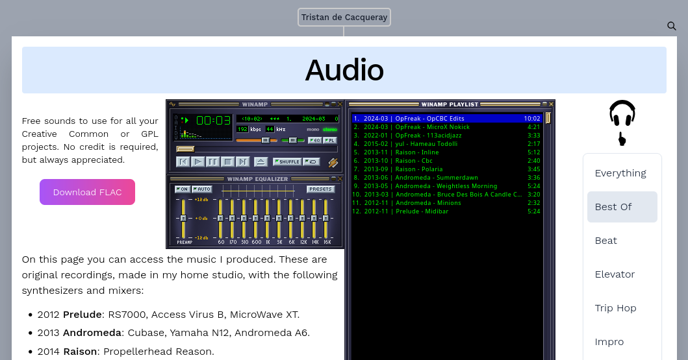

On this page you can access the music I produced.
These are original recordings, made in my home studio,
with the following synthesizers and mixers:

:::{.hidden}

:::

- 2012 **Prelude**: RS7000, Access Virus B, MicroWave XT.
- 2013 **Andromeda**: Cubase, Yamaha N12, Andromeda A6.
- 2014 **Raison**: Propellerhead Reason.
- 2015 **YUL**: Reason and midi keyboard.
- 2022 **opFreak**: Reaper, OP1, DrumBrute and μFreak.

Here are the things I would like to add to this page:

- Individual pages per album and song with production notes.
  This will also provides a RSS feed thanks to emanote.
- Timestamp markers for jumping to a specific part.
- Cover image and notes of the playing track displayed on this page.
- Import missing files.

Of course I would like to fix the player, I love WinAmp,
but this web implementation is janky. A lighter player,
with waveform display will be available in the future.

Lastly I would like to share the raw stems and the Reaper projects.
Please get in touch if you are interested!
