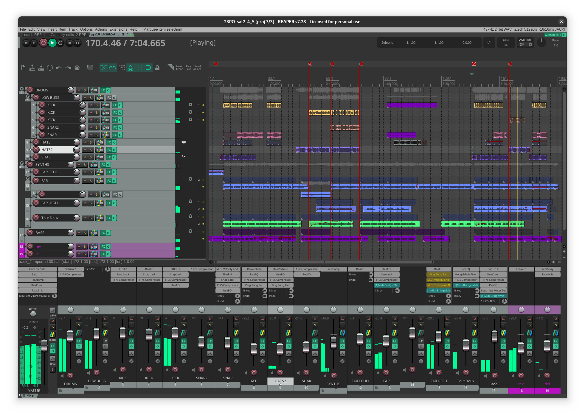

# opFreak - 23PO

This is my remix of the Ballade OP.23 by Chopin:

:::{.hidden}

:::

:::{.flex .items-center .justify-center}
<audio controls class="lg:w-[750px] mb-4">
  <source src="https://cdn.midirus.com/audio/2022-opFreak/23PO.mp3" type="audio/mpeg">
Your browser does not support the audio element.
</audio>
:::

Here is how the [[reaper]] project looks like:

I recorded this track after working on the [[using-dhall-to-animate-fractal|19th Century Piano Fractal]] collection using the following setup:

The main challenge of this track was to adapt the MIDI pattern to a more familiar 4/4 signature.
Though I kept one part in 6/8 around the 4' minutes, and it's the first time ever I programmed a drum pattern in that mode.
You can find the project's MIDI [here](https://cdn.midirus.com/audio/2022-opFreak/23PO.mid).

I used the OP-1 for the drums and the μFreak for the synths:

- The kick/snare/hats were recorded using the finger sequencer.
- The melodic lead is the *Far Away* patch.
- The warm pad is the *TOUT DOUX* patch.
- The bass is the *GiveMeSub* patch.

Here is the final export:

