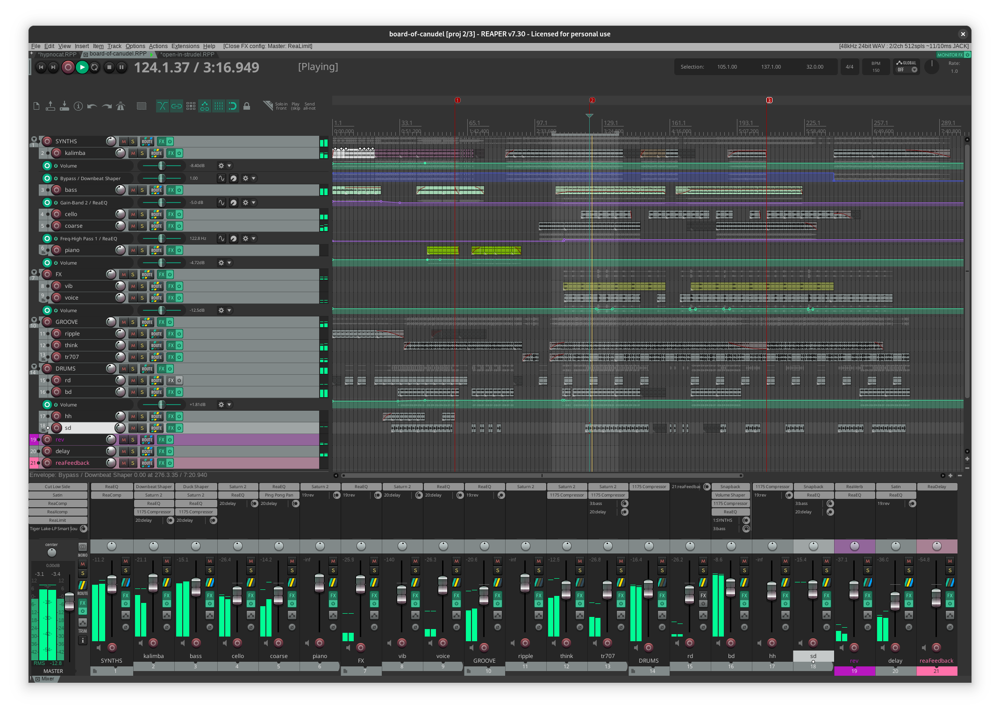
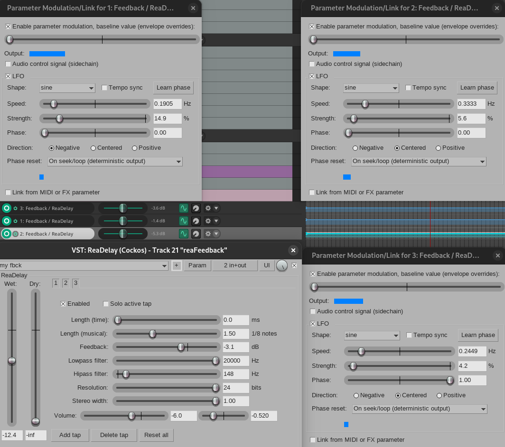

# pastagang - board of canudel

*board of canudel* @by pastagang:

:::{.flex .items-center .justify-center}
<peaks-player url="https://cdn.midirus.com/audio/2025-pastagang/board-of-canudel"></peaks-player>
:::

> Checkout the [strudel source](https://strudel.cc/?f1elh6otvpoy)and the [video](https://youtu.be/MdgN-Hhys1s).

Below I explain how I made this track. Here is how the [[reaper]] project looks like:

Here is what I did differently this time:

- I made my own feedback delay using the stock ReaDelay and 3 LFOs to modulate the feedback:

I only needed it for the rd shots, so I was looking for something lighter than Satin.

- Thanks to the pastagang recordings and the strudel code, I am able to focus more on the production since I don't have to start from scratch each time, like I used to do with [[opFreak]]. After doing a few remixes, I developed a more efficient workflow that let me get faster to a mix I like.

The original jam session happened unexpectedly and I'd like to thank osc() peterson, it was really nice:) [video](https://youtu.be/MdgN-Hhys1s)
