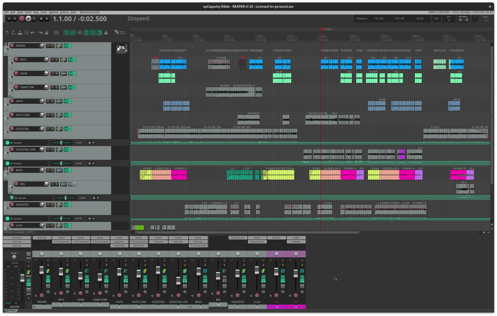

# opFreak - opCapacity

For this compo I plugged the OP-1 directly into Reaper using a miniFuse audio interface.
This was recorded in one-shot, and I kept most of it for a live home studio feel.

:::{.hidden}

:::

:::{.flex .items-center .justify-center}
<audio controls class="md:w-[750px] mb-4">
  <source src="https://cdn.midirus.com/audio/2022-opFreak/opCapacity.mp3" type="audio/mpeg">
Your browser does not support the audio element.
</audio>
:::

Here are the different tracks:

- Lula: made with the digital patch named *Lullaby Time* with a delay size modulated by free lfo.
- Keys: made with the voltage patch named *Celestial-464* from the LOFI Hip Hop pack, using the arpegio sequencer.
- Bass: made with the digital patch named *FEUX DOUX 530* in legato playmode.
- Drum: made with the [J Dilla kit][jdilla], using the drum pattern from Flim (AFX) as transcribed by captain pikant. The snare and hats sometime goes through the COW effect.
- Bell: made with the dsynth patch named *Haunted*, as usual.

> You can download the project and the raw stems: [opCapacity.RPP][rpp-link]. Open it with a stock [Reaper](https://www.reaper.fm/download.php).

[jdilla]: https://op1.fun/users/probablyjm/patches/dilla
[rpp-link]: https://cdn.midirus.com/stem/2024-11-opCapacity.tar.gz
