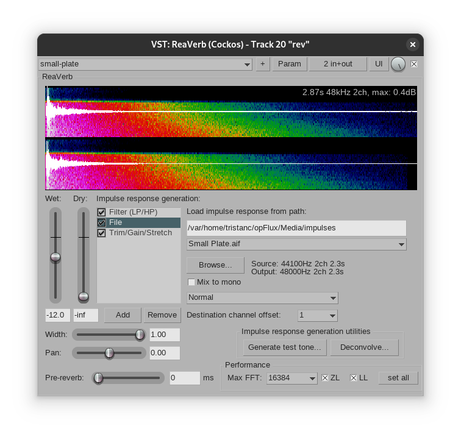

# opFlux

:::{.hidden}

:::

:::{.flex .items-center .justify-center}
<audio controls class="md:w-[750px] mb-4">
  <source src="https://cdn.midirus.com/audio/2022-opFreak/opFlux.mp3" type="audio/mpeg">
Your browser does not support the audio element.
</audio>
:::

Here is how the project looks like:

Since I don't have a strudel source or video to share this time,
I'll explain how I made this track in the next sections.

## Setup

I recorded this track after [[opCapacity]] using the same setup:

This was the last track I made before transitioning to Strudel, I had it for a while on the back burner and I want to explain how I made it.
I used a niche synthesizer called the OP-1 by Teenage Engineering. I bought mine when it first came out, and it took me years to understand how to use it.
With the amount of time I spent practicing this neat instrument, I am happy with my decision to keep it, and I might get a new one when this one breaks.
Even though it's really expensive, the most expensive device I currently own, this little guy is a constant source of wonder.
Here is what I really like about it:

- It is very constrained: the synths and effects only have four parameters each. There is no undo button.
- It features a tape recorder emulation with four audio tracks.
- Its interface is unique, it encourages a workflow that helps the creation process. This is hard to explain, you have to use it to understand what I mean. For example, I learned very recently that you can save a patch by holding it's number, after a few second a saving icon appears and you get a new snapshot named after the current datetime.
- The sequencers are quirky and I like the micro-timings they seem to create.

Here is the breakdown of opFlux:

## Sounds

- The hats goes through the *phone* effect, which adds some interesting tone here and there:

:::{.flex .items-center .justify-center}

:::

> The red *telematic* parameter is the mix, *baud* and *phonic* changes the effect. I setup a free running LFO to modulate the tone, hence the variations at the begining.

- The second snare goes through the *cow* effect, which is a delay+phaser thingy:

:::{.flex .items-center .justify-center}

:::

> I set a very short delay to create the high pitch snare.

- The last kick goes through the *punch* effect, which acts like a compressor+disto:

:::{.flex .items-center .justify-center}

:::

> I usually prefer doing this effect in the DAW, and I'm not sure I used it well here, it's present at 6'40.

- The lead melody is made with the *CELESTIAL* patch of the *voltage* synth engine:

:::{.flex .items-center .justify-center}

:::

> I can't tell what are the parameters, I just modulated the green and white knobs to change the timbre.

- The bass is played with the *LOVE CHORDS* patch of the *cluster* synth engine:

:::{.flex .items-center .justify-center}

:::

> I think the green knob is the filter envelop, and that's the only parameter I changed.

- The keys are played with the *SUNDAY MORNING* patch of the *dsynth* engine:

:::{.flex .items-center .justify-center}

:::

> This engine has 2 oscillators, and I used the green knob to morph the shape.
> The last part of the keys also goes through the *cow* effect with extreme params.

I left the master drive on by mistake on some of the recording which results is some extra noise.
I usually don't notice it because it is not active on the tape recording, but since I captured the audio from the line-out, then it got in the mix too early.

## Sequencers

I played a few parts live, directly on the keyboard, like for the intro melody and the main chords.
But my timings were sloppy and I had to quantize the audio clip by hand afterward.
For the rest I used the following sequencers:

- The *finger* sequencer, which provides a step sequencer per keys, and two of them can be running in parallel:

:::{.flex .items-center .justify-center}

:::

> - The blue knob selects a step, multiple note/sample can be added by pressing <kbd>shift</kbd>+<kbd>note</kbd>.
> - The green knob adjusts the swing, I always put it slightly on the right.
> - The white knob adjusts the pattern length, I mostly use 16 or 32 steps, but using a prime number can produce interesting evolving pattern.
> - The red knob holds the pattern(s).
>
> To this day, I'm still not sure what the join cross and the mini keyboard represent :)
>
> What is great with this sequencer, is that the pattern can be triggered at any time, they are queued to some fixed timing, which can easily create unexpected groove.
> When used with the synth, the monkeys are replaced with keyboardists.

- The *endless* sequencer:

:::{.flex .items-center .justify-center}

:::

> - The blue knob adjusts the sync timing.
> - The green knob adjusts the swing.
> - The white knob changes the sequence pattern, displayed by the white dots under the sync. They provide fixed sequence, usually at odd length like three or five.
> - The red knob holds the pattern.
>
> You type the sequence by pressing <kbd>shift</kbd>+<kbd>note</kbd>, one at a time. Then the sequence is transposed to the note being played.
> That can be used for melody or bass line, but also with drums.

- The *arpeggio* sequencer:

:::{.flex .items-center .justify-center}

:::

> This one is hard to explain. It has the same sequence pattern system as the *endless* sequencer, but the length is fixed to 4 step, as seen in the top right. By pressing <kbd>shift</kbd>, we can change the note length, the scale type, and how the pattern runs, as seen in the bottom row.
>
> What's really curious about the *arpeggio* is that pressing the same chord sometime triggers a different arpege. Most of my melodies are made with this sequencer.

Checkout this demo to see the OP-1 in action: [05-28-17 (I Need U)](https://www.youtube.com/watch?v=7z4hoazra_g) by *Red Means Recording*.

## Effects

- Time shaper to change the bass intro. You can see the by-pass automation in purple on the project screenshot:

- Gentle saturation and low boost for the sequenced bass line, using an envelop follower with the kick on the side chain:

- Three bands saturation on the master. I thought that would eliminate the need for ReaXcomp, but I kept both in the end:

- I finally figured how to setup a low cut on the side using stock plugins. Turns out my encoder script was corrupted and I needed to reset it to the factory implem:

- Pan shaper for custom pan modulation:

- The small plate reverb:

> I made it as a track template and I used it almost everytime.

- Lastly, I put snapback on the kick/snare to add some oompf and punch:

## Analog Versus Digital

I meant to write a dedicated post to share my take on the Analog vs Digital debate, but I'll do a brief summary here:
I don't think the analog part matters, it mostly adds a bit of grain to the signal, and I believe we can simulate that effect effectively with digital processing.
To me, what matters is the user interface that physical devices can provide, and how they let you discover things you would not have explored otherwise.
Also, hardwares feature custom interfaces using physical actuation which are complicated to replicate with a general purpose mouse, keyboard and screen.

Moreover, the resulting signal contains micro rythms, depending on the load of the device or its crystal frequency.
This can of course be emulated using humanizer or groove algorithms.
In the end, I think it's the imperfections that matter, and I don't like having to fake them using digital processing.
