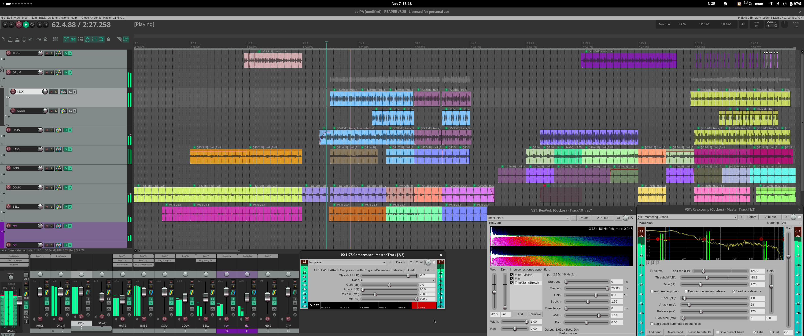

# opFreak - opIPA

The first sample is called "FEUX DOUX", and the second part features the "BROKENPAD-332".

:::{.hidden}

:::

:::{.flex .items-center .justify-center}
<audio controls class="md:w-96">
  <source src="https://cdn.midirus.com/audio/2022-opFreak/opIPA.mp3" type="audio/mpeg">
Your browser does not support the audio element.
</audio>
:::

