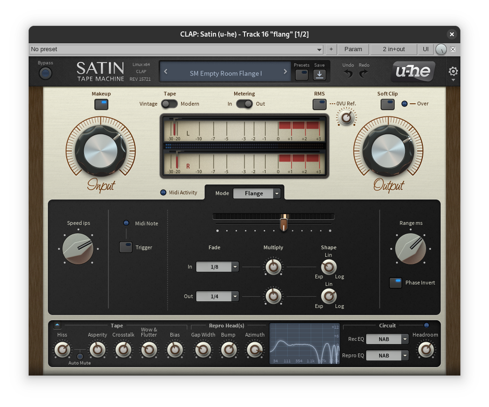

# pastagang - open in strudel

*open in strudel* @by pastagang:

:::{.flex .items-center .justify-center}
<peaks-player url="https://cdn.midirus.com/audio/2025-pastagang/open-in-strudel"></peaks-player>
:::

> Checkout the [strudel source](https://strudel.cc/?QUIJvyxGpHpO)

This track was made mostly asynchronously, so I don't have a video recording. I just used the new "open in strudel" feature, hence the name :)
Below I explain how I made this track. Here is how the [[reaper]] project looks like:

Here is what I did differently this time:

- I used a flanger effect with Satin. It's actually the first time I ever used a flanger; here it provides an extra dark reverb:

I setup an LFO to modulate the azimuth parameter that way:

It's interesting that this effect produces a noise, even when the playback is stopped.

- I have been using a time shaper to create variations on the keys pattern and I think I got better at it after watching this [ultimate guide video](https://www.youtube.com/watch?v=PmX8UY8q6oA):

- I also used a ReaGate to remove the hi-hats reverb in the second part, this stock plugin works like a charm:

- On the master I have been using another Satin, and I noticed that the mastering presets often recommend an input volume, like -12dB RMS. So I used a volume adjustment before to match the recommendation, and since then, I realized that I could use the same technique in place of my final limiter. You see, I was using ReaLimit mostly to reach -0dB peak volume, and it's not a good application for a limiter. Someday, I'd like to learn how to use a limiter, but for now I'll keep it simpler and I think my mix will have higher dynamic ranges that way. I'll now do a dry render to measure the peak volume, and compensate with a final volume adjustment, this time by 2.4dB:

