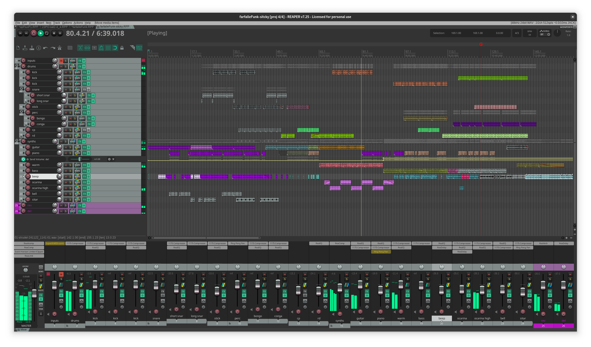

# pastagang - farfalle funk

:::{.hidden}

:::

It all started with todepond sharing a link to a web interface called Flok.
This website hosts a collaborative Strudel session where anyone can share and modify music patterns.
I had the honour of playing with a formation called the *pastagang*.
We got to know each other by writting patterns, and I really enjoyed the last two sessions, named *crash recovery* and *farfalle funk*.
Thanksfully, someone named froos made a recording, which is great because the sessions would have been lost otherwise.

I think Strudel, and Tidal by extension, is the best music writing system.
The pattern notation and the combinators are uniquely powerful.
Combined with multiplayer Flok, this is un-stoppable.
However, I don't think that's enough for music production because this not a full DAW (yet?).
For now, I prefer to use Reaper for mixing and arranging the final product.
So, that's what I did: I re-constructed the session from the video recording and
I learned how to use the built-in Super8 looper to playback the Strudel's patterns.

I hope you enjoy this.

:::{.flex .items-center .justify-center}
<audio controls class="md:w-[750px] mb-4">
  <source src="https://cdn.midirus.com/audio/2024-pastagang/farfalleFunk.mp3" type="audio/mpeg">
Your browser does not support the audio element.
</audio>
:::

> Checkout the [strudel source](https://strudel.cc/?vGTLU-YVDzx-) and the [video](https://youtu.be/AWM4r_6VEmQ?t=1100).

Here is how the Reaper project looks like:

In this screen capture, you can see:

- The items are colored and split to clean-up the unpleasant bits. Then they are repeated to make the arrangement.
- The tracks with a yellow stripe next to its fader are sent to ReaVerb which is using the Lexicon's Small Plate impulse response. I recorded Strudel by disabling the `.room` modifiers.
- The volumes are adjusted with the JS 1175 compressor. I used it that way: set the attack to >200uS, dial down the threshold until the compression reach -6db. Lower the release to amplify the tail if needed. Then adjust the gain so that by-passing the plugin doesn't change the volume.
- The synths are compressed with ReaComp using a side-chain from the drums bus (indicated by a blue stripe).
- Most tracks, except the kick/bass, have a low shelf EQ.
- On the master there is ReaXcomp with the 3band preset and ReaComp with the bus glue preset. I added the limiter to adjust the peak volume so that it reachs -0.1dB.

Here is what I also tried:

- Mid/Side processing to remove the bass from the side, but I couldn't make the decoder work.
- Narrow EQs, but I can't tell which frequencies to boost or reduce.
- Multiple reverbs, so far I've only used a single Small Plate but it doesn't work well on the drums. I tried to add some other responses, but they mudied the mix.
- Saturation with the event horizon clipper, but I couldn't tell the differences so the plugin is bypassed in the final max.

I would appreciate any tips to improve my mix. Also, let me know if you want the project files.

To record Strudel with Reaper: the trick is to press record only once on the input track, and let Strudel run continuously.
Then run the patterns individually, using the Super8 to playback the previous ones.
It's a bit tricky, but that way I can chop the loops afterward and they are mostly in sync!

Here is how Super8 looks like during recording:

And here is the project after the initial split:

