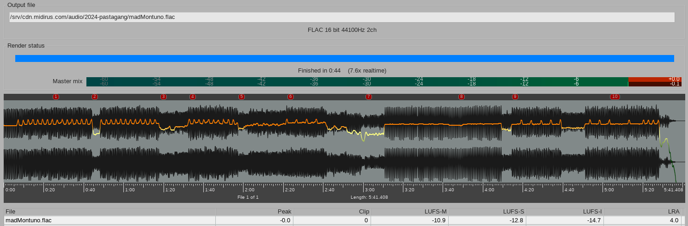
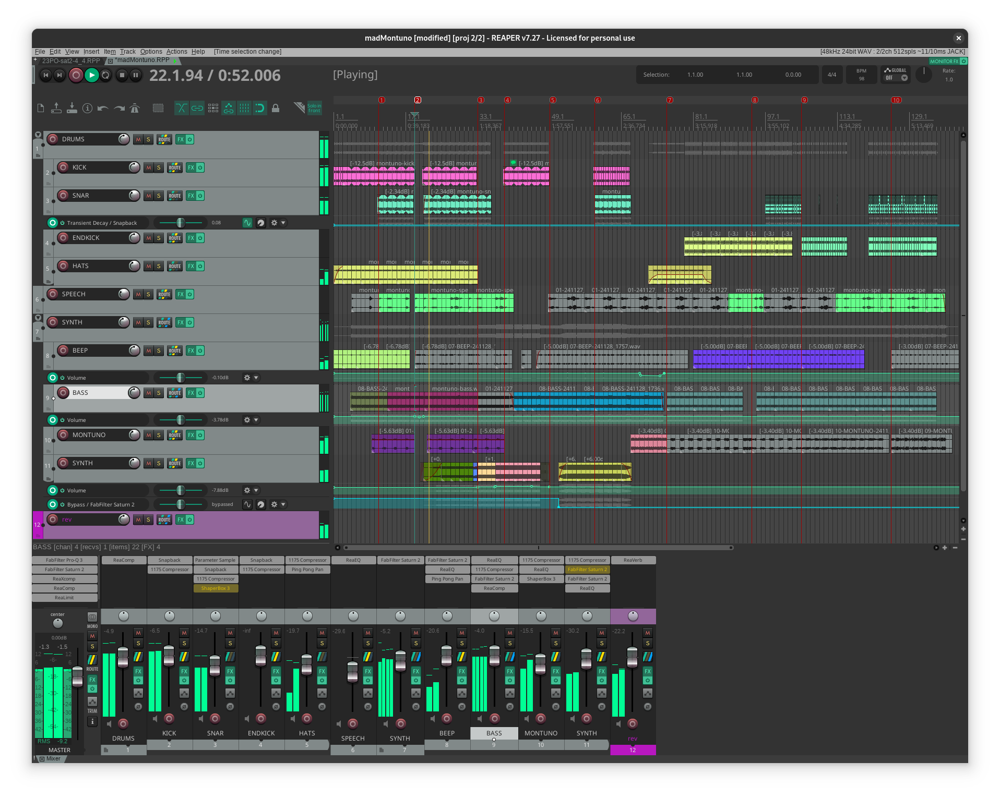

# pastagang - mad montuno

:::{.hidden}

:::

Here is *mad montuno* @by the pastagang:

:::{.flex .items-center .justify-center}
<audio controls class="md:w-[750px] mb-4">
  <source src="https://cdn.midirus.com/audio/2024-pastagang/madMontuno.mp3" type="audio/mpeg">
Your browser does not support the audio element.
</audio>
:::

> Checkout the [strudel source](https://strudel.cc/?fEPl2wU6ssg2) and the [video](https://youtu.be/kKj8cQvWe6o).

Here is how the [[reaper]] project looks like:

As you can see on the FX section, I'm exploring new plugins:

- Saturn2 to add multiband saturation. On the master I used the `Warm Tube Base - 4 Bands SM` preset, for the bass `Smoothness FL` with the mix at 20%. For the last synth part, I added an extra saturn with the `A Wobble Pour Toi MdB` preset.
- ProQ2 with the `Cut Low Side` preset on the master.
- Snapback to add ompf and sparkles on the drums.
- Shaperbox to create pan movements and remix the snare in the second section with two stutter presets.

This is my first mix with external plugins. I barely scratched the surface, and I'm already worried this is getting too much processing for my taste.
I actually don't know how to use multi-band processing or how to set up a saturation, but that seems important so I'll have to learn how that works.

FabFilters seem to be the industry standard, and I certainly don't have the skill to use ProQ2 properly, so I'll probably stick to ReaEQ in the future.
Though it's nice to try different things, and I appreciate their work on the user interface. The manual has a full section on how to turn a knob.
Cabelguys makes convenient plugins to speed up my workflow, so I'll surely keep on using their tools.

Here is how the export looks like, I'm surprised by the waveform I got:

