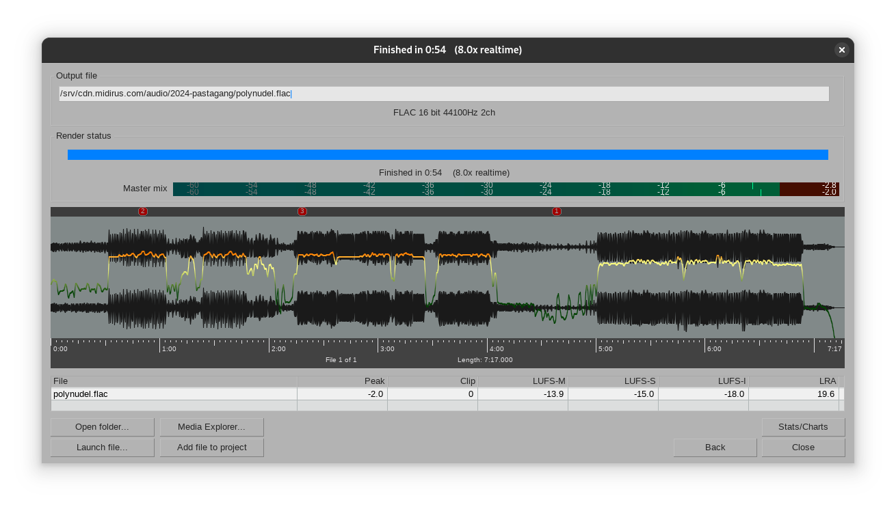
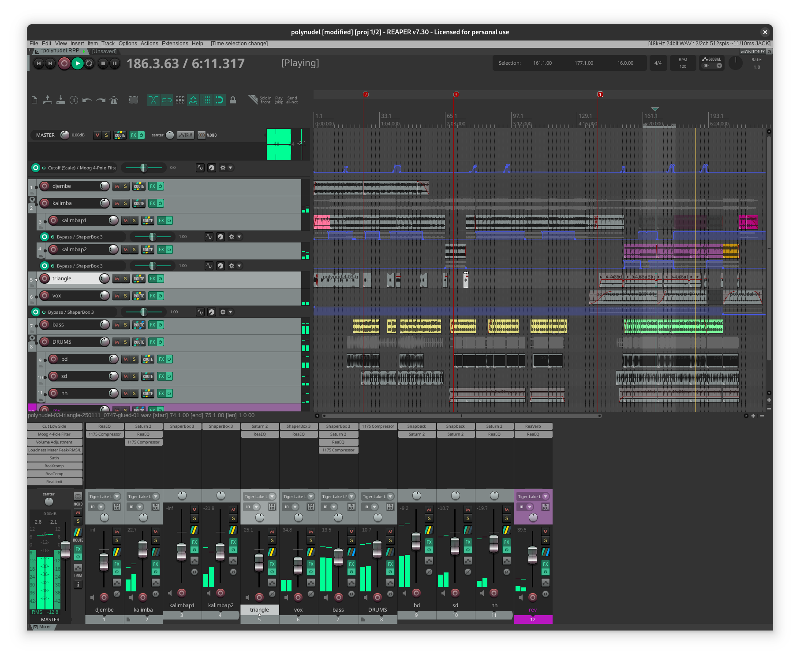
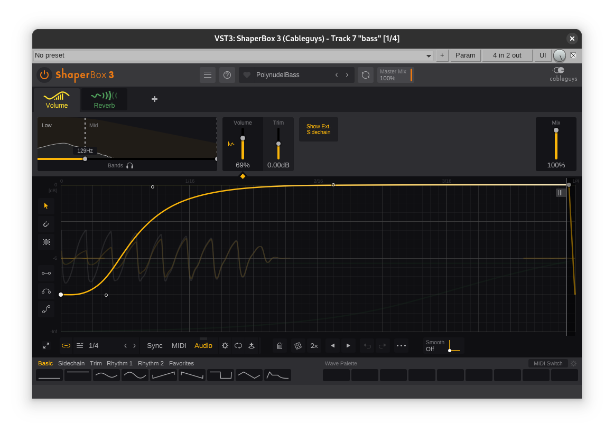
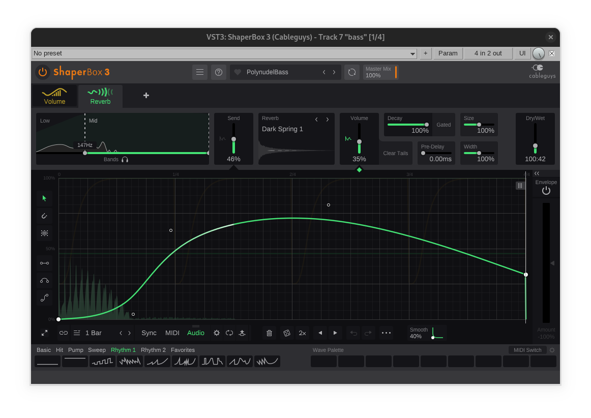

# pastagang - polynudel

:::{.hidden}

:::

*polynudel* @by pastagang:

:::{.flex .items-center .justify-center}
<peaks-player url="https://cdn.midirus.com/audio/2024-pastagang/polynudel"></peaks-player>
:::

> Checkout the [strudel source](https://strudel.cc/?rRLQ66BMAxgQ) and the [video](https://youtu.be/2kGB7lrhy5Q).

Here is how the [[reaper]] project looks like:

Here is what I did differently this time:

- I recorded the strudel patterns individually as I'm getting better at anticipating the initial latency to sync the browser with the daw. This is useful to punch in new variations without having to fiddle with the super8 looper.
- I used Saturn to add clean tube/gentle transformer saturation on most tracks.
- On the master, I replaced Saturn with Satin using the *MasterBuss Thick & Warm For -15db RMS* preset.
- The kalimba goes through two different time shapers to create the loop variations.
- For the bass, I used a volume shaper to apply the side chain compression only on the low frequency:

- I also added a reverb shaper to add some color to bass tails:

Here is the final export waveform:

