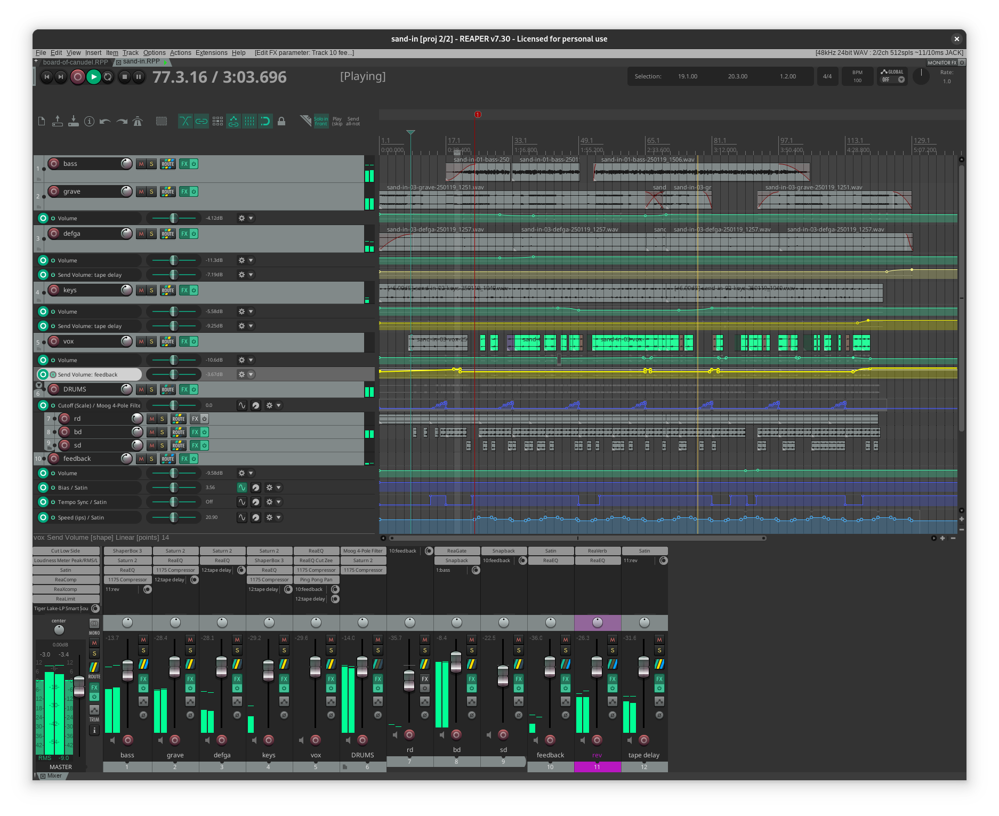
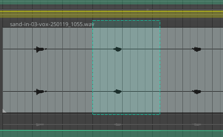
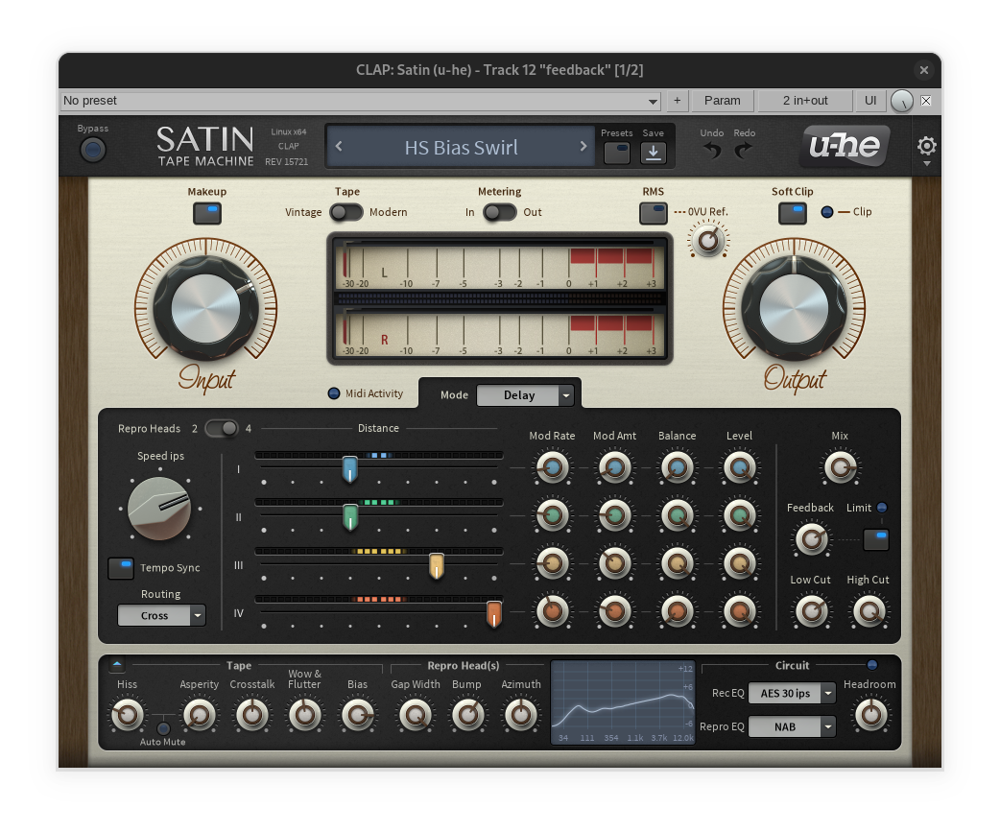
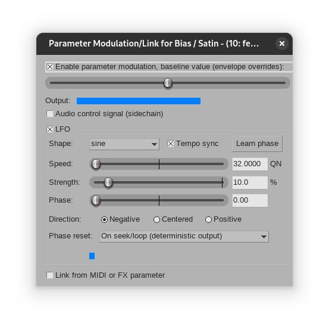

# pastagang - sand in

*sand in* @by pastagang:

:::{.flex .items-center .justify-center}
<peaks-player url="https://cdn.midirus.com/audio/2024-pastagang/sand-in"></peaks-player>
:::

> Checkout the [strudel source](https://strudel.cc/#Ly8gIm51ZGVsIDIwMjUtMDEtMTggMTU6MTQiIEBieSBwYXN0YWdhbmcKCi8vIGl2ZSBnb3QKLy8gaXZlIGdvdHRhIG1ha2UKLy8gc2FuZCBpbgovLyBuaW5ldHkgbmluZSB3YXlzCi8vIAovLyB0b2RlIGlzCi8vIHN0aWxsIGFzbGVlcAovLyBib3Qgd2VudAovLyBtaXNzaW5nCi8vIAovLyBhbmQgYmVyZAovLyBiZXJkIGZsZXcgYXdheQovLyBvaCBiZXJkCi8vIGZsZXcgYXdheQovLyAKLy8gKHJlcGVhdCkKCi8vCi8vIHBhbmVsIDEKc2V0Y3BtKDEwMC80KQoKc2lsZW5jZQoKCgoKLy8gcGFuZWwgMgpzaWxlbmNlCgoKCi8vIHBhbmVsIDMKc2lsZW5jZQoKCi8vIGdnCgovLyB3YXMgZ29vZCB0byBsaXN0ZW4uLi4gCgovLyBuaWNlIDopCgoKCgovLyBwYW5lbCA1CgoKCgovLyBwYW5lbCA2CgokOiBub3RlKCI8ZzIgYzM%2BLzIsPFstIDxkNCBlND4gWy0gPGY0IDxnNCBhND4%2BKjwxIDI%2BXSAtXT4iKQoucygic2luZSIpLmF0dChzaW5lLnJhbmdlKC4xLC41KS5zbG93KDE2KSkuZm0oNCkKLmxwZihzaW5lLnJhbmdlKDEyMCwzMDApLnNsb3coMTcpKQouaHBmKDIwMCkucG9zdGdhaW4oLjMpCi5scGQoLjQpLmxwZW52KDEuNCkucmVsKC40KQoucm9vbSguOCkKLmNsaXAoMS4yKS5kZWxheSguNCkKLnZpYigiMTouMiIpCgokOiBub3RlKCItIDxnNSA8YTUgW2E1IGY1XSBbYTUgW2M2IGQ2XV0%2BPiIpCi5kZWMoc2luZS5yYW5nZSguMDUsLjQpLnNsb3coMzEpKQoucygic2luZSIpLmdhaW4oLjMpLmp1eCh4PT54LmRlZ3JhZGUoKS5yZXYoKSkKLmRlbGF5KCIuNDouMTY6LjkiKS5vcmJpdCgyMzIpCi5yb29tKC41KS5hZGQobm90ZShwZXJsaW4ucmFuZ2UoMCwuMykpKQoucG9zdGdhaW4oLjQpLmZtKC41KS5mbWgoMS4wNCkKLm9mZigxLzgsIGFkZChub3RlKCI8Mi4xIFstIC0xMl0gMS45IDc%2BPyIpKSkKLmxwZigzMDAwKS5zdWIobm90ZSgiMTIgWzEyIDBdIikpCgoKCg%3D%3D) and the [video](https://youtu.be/6QoxZ9a83d4).

Below I explain how I made this track. Here is how the [[reaper]] project looks like:

As explained in the previous [[pastagang|notes]], this screenshot presents the work I did after recording the strudel patterns individually.
Note that it contains all the cuts and the envelops I put together to create the different parts. At the bottom of the screen,
you can see the mixer with each sound processing plugins per track.
Here is the list of things I did differently this time:

- I learned about the [Razor Editing and Quick Delete in REAPER](https://www.youtube.com/watch?v=NqlM6PWlME4) to easily cut through the broken vox samples.
  I can't believe I didn't notice this elementary feature before, it's a big time saver. The razor selection looks like this:

  

This can be used to cut or duplicate a segment in just two clicks (instead of four when spliting with the cursor).

- I used the Satin Tape Emulation plugin by *u-he* for the long feedback delay. This is a bit over powered for my skills, but I've been fascinated by tape delay since I watched this video [Tape Does Something Pedals Can't](https://www.youtube.com/watch?v=KgZtCqzZlBoke) by Benn Jordan, and because *u-he* supports Linux natively, I indulged myself with this luxurious effect. So, here is how it looks:

  

I used the *HS Bias Swirl* preset which curiously mentions in its description: *For infinite swirl, don't change the Feedback, but lower the Bias!*. So, that's what I did, you can see at the bottom of the project screenshot 3 blue automation lanes that modulate the bias, tempo and the speed ips. For the bias, the envelop is generated with a slow LFO (indicated by a green buton with a sine wave in the track control panel):

  

I'm not sure I used the delay properly, but I like the subtle variations it creates in the repetition pattern.

- Lastly, I used less processing on the drums, since they come from a custom kit named the *crate*, which I think is already pre-processed to sound good. Though I used a gate on the kick to remove the extra noise.

That's it. I'd be happy to share the project files, and I'd love to collaborate on these remixes.
For what it's worth, I have spent about 10 to 20 hours per project, and even though I poured more than 1000 hours into Reaper (1462 according to the about page), I still have a lot to learn to make it sound great.
