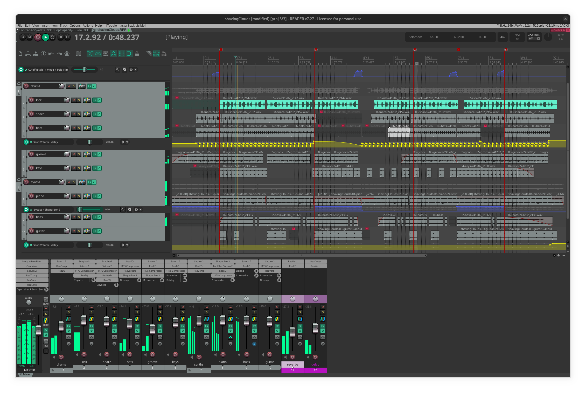
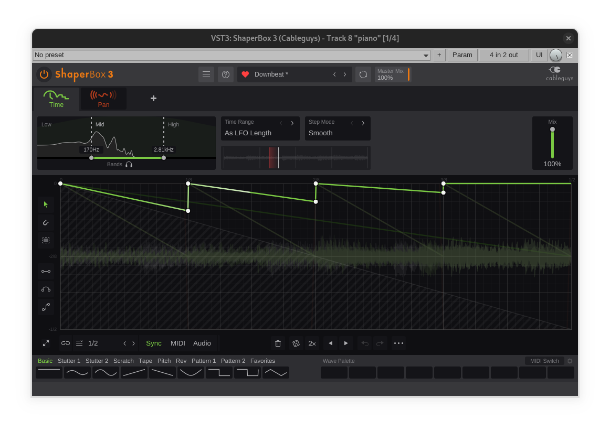

# pastagang - shaving clouds

:::{.hidden}

:::

:::{.flex .items-center .justify-center}
<audio controls class="md:w-[750px] mb-4">
  <source src="https://cdn.midirus.com/audio/2024-pastagang/shaving-clouds.mp3" type="audio/mpeg">
Your browser does not support the audio element.
</audio>
:::

> Checkout the [strudel source](https://strudel.cc/?gVJMW8RwLPJX) and the [video](https://youtu.be/kKj8cQvWe6o?t=1913).


In this screen capture, you can see the [[reaper]] project of this compo.
Here is what I did differently this time:

- There is a gentle tape/tube saturation with a 20/30% drive on most tracks. I can barely ear the individual effect, but combined they create a nice extra color. I guess the idea is to replicate the sound of analog recording circuits. It also helps with compression as the tape shave off the hard transients.
- I always struggle with the phase when mixing, I don't know how to diagnose and fix the problem. I just discovered (in [this course][mixing-course]) that inverting the phase may change the peak volume by +/- 2db, so I'm now trying to keep the setting that produces a gain. Here, the bass is inverted, as shown by the blue dot next to its fader.
- Thanks to this new knowledge, I noticed that adding a high-pass filter at 30Hz on the drum slightly increase the overall volume by 0.3db. I configured Reaper to reset the peaks (displayed on top of the faders) when the playback restart, which makes it easy to compare different settings.
- On the master, I added a moog high pass filter to accentuate the transitions. You can see the cutoff automation at the top of the project.
- I learnt how to setup envelops for adjusting the FX send to improve the transitions.
- Lastly here is the main effect applied on the piano to create the different parts, you can see the by-pass automation in blue:

:::{.flex .items-center .justify-center}

:::

> This manipulates the flow of time to create such an interesting effect, I love it.

Finally, I think this simple sound adds such a nice groove, I'll use it in my next project:

```strudel
samples('github:yaxu/clean-breaks') // thanks yaxu
$: s("ripple/2").fit().chop(32).dec(.1).hpf(300).gain(.5)
```

[mixing-course]: https://youtu.be/1BLZGe-TqW0?t=2314
