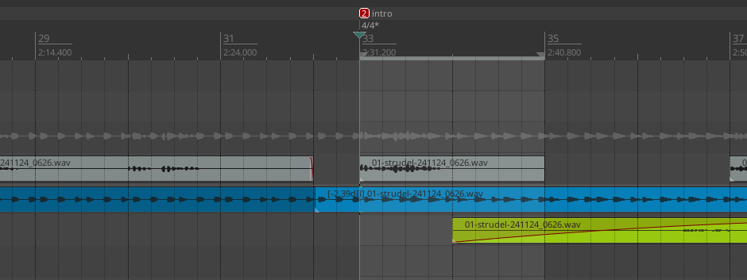

# pastagang - simple but hard

:::{.hidden}

:::

This is my second production for the pastagang, following-up from the [*farfalle funk*](./pgFarfalleFunk.md).
Here is *simple but hard*:

:::{.flex .items-center .justify-center}
<audio controls class="md:w-[750px] mb-4">
  <source src="https://cdn.midirus.com/audio/2024-pastagang/simple-but-hard.mp3" type="audio/mpeg">
Your browser does not support the audio element.
</audio>
:::

> Checkout the [strudel source](https://strudel.cc/?azOBiV6qi-o9) and the [video](https://youtu.be/kKj8cQvWe6o?t=3266).

Here is how the project looks like:

In this screen capture, you can see the same layout as for the *farfalle funk*.
I used extra send effects: the Short Plate response for the rim and the Small Bright for the bass.
I also tried to pan and glue the two piano tracks, but I'm not sure this is working very well.

For this project, I learned a new feature to reset the measures after a bridge.
Previously I made sure all the loop started on a fixed measure, but this was not working out for this compo.
So here is the trick:

- Insert a new marker when a new verse begin by right clicking on the ruler: `insert tempo/time signature marker`.
- Copy the position (because it will be adjusted to the closest measure), untick `Set tempo` and tick `Set time signature`.
- Then tick `Allow a partial measure before this marker`, paste the position and add the marker.

This looks like this:

:::{.flex .items-center .justify-center}

:::

Notice how the measure 33 starts before the end of the previous one. That is convenient to keep the next section on the beat.

Also, here is how the final export looks like:

As always, I'd be happy to share the project file, please let me know.
That's it for today, hope you like it!
