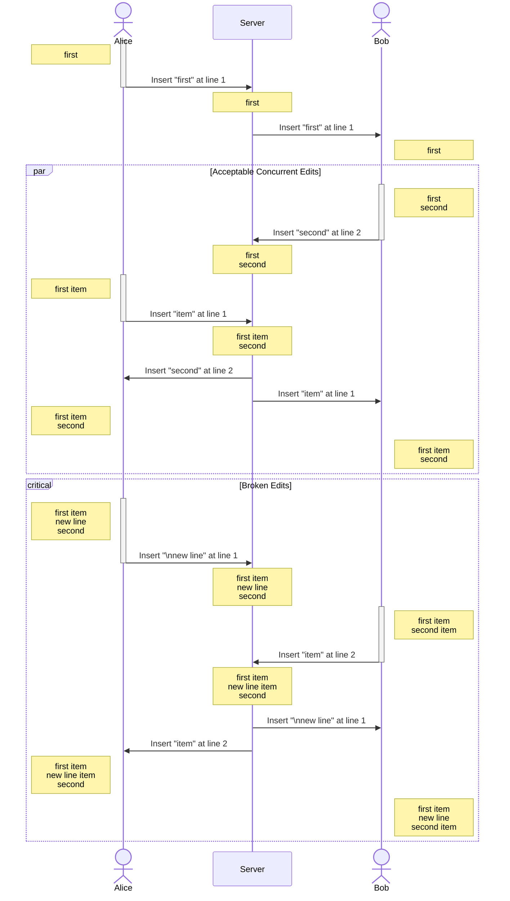
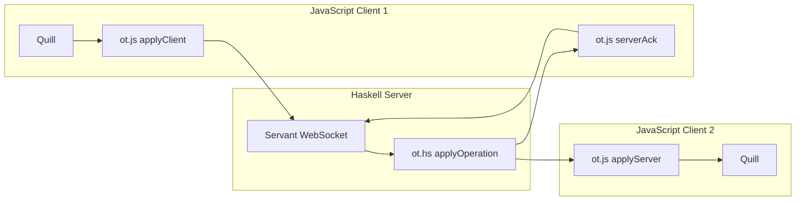

[Butler][butler] is a web-based multiplayer virtual operating system that features collaborative applications.
This post shows how I integrated Operational Transformation (OT) to enable users to simultaneously edit a text document in Butler.

In three parts, I present:

- The flaw in my initial implementation.
- How to use the [ot.hs][ot.hs] library.
- An integration with the [quill][quill] editor.

:::{.flex .items-center .justify-center}

:::
> Image by [Nusnus - Own work, CC BY-SA 3.0](https://commons.wikimedia.org/w/index.php?curid=7123571)

## Context and problem statement

Butler's text editor, Noter, is the default document editing application.
Each user has their own cursor, and can simultaneously update the document.
The initial implementation simply broadcasted the users' events without considering potential conflicts.

The events were composed of a line and column position along with an insert or delete operation.
This worked well, as long as concurrent edits happened on different lines, and no lines were added nor removed above another cursor.

Unfortunately, as demonstrated by the following scenario, there was a risk of desynchronization:



In this case, the last edits from Bob happened at the wrong line, and the documents are no longer synchronized.
I tried to manually take into account the previous events, before quickly realizing that this is a hard problem with many edge cases.
Fortunately, I discovered the OT algorithm which nicely solves this issue.


## OT with Haskell

OT's core idea is to transform and compose operations to maintain the document consistency.
Tim Baumann, the creator of the Operational-Transformation GitHub group implemented OT with Haskell.

The API defines a text operation with a list of actions:

```haskell
newtype Operation = Operation [Action]
data Action = Retain Int | Insert Text | Delete Int
```

To perform the transformations, the API features the following functions to manage the server and clients states:

```haskell
-- | Text editor produces a new operation.
-- Return wheter to send the operation to the server.
applyClient :: ClientState -> Operation -> (Bool, ClientState)

-- | Server receives the operation.
-- Return the operation to be broadcasted to all clients.
applyOperation :: ServerState -> Revision -> Operation -> (Operation, ServerState)

-- | Emiting editor acknowledge the edit.
-- Return an optional operation that must be sent to the server.
serverAck :: ClientState -> Maybe (Maybe Operation, ClientState)

-- | Other editors receive the server operation.
-- Return the transformed operation that must be applied to the local doc.
applyServer :: ClientState -> Operation -> (Operation, ClientState)
```

The state can be created with the `initialState` helpers, and the revision is just a number that
the client must increment each time it receives a server event.
That's all it takes to integrate OT with Haskell.

For the end-user text edition, I found the [quill][quill] project which conveniently provides text change events as delta objects that are suitable for OT.
So I put together a simple demo in this [commit](https://github.com/TristanCacqueray/haskell-xstatic/commit/204fbda0aeb36a26b518ea418516efd55d0a1b40).
Unfortunately, it didn't work well because the `ClientState` can't be managed on the server side.
I tried to fiddle with the web-socket protocol to roundtrip the events and ensure consistency, but this became unusable on high latency connections.

Thankfully, Tim also implemented OT with JavaScript, as well as a formalization in Coq.
The next section explains my final implementation.


## Integration with Quill

To make this work, the server must only be in charge of applying operations and broadcasting the events
to the connected clients. Therefore, it is necessary to perform client transformations in the user's browser
so that the client state is synchronized with their local document.

Here is the final architecture I used:



The [ot.js][ot.js] uses the same API so it was easy to integrate.
The first step is to initialize the state and setups the callbacks:

```javascript
// Local client state (from ot.js)
const client = new ot.Client(0)

// How to send operation to the server
client.sendOperation = (rev, op) => {
  webSocket.send(JSON.stringify([rev, op]))
}

// How to apply operation to the local document
client.applyOperation = (op) => {
  quill.updateContents({ops: op.ops.map(decodeDelta)}, "api")
}
```

Here is the web-socket connection to the central server:

```javascript
const webSocket = new WebSocket("ws://" + window.location.host + "/ws");
webSocket.onmessage = (event) => {
  const op = JSON.parse(event.data)
  if (op === null) {
    client.serverAck()
  } else {
    // Update the local state with server operation
    client.applyServer(ot.TextOperation.fromJSON(op))
  }
}
```

Finally, the quill editor is configured like this:

```javascript
const quill = new Quill('#editor')
quill.on('text-change', (delta, oldDelta, source) => {
  if (source === "user") {
    const op = ot.TextOperation.fromJSON(delta.ops.map(encodeDelta))
    // Update the local state with local operation
    client.applyClient(op)
  }
})
```

Checkout the [Server.hs][Server.hs] module to see the full implementation.
Note that this version is completely standalone, and it also implements users' selection with [quill-cursors][quill-cursors].

## Conclusion

My initial text editor implementation had a serious flaw when multiple users simultaneously edited a document
resulted in desynchronization.
Fortunately, this is a known problem that can be solved with operational transformation (OT), and
I found a suitable server and client implementation that works well inside #[[butler]] architecture.

The Haskell version helped me figure out how to use OT and I found that the code was well thought out, with
many property tests. The author also wrote a [formalization in Coq][ot.v], a theorem prover, to provide a formal
proof that the algorithm is sound.

My integration seems to work well, and I'm looking forward to adding new features, such as
supporting rich text and providing a revision system.
Thanks for your time!

[ot.hs]: https://github.com/Operational-Transformation/ot.hs
[ot.js]: https://github.com/Operational-Transformation/ot.js
[ot.v]: https://github.com/Operational-Transformation/ot.v
[quill]: https://quilljs.com/
[quill-cursors]: https://www.npmjs.com/package/quill-cursors
[butler]: https://github.com/ButlerOS/haskell-butler
[Server.hs]: https://github.com/TristanCacqueray/haskell-xstatic/blob/quill-ot/demo-quill-ot/Server.hs
