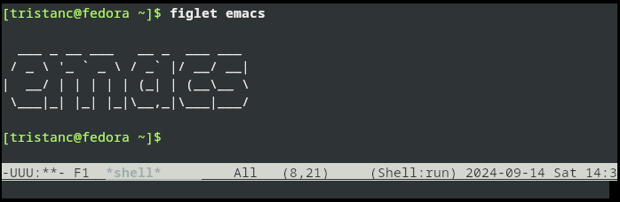

In this post I explain why I believe Emacs is the greatest text editor.

:::{.flex .items-center .justify-center}

:::

---

You can find my configuration here: [emacs.el][my-emacs].
It is a light standalone file that setups a minimal developer environment with
auto completion, projects management, language server and some quality of life improvements.


## Context

I recently setup a new developer environment from scratch.
I started with the emacs-nox package, which is the lightweight terminal edition without the graphic libraries.
Then, I progressively setup the configurations I needed.
Before activating a new setting, I read through the documentation and the source code to refresh my memory.
In a couple of days, I got Emacs working exactly as I wanted, and I was blown away by how far it has come.

Emacs is my main tool to create projects, contribute code, run experiments, read mail, and perform basically any text based activity.
I would say it is my most valuable tool because over time I built a custom workflow that would be hard to replace with another tool.
In the following section, I present how I use Emacs.


## Features

In this section I present the main features I get with Emacs.

### Completion framework

This key capability enhances the process of finding an element within a list.
Emacs includes `ido` by default, but there are more advanced package available, such as `vertico` or `ivy`.

The concept is to use fuzzy matching to efficiently narrow down a list of elements.
For instance, typing `butler .hs` will match entries containing both `butler` and `.hs` regardless of their order.
Adding further keywords, like `parser`, further refines the list to only include entries with `parser`.

Emacs's completion framework is pervasive and integrated into many systems, such as:

- Finding a file,
- Selecting a remote reference,
- Executing a command.

Once you become accustomed to a robust completion system, it’s hard to go back.


### Buffers

Emacs manages window content through objects called *buffers*,
and switching between these buffers is a command I use frequently.
Combined with `recentf` to track visited files and `saveplace` to restore the last cursor position,
Emacs offers a fast and efficient system for recalling files.

When working on distributed systems with multiple projects,
I often need to switch contexts, for example to alternate between a frontend application and a configuration management system.
Over time I've accumulated over a thousand checkouts, and with just a few keystrokes,
I can quickly access any project's files:

- `project-switch-project` loads a project from the list of checkout.
- `project-find-file` selects a file within the current project.

### Company

Company is a modular text completion framework that provides basic auto-completion
for local paths, keywords, and abbreviations.
It can be extended by other packages to enable custom completion,
such as those provided by a language server.

Company is incredibly lightweight and operates seamlessly in the background.
Its presence is so unobtrusive that I only notice it when it's not there.


### Elisp

Emacs is highly extensible through Lisp, a powerful and intriguing programming language.
At a minimum, you only need to understand how to set variables and call functions to customize
your environment:

```scheme
(setq recentf-max-saved-items 1024)
(recentf-mode)
```

From the editor, you can access the documentation and the sources of everything through the
`describe-*` family of commands.

Then you can implement any kind of customization, for example, here is how to start a language
server inside a nix shell when a flake is available:

```scheme
(defun start-hls (_mode)
  "Start HLS by trying to wrap in nix develop."
  (if (file-exists-p "flake.nix")
    (progn
      (message "Running HLS with flake")
      (list "nix" "develop" "--command" "haskell-language-server-wrapper" "--lsp"))
    (progn
      (message "Running HLS from host")
      (list "haskell-language-server-wrapper" "--lsp"))))

(add-to-list 'eglot-server-programs '(haskell-mode . start-hls))
```

Here is how I insert my latest screen capture into a markdown file:

```scheme
(defun get-newest-file-from-dir  (path)
  "Return the latest file in PATH."
  (car (directory-files path 'full nil #'file-newer-than-file-p)))

(defun copy-screenshot-markdown (name)
  "Move the latest screenshot and insert markdown link with NAME."
  (interactive "Mname: ")
  (let* ((infile (expand-file-name (get-newest-file-from-dir "~/Pictures/Screenshots")))
         (outdir (concat (file-name-directory (buffer-file-name)) "/media"))
         (outfile (expand-file-name (concat name ".png") outdir)))
    (unless (file-directory-p outdir) (make-directory outdir t))
    (rename-file infile outfile)
    (insert (concat " ")"))
    (newline)
    (newline)))
```

> If you have never used Lisp, do yourself a favor and give it try, for example through
> this [elisp-guide](https://github.com/chrisdone-archive/elisp-guide).

While Lisp isn't my favorite language, I find it quite enjoyable to use,
especially within the integrated environment that Emacs provides.
I believe Lisp is a crucial factor in Emacs's success and versatility.


### Compilation

Emacs comes with a simple, yet powerful compilation mode that works like this:

- `compile`, starts the build process by selecting a command like `make`.
- `next-error`, jumps to the location of the next error according to `compilation-error-regexp`.
- `recompile`, restarts the compilation process.

This workflow provides the ideal feedback loop to fix compilation errors.


### Eglot

Emacs comes with a language server client called eglot that works like this:

- `eglot`, start the language server.
- `eglot-shutdown`, kill the server.
- `eglot-code-actions`, execute server actions.
- `flymake-show-project-diagnostics`, show the annotations.
- `xref-find-definitions`, find definition.
- `xref-find-references`, find call sites.

Eglot works seamlessly right out of the box, requiring no additional configuration or external packages.
It’s impressive how it integrates with existing Emacs features like Flymake and Xref,
which can also work without a language server, such as when using a standalone linter or TAGS.


### Shell

Emacs can interact with inferior commands through a regular buffer.
This works like a standard terminal but with the added benefit of text manipulation features.
The main difference is that, instead of using the up arrow to scroll through shell history,
you use `M-p` to access previous commands.
It takes a little time to adjust to this,
but the advantages of integrating a terminal within a text editor are significant:

- You can select and copy output as you would with regular text using standard commands.
- The buffer can be edited, allowing you to correct mistakes and create a polished transcript.

By running shells within Emacs, I can also implement a per project command history
with my [project-shell.el][project-shell.el] package.


### Magit

Magit is a Git porcelain. It is such a major package I won't introduce it here,
checkout its website: <https://magit.vc/>.
However, I would like to describe a key workflow for me:

- In a diff, pressing enter visit the *thing-at-point*.
- When the cursor is on a removed chunk, magit creates a temporary buffer to show the file's previous version.
- This temporary buffer works with other magit command like `magit-blame`.

Magit allows you to explore Git history effortlessly, handling the complex details transparently and seamlessly.

### Org mode

Org is a powerful, outline-based notes management and organizer tool.
If you're not familiar with it yet, checkout its website for more details: <https://orgmode.org/>.

Combined with `org-capture` and `org-agenda`, it provides a fast
and effective plain text system for getting things done.
I previously introduced a project management system in this [[no-frills-daily-project-management-with-org-mode|post]],
and recently, I developed the [gnome-org-next-schedule](https://github.com/TristanCacqueray/gnome-org-next-schedule/)
extension to display my next scheduled task.


### Notmuch

Notmuch is a fast, tag-based email system with powerful global search capabilities.
It leverages the Xapian search engine library and features a user-friendly Emacs client.
Notmuch handles millions of mails effortlessly, making it particularly well-suited for high-traffic development mailing lists.
I've developed a custom workflow using thread tags such as `unseen`, `ignored` and `watched`, which has served me well for many years.

I run an external synchronization script to send and receive mails with the following tools: *msmtp*, *mbsync*, *sieve-filter* and *notmuch new*.
I then read, tag and compose mails directly within Emacs.


## Upgrading to Emacs 30

For my latest setup I upgraded to the upcoming Emacs 30. I wanted to explore the new defaults,
which includes enhanced tree-sitter modes and a new `project--remember-dir` function
for dynamically recording new projects.

Here is how I built Emacs from source:

```ShellSession
dnf config-manager --enable codeready-builder-for-rhel-9-x86_64-rpms
dnf install -y texinfo zlib-devel libgccjit-devel ncurses-devel gnutls-devel
git clone --depth 1 -b emacs-30 https://git.savannah.gnu.org/git/emacs.git && cd emacs
./autogen.sh
./configure --prefix=/usr/local/emacs --without-all --with-x-toolkit=no --with-native-compilation --with-gpm --with-zlib --enable-link-time-optimization --with-gnutls
make && sudo make install
```

During this transition, I encountered a couple of issues with my config, something that's to be expected with unreleased software:

- Ivy completion in shell mode drops the previous path segment: [swiper\#3051](https://github.com/abo-abo/swiper/pull/3051).

- Org element may now be lazy, causing my `org-next-schedule` to require manual forcing of headlines: [org-ql\#364](https://github.com/alphapapa/org-ql/issues/364#issuecomment-2340384162).

While these errors were somewhat frustrating, I was able to quickly identify the root cause and implement  workarounds.
Given that Emacs is 40 years old, it's impressive how well Elisp code has stood the test of time.


## Alternatives

I find Emacs to be significantly ahead of the competition, particularly when evaluated against the following criteria:

- Is it a free software that I can modify?
- Is it portable and lightweight?
- Is it stable?

While I appreciate alternatives like Vim or Acme, I find Emacs to be simpler and more integrated.
However, I also believe that a fully integrated system can be preferable in certain scenarios.
For instance, I wouldn't mind using:

- Pharo for Smalltalk.
- Eclipse for Java.
- Visual studio for Windows.


## Conclusion

In this post I focused on the core features of Emacs that I rely on for my work.
I had to skip some of the additional functionalities you might expect from a text editor, such as: spell checkers, abbreviations, Dired, Info and Tramp.

My goal is to inspire you to give Emacs a try. If you decide to dive in, here are some tips to enhance your keyboard ergonomics:

- Adopt the default keybindings, perhaps with an home row mod to reduce strain on your pinkies.
- Consider the evil package to get the vim modal editing.
- Explore alternatives like *meow* or *boon* for different keybinding schemes.

Lastly, Emacs is perfectly suited for integrating AI workflow, and you'll be able to implement the fanciest demo if you are into that sort of things.
One of my colleagues even wrote the [allow-lists-for-ai-services](https://github.com/atgreen/emacs-allow-lists-for-ai-services/) package to prevent leaking private data,
and as far I can tell, this only exists in Emacs.
I personally don't use AI services out of ethical concern and I'm satisfied with good old-fashioned local completion that doesn't boil the ocean.

Thanks for your time!

[my-emacs]: https://github.com/TristanCacqueray/dot-files/blob/master/home/.emacs.el
[project-shell.el]: https://github.com/TristanCacqueray/emacs-toolbox/blob/main/project-shell.el
