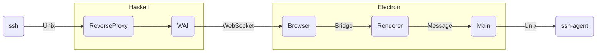
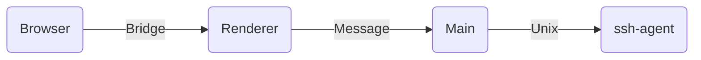

This post introduces how to forward an ssh-agent through WebSockets using [Electron][electron].
In three parts, I present:

- A reverse proxy to listen for ssh-agent clients such as git.
- A Web Application Interface (WAI) to forward ssh-agent requests through WebSockets.
- An Electron app to bridge a local ssh-agent.

This post is a literate haskell file that implements the following architecture:


The following libraries are used for the backend:

```haskell
{-# LANGUAGE BlockArguments, OverloadedStrings, QuasiQuotes #-}

-- rio, a standard library to extend the default Prelude
import RIO
import RIO.Directory (removeFile)

-- network for the unix domain socket service
import Network.Socket (Socket, socket, bind, listen, accept, close, defaultProtocol)
import Network.Socket (SockAddr(SockAddrUnix), Family(AF_UNIX), SocketType(Stream))
import Network.Socket.ByteString (recv, sendAll)

-- wai, warp and websocket for the http service
import Network.WebSockets qualified as WS
import Network.Wai.Handler.WebSockets qualified as WaiWS
import Network.Wai qualified as Wai
import Network.Wai.Handler.Warp qualified as Warp
import Network.HTTP.Types.Status (status200, status404)

-- string-qq to embed the multi-line JavaScript client
import Data.String.QQ (s)
```

:::{.hidden}
Imports to cleanup the `markdown-unlit` metadatas.
```haskell
import Data.Text.Lazy qualified as Text
import Data.Text.Lazy.Encoding qualified as Text
```

> This document is a literate haskell file. You can run the demo with:
> nix develop .#gstreamer --command ghcid --command "ghci -XGHC2021 -pgmL markdown-unlit -optL haskell -optL html" --test=:main forwarding-ssh-agent-through-electron.lhs

:::


## Unix Domain Socket Server

In this section, I implement a local server to listen for ssh-agent requests.
The service waits for an ssh-agent client to connect to the
unix domain socket before serving it with the websocket client.

```haskell
reverseProxy :: WS.Connection -> IO Void
reverseProxy wsConn = unixService "/tmp/remote-agent.socket" \agentClient -> do
  putStrLn "Forwarding request..."

  -- Tell the remote client that a new request is starting.
  let wsSend = WS.sendBinaryData wsConn
  wsSend mempty

  -- Forward the local client messages to the remote endpoint.
  let reader = do
        buf <- recv agentClient 4096
        wsSend buf
        unless (buf == mempty) reader

  -- Forward the remote messages to the local client.
  let writer = forever do
        buf <- WS.receiveData wsConn
        sendAll agentClient buf

  -- Run both the reader and writer action concurrently.
  void $ race reader writer
  putStrLn "Completed request"
```

Here is an helper to bootstrap the service:

```haskell
unixService :: FilePath -> (Socket -> IO ()) -> IO Void
unixService fp cb =
    bracket (socket AF_UNIX Stream defaultProtocol) close \socket ->
    bracket_ (bind socket (SockAddrUnix fp)) (removeFile fp) do
        listen socket 5
        forever do
            (client, _) <- accept socket
            cb client
```

The next section shows how to serve the reverse proxy over http.

## WebSocket proxy

In this section, I implement an http service to expose the reverse proxy.
The WAI application is composed of the websocket server app and a minimal
http service to provide the web-page.

```haskell
-- | The service is protected by an MVar to ensure a single agent is connected.
reverseProxyServer :: MVar () -> WS.ServerApp
reverseProxyServer lock pendingConnection = withMVar lock \_ -> do
    wsConn <- WS.acceptRequest pendingConnection
    putStrLn "New provider..."
    void $ WS.withPingThread wsConn 30 (pure ()) (reverseProxy wsConn)

waiApp :: Wai.Application
waiApp req resp = resp $ case Wai.rawPathInfo req of
    "/" -> Wai.responseLBS status200 [] indexHtml
    _ -> Wai.responseLBS status404 [] mempty

main :: IO ()
main = do
    lock <- newMVar ()
    Warp.run 22022 (mkApp (reverseProxyServer lock) waiApp)
  where
    mkApp = WaiWS.websocketsOr WS.defaultConnectionOptions

indexHtml :: LByteString
indexHtml = [s|
```

Here is the web-page to initialize the remote client:

```html
<!DOCTYPE html>
<html>
  <head>
    <title>SshAgent Reverse Proxy</title>
    <script>
// Create the WebSocket.
const webSocket = new WebSocket('ws://' + window.location.host)

// Make the socket works with binary data.
webSocket.binaryType = 'arraybuffer';
webSocket.onopen = () => console.log("Connected!")

// Handle message from the server.
let connected = false
webSocket.onmessage = event => {
  const buf = new Uint8Array(event.data)
  if (buf.length == 0) {
    if (!connected) {
      console.log("Initializing the connection")
      sshAgentAPI.connect((data) => webSocket.send(data))
    }
    connected = !connected
  } else {
    console.log("Sending message")
    sshAgentAPI.send(buf)
  }
}
    </script>
  </head>
  <body>Welcome!</body>
</html>
```

:::{.hidden}
A small helper to remove `markdown-unlit` metadata:

```haskell
|] & cleanup

cleanup :: LText -> LByteString
cleanup = Text.encodeUtf8 . Text.unlines . filter removeMarkdownMarker . Text.lines
  where
    removeMarkdownMarker = not . Text.isPrefixOf "#line "
```
:::

The next section shows how to implement the `sshAgentAPI` for the `connect` and `send` function.

## Electron Bridge

The [Electron][electron] client implements context isolation to sandbox the web page.
We need to preload some code to expose the host APIs and enable the web page to access the ssh-agent.

I don't fully understand this part, but this workflow works:

- Perform the I/O in the main process and forward the data using a `MessageChannel`.
- Create the channel in the renderer process and share the port with the main process.
- Use `contextBridge.exposeInMainWorld` to create a new API for the browser.



It does not seem possible to directly share the local network API with the browser context.
Only certain types of objects can be passed through IPC channels, see [Object serialization](https://www.electronjs.org/docs/latest/tutorial/ipc#object-serialization).
Moreover `MessageChannel` ports don't seem to work between the main and browser context.
Therefore, it is necessary to implement an intermediary API, as demonstrated below:

```javascript
// forward-ssh-agent.js

const { app, ipcMain, BrowserWindow } = require('electron')
const path = require('path')
const net = require("net")

// Connect to the ssh-agent socket
const connectSshAgent = (port) =>  {
  console.log("Connecting to ssh-agent...")
  const client = net.createConnection(process.env.SSH_AUTH_SOCK)
    .on('data', data => {
        console.log("Server:", data)
        port.postMessage(data)
    })
  port.on('message', ev => {
    console.log("Client:", ev.data)
    client.write(ev.data)
  })
  port.start()
}

// Start the electron app.
app.whenReady().then(() => {
  const win = new BrowserWindow({
    webPreferrences: {
        sandbox: true,
    },
    webPreferences: {
      preload: path.join(__dirname, 'ssh-agent.js'),
    }
  });

  // Hook main side of the ssh-agent preload.
  ipcMain.on('connectSshAgent', (event) =>  { connectSshAgent(event.ports[0]); })

  // Comment to hide dev tools on start.
  win.webContents.openDevTools()

  // Load the url given on the command line.
  win.setMenu(null);
  win.loadURL(process.argv[process.argv.length - 1])
})
```

Here is the pre-load script which implements the `sshAgentAPI`.

```javascript
// ssh-agent.js

const { contextBridge, ipcRenderer } = require("electron");
let port;
contextBridge.exposeInMainWorld("sshAgentAPI", {
  // Send data to the ssh-agent
  send: (data) => {
    console.log("Sending data to main", data)
    port.postMessage(data)
  },
  // Initialize a new ssh-agent request.
  connect: (onData) => {
    // Create communication channel between main and render.
    const channel = new MessageChannel()
    ipcRenderer.postMessage("connectSshAgent", null, [channel.port1])

    // Receive data from the ssh-agent.
    channel.port2.onmessage = (ev) => {
      console.log("Sending data back to browser", ev)
      onData(ev.data)
    }

    // Register the other end of the channel.
    port = channel.port2
  }
})
```

Finally, the client can be started with this command: `electron forward-ssh-agent.js http://localhost:22022/`.

## Conclusion

Once again, it wasn't obvious that this implementation would work.
I had to use trial and error as a means of understanding the context sandbox.
In the end, I am happy to have learnt more about Electron, it looks like a
good platform to run web apps without the clutter of a traditional web browser.

[electron]: https://electronjs.org
