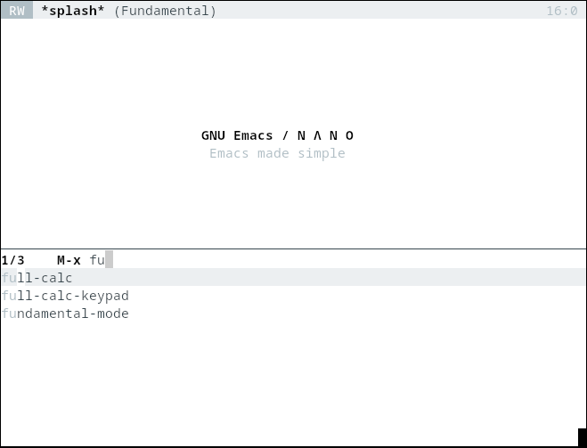
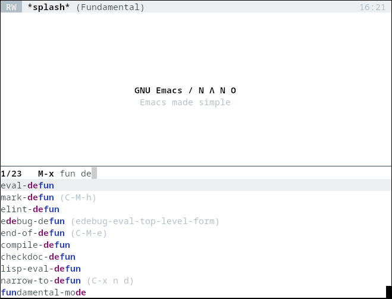

In this post, I will show how I migrated my completion framework from Ivy to Vert&co.

In my last post, [[emacs-30|Why Emacs Is The Best]], I listed completion framework as the top feature of Emacs and I would like to explain this point in more detail.

:::{.flex .items-center .justify-center}

:::

## Context

As a long-time Emacs user, I switched from `ido` to `ivy` a few years ago for my completion needs. `helm` was also a popular package back then, but I chose `ivy` because it was leaner. The main reasons for this switch were:

- Fuzzy matching on vertical listing looks more natural, and
- Counsel commands like *git-grep* are strictly more useful than their default equivalents.

Ivy also comes with `swiper`, but I rarely used it; instead, I mostly relied on `counsel-git-grep` and `isearch`.

Even though I only used Ivy's most basic features, it was an essential package for my workflow.
Thus, it was concerning to me that it broke with Emacs 30.
Fortunately, it didn't take me long to discover Vert&co, the main popular alternative package.


## Completion Frameworks

In this section, I present the two main frameworks.

### The Ivy Stack

The Ivy stack is composed of three packages from a single repository named [swiper](https://github.com/abo-abo/swiper):

| **Package** | **Description**                        |
|-------------|----------------------------------------|
| ivy         | Incremental Vertical completYon        |
| counsel     | Various completion functions using Ivy |
| swiper      | Isearch with an overview.  Oh, man!    |

Ivy provides the base machinery, and Counsel integrates powerful functions to replace standard commands like *switch-to-buffer* or *git-grep*.

### The Vert&co Stack

Vert&co, also known as the Minad stack, is composed of similar packages, but they are standalone and developed independently:

| **Package** | **Description**                                      |
|-------------|------------------------------------------------------|
| vertico     | VERTical Interactive COmpletion                      |
| orderless   | Completion style for matching regexps in any order   |
| consult     | Consulting completing-read                           |
| marginalia  | Enrich existing commands with completion annotations |
| embark      | Conveniently act on minibuffer completions           |

> [@minad][minad] created the main packages, but note that orderless and embark are made by [@oantolin][oantolin].

## Vert&co MVP

In this section, I present a most minimal setup:

First, activate *vertico*:
```elisp
(vertico-mode)
```

Now, pressing <kbd>ALT</kbd>+<kbd>x</kbd>, or any command using completion like `switch-to-buffer`, shows a vertical list of candidates:

:::{.flex .items-center .justify-center}

:::

Then, activate *orderless* to enable fuzzy match filtering:
```elisp
(setq completion-styles '(orderless basic))
```

Now, you can efficiently search the list of entries:

:::{.flex .items-center .justify-center}

:::

Finally, set up *consult*:
```elisp
(global-set-key (kbd "C-x b") 'consult-buffer)
```

This replaces the default `switch-to-buffer` command to include:

- Recent files, so that loading a file is seamless whenever it has been been recently closed.
- Bookmarks for direct access to important locations.

With this minimal setup, I recovered 90% of the usability I had with Ivy. In the next sections I explain how I finished the migration.

## Tweaks Similar to Ivy

Ivy being a full solution, it comes with some opinionated behaviors that I needed to set up in this new stack.

### Scroll with Page Down

By default, Ivy lets you scroll the results with the pages keys, and to keep my muscle memory, I had to tweak the vertico keymap.
Fortunately, it is well documented, and here is how to change the keybindings:

```elisp
(keymap-set vertico-map "<next>"  'vertico-scroll-up)
(keymap-set vertico-map "<prior>" 'vertico-scroll-down)
```

> Use `C-h k` to discover the name of a key and what it does.

### Vertico Directory

When completing file paths, Ivy removes the current directory name when pressing <kbd>DEL</kbd>.
That is, instead of peeling the last letter, it goes straight to the logical parent entry, which is what I want most of the time. This can be implemented using `vertico-directory`:

```elisp
(require 'vertico-directory)
(keymap-set vertico-map "DEL" 'vertico-directory-delete-char)
```

### Embark

Embark is quite a rabbit hole, and I can see how it may significantly change how I use Emacs. Here my goal was simply to recover the following workflow:

To search through a project, I ran `M-x counsel-git-grep` command, typed what I was looking for, then pressed enter to visit the match. To go to the next match, I would repeat the command and press `M-p` to put the cursor back on the last selection.

Vertico/consult doesn't recover the last search position like that; instead you can use Embark. First, you need to bind the `embark-act` command like that:

```elisp
(global-set-key (kbd "C-.") 'embark-act)
```

Then in the mini buffer, when presented with a list of choices, use the embark command to export the list to a temporary buffer that you can explore and further refine the search results.

I barely scratched the surface of Embark, but it looked very intuitive: just running the `embark-act` command anywhere provides a list of useful commands depending on the context. For example, when the cursor is on a URL, embark suggests the *browse-url* command.

## use-package

I was a bit overwhelmed by the number of packages needed by Vert&co, but I came to appreciate their individual simplicity.

The authors put a lot of work into the documentation to explain how everything fits together, and I was able to use the Vert&co stack in no time. I also liked how they leverage the `use-package` facility to introduce modular customization. For completeness, here is my full configuration:

```elisp
(use-package vertico
  :custom
  (vertico-count 20)  ;; limit to a fixed size
  :bind (:map vertico-map
    ;; Use page-up/down to scroll vertico buffer, like ivy does by default.
    ("<prior>" . 'vertico-scroll-down)
    ("<next>"  . 'vertico-scroll-up))
  :init
  ;; Activate vertico
  (vertico-mode))

;; Convenient path selection
(use-package vertico-directory
  :after vertico
  :ensure nil  ;; no need to install, it comes with vertico
  :bind (:map vertico-map
    ("DEL" . vertico-directory-delete-char)))

(use-package orderless
  :custom
  ;; Activate orderless completion
  (completion-styles '(orderless basic))
  ;; Enable partial completion for file wildcard support
  (completion-category-overrides '((file (styles partial-completion)))))

(use-package consult
  :custom
  ;; Disable preview
  (consult-preview-key nil)
  :bind
  (("C-x b" . 'consult-buffer)    ;; Switch buffer, including recentf and bookmarks
   ("M-l"   . 'consult-git-grep)  ;; Search inside a project
   ("M-y"   . 'consult-yank-pop)  ;; Paste by selecting the kill-ring
   ("M-s"   . 'consult-line)      ;; Search current buffer, like swiper
   ))

(use-package embark
  :bind
  (("C-."   . embark-act)         ;; Begin the embark process
   ("C-;"   . embark-dwim)        ;; good alternative: M-.
   ("C-h B" . embark-bindings)) ;; alternative for `describe-bindings'
  :config
  (use-package embark-consult))
```


## Conclusion

Vert&co offers many features, such as `consult-line` to replace Swiper. However the vanilla experience is great, and I barely needed anything else.

[@minad][minad] also developed an alternative to Company for in-buffer completions with the Corfu and Cape packages. That sounds very interesting since it uses the same UI as Vertico, and I will explore it in the future.

For now I am happy with the change, and I have caught up with the state of the art for completion in Emacs. I would like to thank [@abo-abo][abo] for Ivy; I think it paved the way for vert&co and I am grateful for it!

[abo]: https://github.com/abo-abo
[minad]: https://github.com/minad
[oantolin]: https://github.com/oantolin
