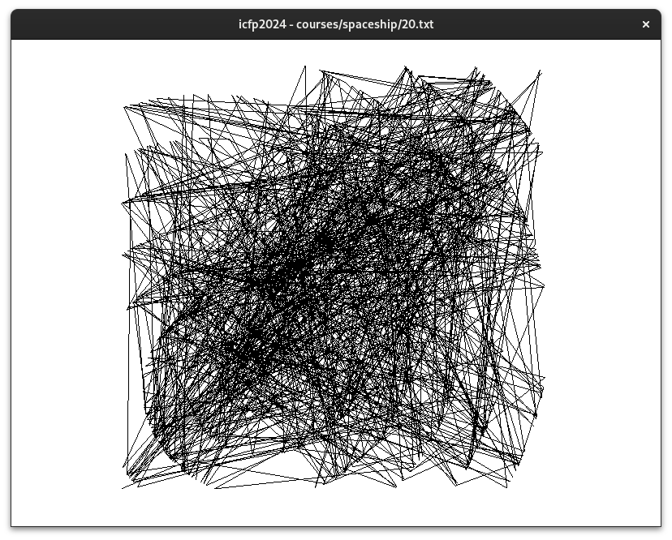
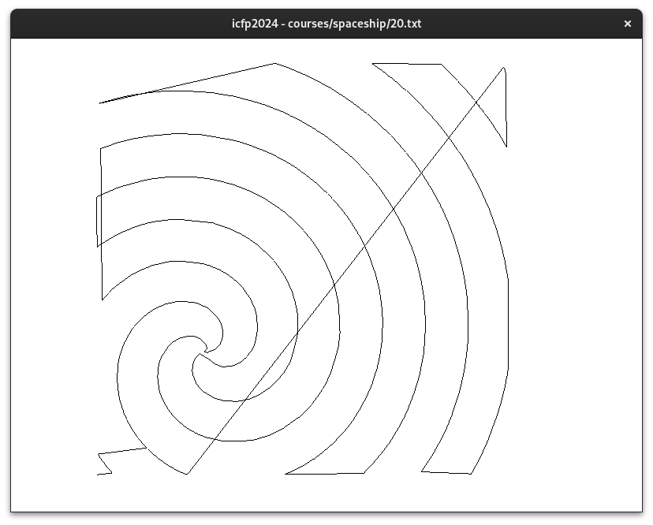

The International Conference on Functional Programming ([ICFP][icfp]) Programming Contest is a three days annual event.
This post is my participation report.

:::{.flex .items-center .justify-center}

:::

[icfp]: https://icfp23.sigplan.org/

---

In three parts I present how I worked on the contest:

- Alien programming language interpretation.
- Spaceship operation.
- String compression.

I include many code samples for the curious reader, but feel free to skip over them or checkout the [repository](https://github.com/TristanCacqueray/icfpc2024).


## Context

A month before the event started, I posted a [call for participants][cfp] on the Haskell forum and created a chat room on matrix.
Three members of the community joined, but on the day of the event, only [@kindaro][kindaro] was available.
As for myself, I needed some rest and was thinking about calling it off.

Nevertheless, on Friday 28 June 2024 at 12:00 UTC, the event started with the following setup:
A forgotten society called the *Cult of the Bound variable* was recently observed in space.
The researchers created a communication gateway to send and receive messages through HTTP requests.
The people of this society conversed through a programming language called Interstellar Communication Functional Programs (ICFP term).

The organizer provided a [specification][spec] for the language and suggested we start by sending the following program: `S'%4}).$%8`.
After interpreting the response, we were introduced to the School of the Bound Variable which offered several courses that needed to be completed.

Even though we were unprepared, this looked reasonable and we decided to give it a shot.
The following sections present the main work I did over the weekend.

[spec]: https://icfpcontest2024.github.io/icfp.html
[cfp]: https://discourse.haskell.org/t/team-jkrt-participation-to-the-icfp-programming-contest-2024-june-29th/9454


## Alien Language

In order to participate, we had to read and write ICFP terms.
In this first part I introduce the term semantic and how I implemented a parser and evaluator for the alien language.


### Hello World

As suggested by the organizer, here is how the communication channel looked like:

```ShellSession
$ curl -XPOST https://boundvariable.space/communicate -d"S'%4}).$%8"
SB%,,/}!.$}7%,#/-%}4/}4(%}M#(//,}/&}4(%}</5.$}P!2)!",%_~~<%&/2...
```

The response is a program that needs to be interpreted.

### ICFP term

The [specification][spec] page described the language.
It looked like a lambda calculus with extra operators and values.
Thus, I wrote the simplest data type to represent the term expression:

```haskell
data Expr
  = EBool Bool
  | EInt Natural
  | EStr Text
  | EUnary Char Expr
  | EBinary Char Expr Expr
  | EIf Expr Expr Expr
  | ELam Natural Expr
  | EVar Natural
  deriving (Show, Eq, Ord)
```

> Function applications are implemented with the '$' binary operator.

The terms are encoded using a space separated list of instruction which looked like this: `B$ B$ L# L$ v# B. SB%,,/ S}Q/2,$_ IK`.
The next section introduce a parser for this language.

### Parser

I recently used [attoparsec][attoparsec] for processing Pipewire properties, and I did the same for decoding ICFP terms:

[attoparsec]: https://hackage.haskell.org/package/attoparsec-0.14.4/docs/Data-Attoparsec-Text.html

```haskell
import Data.Attoparsec.Text qualified as P

parseExpr :: Text -> Either String Expr
parseExpr = P.parseOnly (exprP <* P.endOfInput)
```

The main parser looked like this:

```haskell
exprP :: P.Parser Expr
exprP = P.skipSpace >> p
 where
  p =     taggedP 'T' EBool (pure True)
      <|> taggedP 'F' EBool (pure False)
      <|> taggedP 'I' EInt intP
      <|> taggedP 'S' EStr stringP
      <|> taggedP 'v' EVar natP
      <|> (P.char 'U' *> unaryP)
      <|> (P.char 'B' *> binaryP)
      <|> (P.char '?' *> ifP)
      <|> (P.char 'L' *> lambdaP)

  taggedP :: Char -> (a -> b) -> P.Parser a -> P.Parser b
  taggedP c tag parser = P.char c *> (tag <$> parser)
```

The string used an ASCII like encoding but with a different order:

```haskell
-- | Parse a list of printable characters
asciiP :: P.Parser Text
asciiP = P.takeWhile (\c -> c >= '!' && c <= '~')

-- | Parse and decode ICFP string
stringP :: P.Parser Text
stringP = fmap decodeString asciiP

-- | Remap from ASCII to ICFP order
decodeString :: Text -> Text
decodeString = T.map convertChars
 where
  convertChars c = charOrder !! (fromEnum c - 33)

charOrder :: String
charOrder = "abcdefghijklmnopqrstuvwxyzABCDEFGHIJKLMNOPQRSTUVWXYZ0123456789!\"#$%&'()*+,-./:;<=>?@[\\]^_`|~ \n"
```

The integer were encoded in base 96:

```haskell
intP :: P.Parser Natural
intP = str2int <$> asciiP

str2int :: Text -> Natural
str2int = T.foldl' go 0
 where
  go acc c = acc * 94 + (fromIntegral (fromEnum c) - 33)
```

Parsing the remaining terms was trivial:

```haskell
lambdaP :: P.Parser Expr
lambdaP = ELam <$> natP <*> exprP

ifP :: P.Parser Expr
ifP = EIf <$> exprP <*> exprP <*> exprP

unaryP :: P.Parser Expr
unaryP = EUnary <$> P.anyChar <*> exprP

binaryP :: P.Parser Expr
binaryP = EBinary <$> P.anyChar <*> exprP <*> exprP
```

That's all it took to decode the ICFP terms (checkout the full [Parser.hs][parser] module). Here is how the example expression looked like once decoded:

```ShellSession
λ> parseExpr "B$ B$ L# L$ v# B. SB%,,/ S}Q/2,$_ IK"
Right
    ( EBinary '$'
        ( EBinary '$'
            ( ELam 2
                ( ELam 3
                    ( EVar 2 )
                )
            )
            ( EBinary '.'
                ( EStr "Hello" )
                ( EStr " World!" )
            )
        )
        ( EInt 42 )
    )
```

Lovely, the next step was to implement an evaluator.

### Call By Name

The language used a call by name semantic, here is what I wrote to interpret the terms:

```haskell
evalExpr :: Expr -> Either String Expr
evalExpr expr = case expr of
  EUnary '-' e | Right (EInt x)  <- evalExpr e -> pure $ EInt (negate x)
  EUnary '-' _ -> Left "Expected a int"
  EUnary '!' e | Right (EBool x) <- evalExpr e -> pure $ EBool (not x)
  -- Function application:
  EBinary '$' e1 e2 | Right (ELam var body) <- evalExpr e1 -> evalExpr $ subst var e2 body
  EBinary '.' e1 e2
    | Right (EStr s1) <- evalExpr e1
    , Right (EStr s2) <- evalExpr e2 -> pure $ EStr (s1 <> s2)
  -- other binary operator omited
  EVar v -> Left $ "Unbound var: " <> show v
  e -> pure e
```

In case you are not familiar with this syntax, the pattern guards let you match further expressions using `| pattern <- value -> result`.
This is useful to avoid nesting case expressions. For example, The first match above is equivalent to:

```haskell
evalExpr expr = case expr of
  EUnary '-' e -> case evalExpr e of
    Right (EInt n) -> Right $ EInt $ negate n
    _ -> Left "Expected a int"
```

At first I forgot to handle variables substitution, and even though the original implementation worked in most cases,
some terms were diverging. We needed to use the following function:

```haskell
-- | Replace the variables matching the given name
subst :: Natural -> Expr -> Expr -> Expr
subst name expr = \case
  EUnary o e -> EUnary o (doSub e)
  EBinary o e1 e2 -> EBinary o (doSub e1) (doSub e2)
  EVar v
    | -- Substitute the variable
      v == name -> expr
    | otherwise -> EVar v
  EIf e1 e2 e3 -> EIf (doSub e1) (doSub e2) (doSub e3)
  ELam v b
    | -- The variable is shadowed, stop here
      v == name -> ELam v b
    | otherwise -> ELam v (doSub b)
  e -> e
 where
  doSub = subst name expr
```

With the above evaluator (checkout the full [Eval.hs][eval] module), we could now interpret programs, for example:

```ShellSession
λ> evalExpr =<< parseExpr "B$ B$ L# L$ v# B. SB%,,/ S}Q/2,$_ IK"
Right (EStr "Hello World!")
```

Thanks to Haskell, it only took us a couple of hours to read and interpret this new language.
My teammate worked on property testings and implemented a printer so that we could transmit messages.
Then I implemented a little `communicate` helper to send messages and decode responses,
for example, to send the first message:

```ShellSession
λ> communicate "S'%4}).$%8"
Sending...   (EStr "get index")
Receiving... (EStr "Hello and welcome to the School of the Bound Variable!...")
```

The response contained instructions to enroll and complete the different courses.
The next section presents how I solved the *spaceship* course.

[parser]: https://github.com/TristanCacqueray/icfpc2024/blob/main/src/ProgCon/Parser.hs
[eval]: https://github.com/TristanCacqueray/icfpc2024/blob/main/src/ProgCon/Eval.hs

## Spaceship Course

The goal of this course was to operate a spaceship to reach a list of destinations.
For each step, we could adjust the velocity using a numeric pad.
To complete the course, we needed to provide the list of inputs for creating a path that visits every destination.

For example, submitting `236659` makes the spaceship visit the following locations: `(0,0) (0,-1) (1,-3) (3,-5) (6,-7) (9,-9) (13,-10)`.

### Levels input

The course contained 25 levels defined by the list of destinations coordinates.
For example, here is how the level 20 looked like:


### First solver

Our first solution consisted of the following procedure, for each destination:

- Accelerate once toward the destination.
- Cruise by pressing '5' until we reached the destination.
- Decelerate.

This procedure can be applied for each axis independently.
The core implementation looked like this:

```haskell
-- | A basic one dimension thrust generator
genThrust :: Int32 -> Int32 -> Int32 -> Int32
genThrust velocity start end
  | -- start moving
    velocity == 0 = signum (end - start)
  | -- stop moving once the destination is reached
    start == end = negate velocity
  | -- just cruise
    otherwise = 0
```

Here is the rest of the supporting code for reference:

```haskell
-- | Compute the thrust to apply for reaching a destination.
genShipThrust :: Ship -> Destination -> IVec2
genShipThrust ship destination =
  ivec2
    (genThrust ship.vel.x ship.pos.x destination.x)
    (genThrust ship.vel.y ship.pos.y destination.y)

-- | Compute the thrust String for reaching a destination.
genThrusts :: Ship -> Destination -> (String, Ship)
genThrusts iship destination = go "" iship
 where
  go :: String -> Ship -> (String, Ship)
  go acc ship
    | -- we reached the destination, stop now
      ship.pos == destination = (reverse newAcc, newShip)
    | otherwise = go newAcc newShip
   where
    thrust = genShipThrust ship destination
    newShip = applyThrust thrust ship
    newAcc = thrustChar thrust : acc

-- | Compute the full thrust String for reaching all the destinations.
solve :: [Destination] -> String
solve = go [] initialShip
 where
  go acc _ship [] = concat (reverse acc)
  go acc ship (destination : rest) = go (thrusts : acc) newShip rest
   where
    (thrusts, newShip) = genThrusts ship destination

-- | Update the ship based on a new thrust
applyThrust :: IVec2 -> Ship -> Ship
applyThrust thrust ship = Ship {vel, pos}
 where
  vel = ship.vel + thrust
  pos = ship.pos + vel

data Ship = Ship {pos :: IVec2, vel :: IVec2}
type Destination = IVec2

initialShip :: Ship
initialShip = Ship 0 0

thrustChar :: IVec2 -> Char
thrustChar thrust =
  case (thrust.x, thrust.y) of
    (1, 1) -> '9'
    (0, 1) -> '8'
    (-1, 1) -> '7'
    (1, 0) -> '6'
    (0, 0) -> '5'
    (-1, 0) -> '4'
    (1, -1) -> '3'
    (0, -1) -> '2'
    (-1, -1) -> '1'
    _ -> 'X'
```

Ten hours into the contest, this solution worked for some of the levels, and we reached position `#74` out of 160 participating teams.
This procedure produced impractical solutions for some of the levels when the destinations were too far apart.
In the next sections, I present a couple of improvements.

### Traveling Salesman

The first major improvement was to sort the positions to minimize the travel distance.
This meant solving the traveling salesman problem.

Here is what the problem 20 looked like after drawing a line between consecutive destinations:



Obviously, this is not a good travel plan.
To improve it, I implemented the following function to arrange the destination by proximity:

```haskell
optimizeOrder :: [Destination] -> [Destination]
optimizeOrder = go [] 0
 where
  -- Order by repeatedly finding the closest destination from the previous location 'pos'
  go acc _pos [] = reverse acc
  go acc pos (x : xs) =
    let
      -- Get the new closest pos and the list of remaining destinations
      ((_, closestPos), others) = foldl' (go' pos) ((idist pos x, x), []) xs
    in
      go (closestPos : acc) closestPos others

  -- Separate the closest position from the rest
  go' pos (prev@(prevClosestDistance, prevClosestPos), others) destination
    | -- The current destination is the new closest
      destinationDist < prevClosestDistance =
        ((destinationDist, destination), prevClosestPos : others)
    | -- otherwise keep the previous closest
      otherwise = (prev, destination : others)
   where
    destinationDist = idist pos destination

idist :: IVec2 -> IVec2 -> Int32
idist p t = dist.x + dist.y
 where
  dist = abs (p - t)
```

… which resulted in this arrangement:


It's not the best solution, but it was good enough to pass most levels.
This was Saturday morning, and we reached position `#42`.

### Faster travel

To solve the really big levels, we had to increase the ship's velocity.
This was surprisingly hard to implement.
My teammate suggested an analytical solution and showed some derivative formulas,
but I was not able to implement it.

Instead, I replaced the original iterative approach by implementing a straightforward strategy:

- Compute the braking distance to kill the velocity.
- If this distance is smaller than the destination, then accelerate.
- Otherwise, start decelerating.

Here is the new *genThrust* implementation:

```haskell
calcBrakingDistance :: Int32 -> Int32
calcBrakingDistance x = x * (x + 1) `div` 2

genThrust :: Int32 -> Int32 -> Int32 -> Int32
genThrust velocity start end
  | -- stop
    start == end = if abs velocity > 1 then error "Going too fast!" else negate velocity
  | -- decelerate
    distance < brakingDistance = negate accelThrust
  | -- accelerate
    distance >= nextBrakingDistance = accelThrust
  | -- cruise
    otherwise = 0
 where
  distance = abs (start - end)
  accelThrust = signum (end - start)
  brakingDistance = calcBrakingDistance (abs velocity)
  nextBrakingDistance = calcBrakingDistance (abs velocity + 1)
```

By the end of Saturday we fell to position `#82`, and by applying this new strategy we
climbed back to position `#41`.

The competition kept on going and toward the end we were `#65`.
Fortunately, kindaro was able to significantly improve the solver by:
- avoiding a full stop at each destination when the next one is on the path, and,
- using a better destination order.

Our last position was `#51` (out of 160). Not bad!

## String Packer

There were 3 other courses:

- Lambda-Man, a sort of pac-man where the goal is to eat all the pills in a rectangular grid.
- Efficiency, an interpreter challenge to evaluate custom programs.
- 3d, a time-travel-oriented programming language using a 2D grid of cells.

We skipped the last two and my teammate worked on the Lambda-Man.
In the next section, I show how I was able to improve our score.

### Compressing Common Substring

This course was evaluated by the size of the solution, thus, I investigated how to compress ICFP terms.

The idea was to find the longest repeated substrings and replace them using lambda variables.
I used the [string-similarity](https://hackage.haskell.org/package/string-similarity) package
to implement the following code generator:

```haskell
import Data.Text qualified as T
import Data.List.CommonSubstring (longestSubstring)

pack :: Text -> Expr
pack = toTerm . splitLongest

toTerm :: SplitResult -> Expr
toTerm res = case res.repeatSplit of
  Nothing -> rawStr
  Just (longest, xs) ->
    let packedExpr = EBinary '$' (ELam 1 (mkBody xs)) (EStr longest)
    in  if T.length (printer packedExpr) < T.length res.original
          then packedExpr
          else rawStr
 where
  rawStr = EStr res.original
  mkBody [] = error "empty body!"
  mkBody [i] = itemTerm i
  mkBody (i : is) = EBinary '.' (itemTerm i) (mkBody is)

  itemTerm = \case
    Nothing -> EVar 1
    Just txt -> EStr txt

data SplitResult = SplitResult
  { original :: Text
  , repeatSplit :: Maybe (Text, [Maybe Text])
  }

splitLongest :: Text -> SplitResult
splitLongest txt = SplitResult txt repeatSplit
 where
  repeatSplit
    | T.length longest > 3 = Just (longest, removeLongest [] txt)
    | otherwise = Nothing
  (T.unpack -> x, T.unpack -> y) = T.splitAt (T.length txt `div` 2) txt
  longest = T.pack $ longestSubstring x y

  removeLongest acc rest = case T.breakOn longest rest of
    ("", "") -> reverse acc
    (last', "") -> reverse (Just last' : acc)
    (last', matched) -> case T.splitAt (T.length longest) matched of
      (_, remaining) -> case last' of
        "" -> removeLongest (Nothing : acc) remaining
        _ -> removeLongest (Nothing : Just last' : acc) remaining
```

Here is an example output:

```ShellSession
λ> pack "96 5555 97 5555 end"
EBinary '$' (ELam 1 (EBinary '.' (EStr "96") (EBinary '.' (EVar 1) (EBinary '.' (EStr "97") (EBinary '.' (EVar 1) (EStr "end")))))) (EStr " 5555 ")
```

This provided a slight improvement to some solutions
but more work was needed to really improve the output.
The main problem is that string-similarity works by comparing two strings, thus, I had to split the input in half.
What we really needed was a method to find the longest repeated substring inside a single string.

### Suffix Tree

Looking at the Wikipedia page on this subject [Longest repeated substring problem](https://en.wikipedia.org/wiki/Longest_repeated_substring_problem),
I learned about suffix tree.
Using the [sufixtree](https://hackage.haskell.org/package/suffixtree) package I implemented the following solution:

```haskell
import Data.SuffixTree qualified as ST

-- | Return the longest repeated substring:
-- >>> longestRepeatedSubstring "solve lambda abc is abc is the end"
-- " abc is "
--
-- >>> longestRepeatedSubstring "UDLLLDURRRRRURR" -- should be URR
-- "RRRR"
longestRepeatedSubstring :: String -> String
longestRepeatedSubstring = getLongest . ST.construct

-- | Return the longest shared string.
-- Q: How to get the most shared, not necessarly the longest?
getLongest :: ST.STree Char -> String
getLongest = go ""
 where
  go acc = \case
    -- the deepest internal node in the tree with more than one child
    ST.Node xs@(_ : _ : _) -> case maximumBy (compare `on` length) $ map (goNode acc) xs of
      [] -> acc
      nested -> nested
    _ -> []
  goNode acc (p, n) = go (acc <> ST.prefix p) n
```

However, as explained in the doctest, this doesn't handle overlapping substring.
I eventually ran out of time and couldn't figure out a satisfactory implementation.
This looks like an interesting problem and I was surprised to not be able to find a readily available implementation.

## Conclusion

We had a great time participating in this contest. I didn't knew my teammate before the event, and it was a lot of fun to discuss the challenge and share some code.
The subject was fascinating, and I wished we had more energy and brain power to reach a better score.

In this article, I shared the code I wrote in the past three days, checkout the [repo][icfpc2024] to get the full picture.
It's not the fanciest Haskell, after-all this was written in a hurry.
Note that Haskell enables much more advanced solution, for example:

- [Control.Lens.Plated][plated] to traverse the Expr data, see [Optics are monoids](https://www.haskellforall.com/2021/09/optics-are-monoids.html).
- [unification-fd][unification-fd] to implement a type checker.
- [recursion-schemes][recursion-schemes] to traverse any data.

Using a simpler solution has benefits too, and I hope you were able to follow the implementation.

I am looking forward attending the contest next year, hopefully by being more prepared.
If you would like to join our team next time, please let me know!
Thanks for your time!

[icfpc2024]: https://github.com/TristanCacqueray/icfpc2024/tree/main/src
[plated]: https://hackage.haskell.org/package/lens-5.3.2/docs/Control-Lens-Plated.html
[unification-fd]: https://hackage.haskell.org/package/unification-fd
[recursion-schemes]: https://hackage.haskell.org/package/recursion-schemes
[kindaro]: https://github.com/kindaro/
