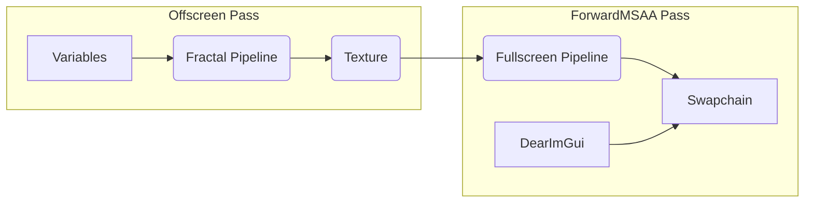

This post introduces [animation-fractal][af], an app to create live visuals.
In two parts, I present:

- How the project works, and,
- What the implementation looks like.

But first, here is a video  where I demonstrate the app along with a modular synthesizer:

<iframe width="560" height="315" src="https://www.youtube.com/embed/LqAKjAut_ag" title="YouTube video player" frameborder="0" allow="accelerometer; autoplay; clipboard-write; encrypted-media; gyroscope; picture-in-picture" allowfullscreen></iframe>


## Generative Art

The base principle of generative art is to create images using a computer system.
I am mostly interested in the following two techniques, [IFS][ifs] and [SDF ray marching][sdf-ray-marching]:

- IFS stands for Iterated Function System, where we recursively evaluate a function and observe it's behavior.
For example, $z = z^2 + c$ produces the mandelbrot set.

- Ray marching is a form of ray casting method where we create objects with a signed distance function (SDF).

We implement a function to produce a color for each pixel.
This kind of work is best performed on the graphic cards using a fragment shader.


## Fragment Shader

The [shadertoy][shadertoy] website lets you interact with fragment shaders directly in your web browser.
Given a pixel coordinate named `fragCoord.xy`, the shader code outputs the pixel color named `fragColor` to render a fullscreen image.

The shadertoy environment provides additional variables, such as the window resolution `iResolution` and the elapsed time `iTime`.
The shader code is defined with the [GLSL ES][glsl] language, here is an example:


The shader function `mainImage` is executed very quickly by the graphic card for each individual pixel.
This execution is highly concurrent and it is suitable for realtime rendering.

Shadertoy is truely fascinating. Inspired by the possibilities, I wanted more:

- Variables with controllers, and,
- Offscreen rendering, using scripted modulations.

Thus, I had to build my own thing, and the next sections describe how I went about it.


## Haskell GameDev

I decided to use the Haskell language to write [animation-fractal][af].
I chose Haskell because:

- The expressive type system lets me define and modify every part of the system with the invaluable help of the compiler.
- The tooling provides a great developer experience: REPL with GHCi, editor integration with the [haskell-language-server][hls] and [ghcid][ghcid] for reloading the code. Static analysis tool such as [hlint][hlint], [weeder][weeder] and [calligraphy][calligraphy] are also very useful.
- The Haskell community is constantly producing interesting work and I find it fascinating to see such progress in the development of the language.

I previously used Haskell for writting a web service application named [monocle](https://change-metrics.io),
and I wanted to apply Haskell to a different task.

> If you are interested in doing Haskell GameDev, checkout [haskell-game.dev](https://haskell-game.dev/), and I recommend this blog post: [Text-Mode Games as First Haskell Projects](http://jackkelly.name/blog/archives/2022/05/28/text-mode_games_as_first_haskell_projects/).


## Vulkan

To execute shader code, you can use either OpenGL or Vulkan.
I picked Vulkan because it is the new standard, and it enables using different shader languages
thanks to the new intermediary representation named SPIR-V.

Vulkan is notoriously difficult to use, and writting a bare bone application is overly complicated.
Thus I'm relying on the [Keid][keid] engine to deal with most of the lower level details such as:

- Context initialization.
- Swapchain creation and presentation.
- Ready-to-use render pass and pipelines.

Keid introduces a concept of stages to define scene resources, event handlers, and how to draw the final image.
Even though that sounds simple, you need a good understanding of computer graphics to use the engine.
To get more familiar with this system, I implemented the [vkguide][vkguide] using Keid in this project: [keid-vkguide][keid-vkguide].

Here is an overview of my [animation-fractal][af] stage:



That is a fairly simple setup where I didn't bother with 3d models or lighting because everything is done by the shader code.
The next section describes how the variables are provided to the render pipeline.


## Descriptor Set

The shader code is executed on a distinct processing unit called the GPU.
After uploading the code, you have three options to use your application's data:

- Push contant.
- Vertex Attributes.
- Descriptor Set.

I don't fully understand this part (any suggestion for improvement would be appreciated), and to keep things simple, I used a static descriptor set.
This is a read-only data type that can be copied from the CPU to the GPU by providing a layout called `uniform`.
Here is the CPU definition:

```haskell
data Scene = Scene
    { screenRatio :: Float
    , screenResolution :: UVec2
    , origin :: Vec2
    , zoom :: Float
    , var1 :: Float
    , var2 :: Float
    }
    deriving (Generic)

instance GStorable Scene
```

… which has to be mapped to this GPU definition:

```glsl
layout(set=0, binding=1, std140) uniform Globals {
  float screenRatio;
  ivec2  screenResolution;
  vec2  origin;
  float zoom;
  float var1;
  float var2;
} scene;
```

In a future version I will look into automatically deriving the GPU definition.

Next, I wanted to define custom scene variables that can be adjusted
while the application is running.

## GPU Buffer Lens

Thanks to the [StateVar][StateVar] and [generic-lens][generic-lens] libraries, I created a couple helper modules:

- [AnimationFractal.Variable] to define generic variables and implement controllers.
- [AnimationFractal.Scene] to map scene fields to generic variables.

For example, a 2d vector is defined with this function:

```haskell
newVec2Var :: Text -> Lens' Scene Vec2 -> Worker.Var Scene -> STM Variable
newVec2Var name sceneLens sceneState = do
    current <- newTVar 0
    mx <- sceneOutVar (name <> ".x") sceneLens v2x sceneState current
    my <- sceneOutVar (name <> ".y") sceneLens v2y sceneState current
    pure $ Variable name (ControllerVec2 (tvar2StateVar current) mx.current my.current) [mx, my]
```

… which uses these lens composition helpers:

```haskell
sceneOutVar :: Text -> Lens' Scene a -> Lens' a Float -> Worker.Var Scene -> TVar a -> STM OutVar
sceneOutVar name sceneLens valueLens sceneState controllerState =
    newOutVar name controllerVar sceneVar
  where
    controllerVar = tvarStateLens valueLens controllerState
    sceneVar = makeSceneStateVar (sceneLens . valueLens) sceneState

makeSceneStateVar :: Lens' Scene a -> Worker.Var Scene -> StateVar a
makeSceneStateVar sceneLens sceneState = makeStateVar getv setv
  where
    getv = view sceneLens <$> Worker.readVar sceneState
    setv v = Worker.pushInput sceneState $ sceneLens .~ v
```

This system enables describing arbitrary scene values into generic variables.
For example, a scene declares its variables like this:

```haskell
variables = [
    newVec2Var "origin" #origin
  , newFloatVar "zoom" #zoom
  , newSciVar "pow" #var1
]
```

… which results in this representation:


> Checkout the [[float-controller]] post for more details.

This implementation enables the scene variables to be defined through the static uniform descriptor set.
When any value changes, the full scene data is updated and uploaded to the GPU to trigger a new render.
This abstraction is useful to implement generic modulations.


## Modulation Input

To make the visuals more interesting, I wanted to modulate the variables based on external events.
As presented in the [[varying-modulation]] post, I created a couple helper modules:

- [AnimationFractal.Modulation] to define modulations and their targets.
- [AnimationFractal.Input] to define input sources.

The inputs, such as pulseaudio line-in, or PortMidi, are running in their own thread,
and they trigger modulations asynchronously. Then, for each frame, the process works as follow:

- Copy the current variable value from the controller, as defined by the user.
- Update the modulation and apply to each target.
- Push the final value to the scene data type.

To make this interactive, I implemented an interface to configure the modulation at runtime:


This part is still under construction and I am looking for new algorithms to provides better modulation.
For example, I would like to implement second order dynamics as presented in this video:
[Giving Personality to Procedural Animations using Math](https://www.youtube.com/watch?v=KPoeNZZ6H4s).


## Conclusion

I faced quite a few grey-hair-inducing issues caused by Vulkan and Wayland while I was working on this project.
I questioned my technical decision multiple times and I was tempted to start over using a more popular stack, such as [WebGL] or [wgpu.rs].
Although it felt like I kept banging my head against the wall, eventually, I found the cause and fixed the symptoms.
I'm glad I did because I gained invaluable knowledge of computer graphics I wouldn't have learnt otherwise.

I was also worried about space leak or GC pause, but that has not been a problem so far.
On the contrary, I skipped premature optimizations, and the application already runs at a steady
60 frame per seconds using less than 10% of the available CPU.

I am quite happy with the end result, and I'm looking forward continuing the development of [animation-fractal][af].

Cheers!

[af]: https://gitlab.com/TristanCacqueray/animation-fractal
[ifs]: https://en.wikipedia.org/wiki/Iterated_function_system
[sdf-ray-marching]: https://en.wikipedia.org/wiki/Ray_marching
[shadertoy]: https://www.shadertoy.com
[glsl]: https://en.wikipedia.org/wiki/OpenGL_Shading_Language
[keid]: https://keid.haskell-game.dev/
[fractal-stage]: https://gitlab.com/TristanCacqueray/animation-fractal/-/blob/main/src/Stage/Fractal/Setup.hs
[hls]: https://haskell-language-server.readthedocs.io/en/latest/index.html
[ghcid]: https://github.com/ndmitchell/ghcid#readme
[hlint]: https://github.com/ndmitchell/hlint#readme
[weeder]: https://github.com/ocharles/weeder#readme
[calligraphy]: https://github.com/jonascarpay/calligraphy#readme
[vkguide]: https://vkguide.dev/
[keid-vkguide]: https://gitlab.com/TristanCacqueray/keid-vkguide
[StateVar]: https://hackage.haskell.org/package/StateVar-1.2.2/docs/Data-StateVar.html
[generic-lens]: https://hackage.haskell.org/package/generic-lens
[AnimationFractal.Variable]: https://gitlab.com/TristanCacqueray/animation-fractal/-/blob/main/src/AnimationFractal/Variable.hs
[AnimationFractal.Scene]: https://gitlab.com/TristanCacqueray/animation-fractal/-/blob/main/src/AnimationFractal/Scene.hs
[AnimationFractal.Modulation]: https://gitlab.com/TristanCacqueray/animation-fractal/-/blob/main/src/AnimationFractal/Modulation.hs
[AnimationFractal.Input]: https://gitlab.com/TristanCacqueray/animation-fractal/-/blob/main/src/AnimationFractal/Input.hs
[WebGL]: https://developer.mozilla.org/en-US/docs/Web/API/WebGL_API
[wgpu.rs]: https://wgpu.rs/
