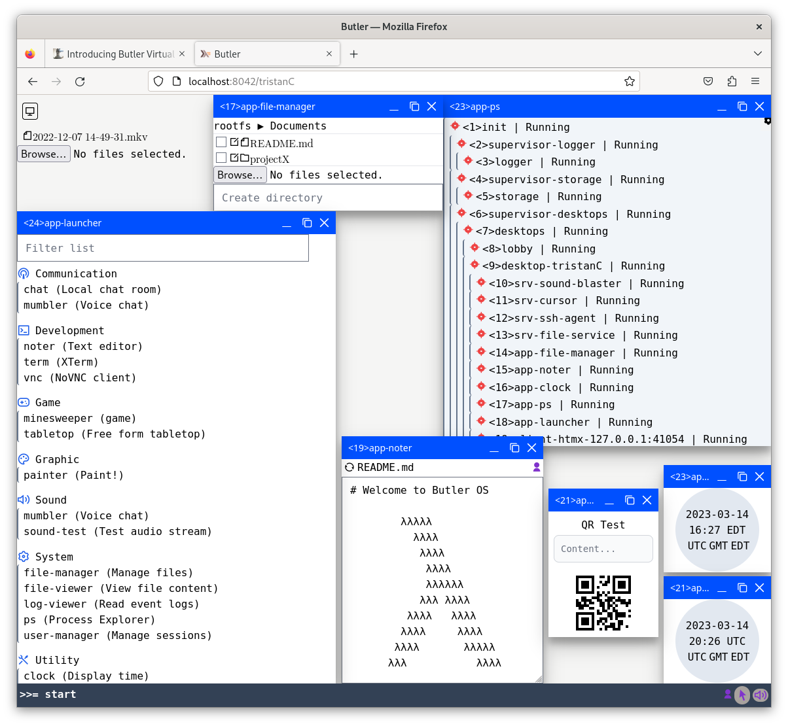

This post introduces #[[butler]], a virtual operating system that runs multi-players applications on the web.
In two parts, I present:

- The project's overview, and,
- A motivating use-case; a remote desktop that looks like this:

## Hobby Project

Before I begin, let me set the expectations.
Butler is a hobby project inspired by the [SerenityOS][serenity] project.
I am working on it on my free time as a challenge and learning experience.
Moreover I am considering alternative runtimes and protocols.
Therefore the implementation is subject to change.

That being said, the project reached a point where it is now enjoyable,
and I'm happy to share its current state with you.

## Modular Operating System

Butler's goal is to implement a virtual operating system with a strong focus on concurrency.
Butler is not a computer hardware operating system.
Instead, Butler is an application environment that runs on top of an existing system.

Thus I created the following modules:

:::{.w-full}

::::

Starting with the `Core` layer, I designed low level interfaces for the host system:

- `Process` for thread management, powered by the [ki][ki] library.
- `Pipe` for inter-process communication using [stm][stm].
- `File` for directory and file objects.
- `Network` to serve Web Application Interface [wai][wai].

Then in the `Main` layer, I implemented higher level interfaces on top of the `Core` primitive:

- `Scheduler` for the process hierarchy and supervision.
- `Display` for graphical user interfaces.
- `Session` for users.
- `Frame` for the a data exchange format.

Finally, the `App` layer provides the application environment:

- `Window` for app instance.
- `Cursor` for user pointer.
- `Sound` to produce and receive audio.
- `Agent` to forward local agent.

I find it valuable to model these APIs after regular operating system constructs.
They are available through a single top level [Butler][butler-doc] module.
The next section introduces the application environment.

## Application Actor

Butler applications are implemented as standalone processes that operate a [AppEvent][app-event] pipe.
Checkout the [App][butler-app] definition. Applications start with a [AppContext][app-context] provided by the display.

In order to run multiple application concurrently, Butler features a data exchange format to share a single socket per client.
Applications output:

- HTMX payload, by suffixing the application id. For example the UI are mounted on: `
`.
- Binary payload, by encoding the application id at the beginning of the buffer: `| $pid | server-data |`

Applications receive:

- HTMX trigger, by suffixing the trigger name with the application id: `{"HEADERS": {"HX-Trigger": "$trigger-$pid"}}`
- Binary payload, using the same application id encoding: `| $pid | client-data |`

The key design is that clients are dumb terminals and the state is controlled server side.
A good example is the text editor app named [Noter][app-noter].
This app leverages the whole application environment to implement an etherpad like text editor.

## <a id="rts">Haskell RunTime System</a>

In this section I explain the choice of using [Haskell][haskell].
Beyond the language's common features, here are two reasons for using Haskell:

- The language lets you break down any problem into smaller chunks, using let or where bindings.
  I find this syntax and way of thinking very helpful for simplifying complex software.
- The REPL evaluates modification almost instantaneously. I run development code through [ghcid][ghcid],
  and thanks to a simple client's reconnect handler, the services are hot reloaded in milliseconds when the source changes.

However, even though the Haskell ecosystem is quickly improving, it is not a mainstream language,
and it can be rough around the edges.
Here are a couple of alternative languages that I am also considering:

- [Rust][rust], because it is very similar to Haskell. Though it can be more complicated: for example,
  some expressions don't seem to be decomposable into sub expressions without triggering the borrow checker.
  And the lack of REPL to evaluate the code interactively is frustrating.
- [Gleam][gleam], because it leverages the BEAM virtual machine, which is a great fit for application actors.

That being said, Haskell works great for Butler. So far I have only used its most basic features,
and the project source is only 5k lines of code according to [polyglot][polyglot].

## HTML5 Graphical User Interface

In this section I explain the choice of using HTML5 for the GUI.
I choose HTML5 because it is an ubiquitous standard and the
[Web API][web-api] offers a fully featured application environment.
Thanks to the hypermedia paradigm enabled by [htmx][htmx], it is a great fit for Butler.

Though it would be interesting to investigate [morphdom][morphdom] and rich client alternatives,
such as [Web GPU][web-gpu] or [Flutter][flutter].

## Application Demos

Here is a list of demos I am using to validate the core implementation:

- [Butler.App.Noter][app-noter]: a text editor.
- [Butler.App.FileManager][app-fm]: a file manager.
- [Butler.App.Mumbler][app-mumbler]: a voice chat.
- [Butler.App.Tabletop][app-tabletop]: a free form tabletop simulator.
- [Butler.App.Terminal][app-terminal]: a legacy terminal.
- [Butler.App.NoVnc][app-novnc]: a VNC client.
- And a few other system applications you can find in the [Butler.App][apps] directory.

I am mostly focusing on the desktop use-case, but I also helped my colleague fboucher use
Butler to create a game named [HazardHunter][hazard-hunter].

## Road-map

A terminal and VNC client are already provided to access non Butler applications,
and perhaps it is possible to re-implemented these legacy system as Butler native applications.
For example, I am looking forward adding:

- Programming REPL.
- Media player named "Ampler".
- IRC and Matrix client.
- Agenda and calendar.
- More video games.

Moreover, I would like to develop the Butler APIs to include:

- Application testing framework, to simulate actor's inputs and validate the outputs.
- User's mailbox and notification system.
- Application debugging strace.
- External identity providers.
- Authorization system.

Finally, it would be interesting to investigate if and how an app registry could be implemented.
For example as a list of packages that could be dynamically loaded/unloaded into a running instance.

## Conclusion

The actor framework looks like a great solution for web applications, and I am quite happy with the
Butler's implementation. Moreover, I am excited about the community discussion for moving
[Towards an actor framework for Haskell][troupe]. My implementation is rather limited, and
I would be happy to use a common library similar to the [erlang/otp][otp].

Butler may sound like a crazy project, but I believe it is important to pursue fun goals that appear impossible.
I would like to quote the author of [SerenityOS][serenity] [Andreas Kling][kling-tweet]:
"Never underestimate the power of a bunch of nerds building something just for fun."

Finally I would like to thank [elmiko][elmiko] for his early feedback and encouragement.

Cheers!

[haskell]: https://haskell.org
[butler]: https://github.com/ButlerOS/haskell-butler
[serenity]: https://serenityos.org
[ki]: https://hackage.haskell.org/package/ki
[stm]: https://hackage.haskell.org/package/stm
[wai]: https://hackage.haskell.org/package/wai
[butler-doc]: https://butleros.github.io/haddock/Butler.html
[butler-app]: https://butleros.github.io/haddock/Butler.html#t:App
[app-context]: https://butleros.github.io/haddock/Butler.html#t:AppContext
[app-event]: https://butleros.github.io/haddock/Butler.html#t:AppEvent
[ghcid]: https://github.com/ndmitchell/ghcid
[rust]: https://www.rust-lang.org/
[gleam]: https://gleam.run/
[polyglot]: https://github.com/vmchale/polyglot
[web-api]: https://developer.mozilla.org/en-US/docs/Web/API
[htmx]: https://htmx.org/
[web-gpu]: https://www.w3.org/TR/webgpu/
[flutter]: https://flutter.dev/
[app-noter]: https://github.com/ButlerOS/haskell-butler/blob/main/source/libraries/desktop/Butler/App/Noter.hs
[app-fm]: https://github.com/ButlerOS/haskell-butler/blob/main/source/libraries/desktop/Butler/App/FileManager.hs
[app-mumbler]: https://github.com/ButlerOS/haskell-butler/blob/main/src/Butler/App/Butler/App/Mumbler.hs
[app-tabletop]: https://github.com/ButlerOS/haskell-butler/blob/main/source/libraries/desktop/Butler/App/Tabletop.hs
[app-terminal]: https://github.com/ButlerOS/haskell-butler/blob/main/src/Butler/App/Terminal.hs
[app-novnc]: https://github.com/ButlerOS/haskell-butler/blob/main/source/libraries/desktop/Butler/App/NoVnc.hs
[apps]: https://github.com/ButlerOS/haskell-butler/tree/main/source/libraries/desktop/Butler/App
[hazard-hunter]: https://github.com/web-apps-lab/HazardHunter
[elmiko]: https://notes.elmiko.dev/
[troupe]: https://discourse.haskell.org/t/towards-an-actor-framework-for-haskell/5929
[otp]: https://github.com/erlang/otp
[kling-tweet]: https://twitter.com/awesomekling/status/1544026282161307648
[ladybird]: https://github.com/SerenityOS/serenity/tree/master/Ladybird
[morphdom]: https://github.com/patrick-steele-idem/morphdom
