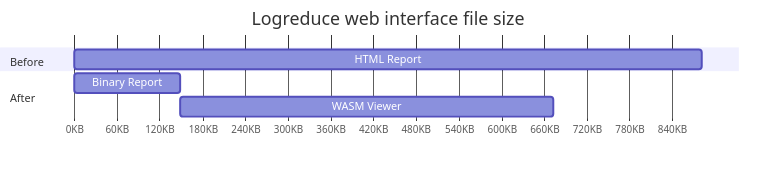

> This post was initially published on the Software Factory blog: https://www.softwarefactory-project.io/logreduce-wasm-based-web-interface.html

This post introduces a new Web Assembly (WASM) based web interface to visualize [logreduce][logreduce]'s reports.

In three parts, I present:

- The logreduce report format.
- WASM and Web APIs.
- HTML macro examples.


## Context and problem statement

Logreduce produces a [report][logreduce-report] containing the anomalies context along with metadata such as read errors and unknown files.
By default the report is printed to the standard output, but it can also be saved as an HTML file.

[logreduce-report]: https://github.com/logreduce/logreduce/blob/main/crates/report/src/report.rs

The HTML export is significantly larger than the report itself. Indeed, each log line needs to be wrapped inside an HTML element, while the report can be tightly packed using the [bincode][bincode] serialization format.
Moreover the HTML export is static and it can't be re-imported, for example to search for known anomalies.

In the next sections, I present a more efficient implementation using WASM.


## Web Assembly (WASM)

WASM is a portable binary instruction format that can be executed by web clients like javascript.
Since Rust has extensive support for this compilation target, I decided to implement the logreduce report interface with WASM.
The main benefits are:

- Leverage Rust type system.
- Re-use the existing logreduce's source code.

> Checkout the [rustwasm book][rustwasm] to learn more.

[rustwasm]: https://rustwasm.github.io/docs/book/

In the next sections I present how to create a web application.


## Web APIs

WASM programs don't have direct access to the Web APIs.
For Rust, the [web-sys][web-sys] library provides the necessary bindings to manipulate the DOM.
Here is how the hello world demo looks like:

[web-sys]: https://docs.rs/web-sys

```rust
#[wasm_bindgen(start)]
pub fn run() -> Result<(), JsValue> {
    let window = web_sys::window().expect("no global `window` exists");
    let document = window.document().expect("should have a document on window");
    let body = document.body().expect("document should have a body");

    let val = document.create_element("p")?;
    val.set_text_content(Some("Hello from Rust!"));

    body.append_child(&val)?;

    Ok(())
}
```

> Checkout the [wasm-bindgen documentation][wasm-bindgen] to learn more.

[wasm-bindgen]: https://rustwasm.github.io/wasm-bindgen/

Similar to React and Angular, there are libraries built on top of web-sys to implement
higher level APIs.

In the next section I present the libraries I used.


## Functional Reactive Programming (FRP)

In an earlier implementation, I used [yew][yew] which provides a React style API. Here is how the report was being fetched:

[yew]: https://yew.rs/

```rust
#[function_component(App)]
fn app() -> Html {
    let report: UseStateHandle<Option<Result<Report, String>>> = use_state(|| None);
    {
        let report = report.clone();
        use_effect_with_deps(
            move |_| {
                let report = report.clone();
                wasm_bindgen_futures::spawn_local(async move {
                    let result = get_report("report.bin").await;
                    report.set(Some(result));
                });
                || ()
            },
            (),
        );
    }

    match report.deref() {
        Some(Ok(report)) => render_report(report),
        Some(Err(err)) => html!(<div>{err}</div>),
        None => html!(<div>{"loading..."}</div>),
    };
}
```

Unfortunately such `use` hooks only work inside components and they require a bit of boilerplate to pass properties.
Instead I switched to a lower level library named [dominator][dominator] which provides FRP APIs I find easier to work with.

Here is the equivalent code where the hooks are replaced with a signal:

[dominator]: https://github.com/Pauan/rust-dominator#readme

```rust
struct App {
    report: Mutable<Option<Result<Report, String>>>,
}

pub fn main() {
    console_error_panic_hook::set_once();
    let app = Arc::new(App {report: Mutable::new(None)});
    spawn_local(clone!(app => async move {
        let result = get_report("report.bin").await;
        app.report.replace(Some(result));
    }));
    dominator::append_dom(&dominator::body(), render_app(&app));
}

fn render_app(state: &Arc<App>) -> Dom {
    html!("div", {.child_signal(state.report.signal_ref(|data| Some(match data {
        Some(Ok(report)) => render_report(report),
        Some(Err(err)) => html!("div", {.children(&mut [text("Error: "), text(err)])}),
        None => html!("div", {.text("loading...")}),
    })))})
}
```

Even though the *html!* macro is less pretty, it is much more flexible as it lets you build reactive elements
without relying on a virtual DOM and clunky properties.


## Conclusion

Thanks to the Rust WASM target, logreduce can now produce efficient reports with this [PR#25][pr-25].
For a typical CI build, the report size is reduced from a 881 KiB report.html, down to a 148 KiB report.bin.
The WASM program that decodes the binary report is 525 KiB, which combined with the binary report, is still smaller than the static HTML.
Moverover the payload can be hosted on a content delivery network so that it is re-used with every report.



WASM is a fascinating system, and I am looking forward making more use of it.
In particular, it would be interesting to compile the whole logreduce process to produce the report directly on the client side.

[logreduce]: https://github.com/logreduce/logreduce#readme
[bincode]: https://github.com/bincode-org/bincode#readme
[pr-25]: https://github.com/logreduce/logreduce/pull/25
