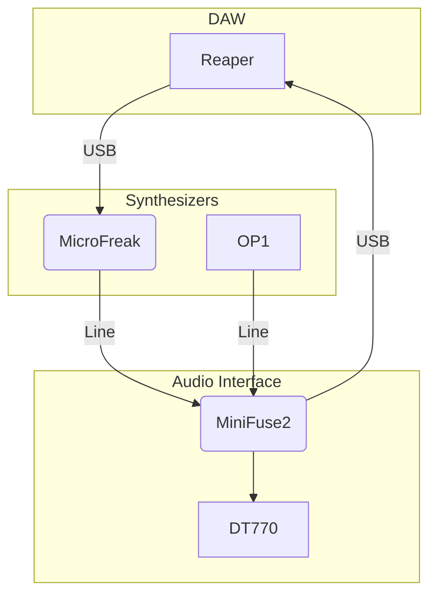
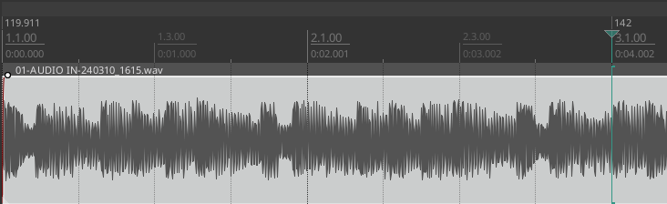
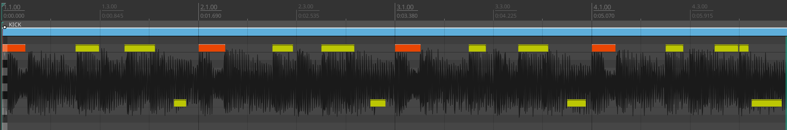
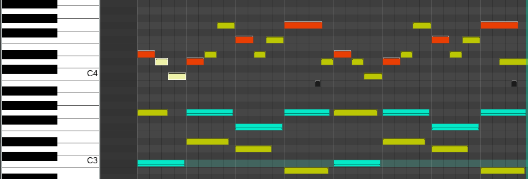

This post presents how I composed and produced the following animation fractal named microX.
This video has been 15 years[^1] in the making and I am proud of this work:

[^1]: I published my very first engine 14 years ago: <https://github.com/TristanCacqueray/pycf>, and it looked like [this](https://www.youtube.com/watch?v=h9vY5H0lWsI).

:::{.flex .items-center .justify-center}
<iframe width="560" height="315" src="https://www.youtube.com/embed/qZTqUQumC6s" title="YouTube video player" frameborder="0" allow="accelerometer; autoplay; clipboard-write; encrypted-media; gyroscope; picture-in-picture" allowfullscreen></iframe>
:::

---

In two parts, I describe how I made the music and then the video.
I hope you'll find this content as interesting as I do.

## Beat Making

The origin of this beat comes from a discussion with a friend where we tried to create a list of our
greatest musicians of all times (checkout the [[playlists]]).
I knew Laurent Garnier had to be on that list, and after listening to my old compact disc titled
*Laurent Garnier - 10 Years At The Rex Club* published in 2003,
I remembered this amazing sound by Scan X named [Wasteland](https://www.youtube.com/watch?v=bFGtQC-SmSY).

I was struck by its apparent simplicity as it only has four main tracks:

- A synth lead repeating the same pattern ad nauseam.
- A FX bip sound growing in the back.
- A brutal kick.
- A fast HiHat.

Thus, I set myself up to recreate this composition as a practice exercise.
The next sections explain how I proceeded.

### My Setup

Here is the setup I used to produce the microX beat:

Here is how this setup looks like on my desk:

:::{.flex .items-center .justify-center}

:::

Previously I worked exclusively on the [op1][op1], running the DAW only at the end to cleanup the composition.
For this track, I wanted to play with the new MicroFreak synth [firmware update 5.0][fw-5.0].
I could have used the op1 line-in to record the synth on the integrated tape, but I didn't like how it sounded.
Instead, I bought a MiniFuse sound card to record directly on [reaper][reaper],
that way the synth was captured with better pre amps.

[op1]: https://teenage.engineering/products/op-1/original
[fw-5.0]: https://www.arturia.com/products/hardware-synths/microfreak/update
[reaper]: https://www.reaper.fm/

Since I already spend too much time looking at the computer screen during the day,
I don't like using a keyboard and mouse for making music.
However, I have to say that reaper is a brilliant piece of software and the following
capabilities were a game changer:

- **Record and playback midi** to fine tune the chords and let them play automatically.
  Previously, I had to play the keys live, but for long synth leads it's not great as
  I'm too sloppy with the piano keys.
- **Record audio takes** to capture long sessions and explode them in order to pick the good parts.
  Previously, I only had a few minutes of tape storage to play the instruments.
- **Undo**: that's right, the op1 doesn't have an undo button,
  and being able to reverse a change is truly useful.

Though using a computer is still a major PITA: I had a few issues with pipewire latency and clock synchronization that were tedious to deal with.

In the next sections I describe how I used this setup.

### Finding the spark

Over the years, I developed a process that works pretty well for producing music. Here is what I do first:

1. Lay down a loop (4 or 8 bars long), starting with either a kick/snare, a bass or a melody. It doesn't have to sound great, it's the timing that is important at this point.
1. Mix the other main parts, like adding the bass and the drums.
1. Figure out variations for a second loop.

Then I repeat that stage again, usually removing most of the scaffolding used at the beginning.
I don't understand how finding the spark works, and most of the time it doesn't, but once in a while,
I get something I like listening to. Then, here is what I do next:

1. Search for instruments that sound good when played together.
  This can be tricky because instruments can sound great on their own but they would clash with the other ones already playing. So it can take time to solo a part, find a sound, and hope it fits with the other parts.
1. Add movement with sound design.
  Electronic synthesizers can sound static, so I always search for modulations by trying every knob and adding free running LFOs to act as invisible hands.
1. Save all the patchs and note their names per tracks.

It's also important to take many breaks to avoid sound fatigue. I used to spend long stretches of time searching for sound without realizing that what I was doing was rubbish. Walking the dog or cleaning up is a great way to step away. Then I come back with fresh ears to check if the sound is still enjoyable.

Finally, I work on creating the final beat:

1. Arrange the parts to make a coherent story.
1. Add ear candy.
1. Mix and master the final audio file.

Again, this process is iterative, once I have the MP3, I copy it on my phone and listen to it in different settings. I take note of the issues and repeat this process until the improvements become negligible. As a hobbyist, I don't have the time or the skills to make a perfect production. I always regret publishing a sound too early and I wish I had the discipline to let it sit for a while before working on it again.

For the last two beats I produced, namely [[opCBC]] and microX, finding the spark took about 10 hours each time, and I worked 10 more hours to make the final compositions.
In the next section I describe how I made the individual parts of microX.

### Making microX

This beat was inspired by *Wasteland*, so I started with the most important part:

#### The kick

For the kick, I used the following trick that I learned from [Captain Pikant](https://www.youtube.com/captainpikant):

- Record the reference track from youtube in reaper using qpwgraph:

- Find the BPM by moving a tempo marker to match the transient:

- Reduce the playback speed:

- Reverse engineer the pattern by placing midi notes on the slowed down sound:

Then I used the *Aphexian* patch from the microFreak to create the percussive sound
by shortening the decay and using the Filter Amt knob to dim the sequence before adding the hats.

#### Synth

*Wasteland* features a main synth lead that I was not able to reproduce with the microFreak.
Instead, I used the *Far Away* patch with an arpeggio playing the following sequence,
which features the familiar chords I use in most of my music:

> What I like in this progression is the inverted Gmaj chord on the last bar, it complements well the previous Cmin/Fmin.
> I learned this from [OP-1 05-28-17 (I Need U)](https://www.youtube.com/watch?v=7z4hoazra_g) by *Red Means Recording*.
> I mostly play the Cmin scale since that's the only one I really know.

Using a piano roll helped me match the time signature with the kick.
For the second part of the beat I turned down the Filter Amt knobs to create a mashed version.

I also tried the *Angels* patch and eventually kept the part playing the main notes.

#### The bip

Similarly, I was not able to reproduce the bip sound accompanying the synth lead of *Wasteland*.
Instead, I picked the *Haunted* patch from the op1 *DSYNTH* engine.
The magic of this sound comes from a very light LFO modulating the delay speed to produce mysterious pitch variations.
The speed only oscillates between 15 and 17, which is enough to create the haunting effect.

Then for the build up, I simply morphed the wave from sin to sqr and I opened the filter a bit.

I also struggled with the timing as it seems like the clock is drifting in the original track.
In the end, I nudged the record a bit to make sure it bips right before the kick.

#### The hats

The hats part is usually what I struggle with the most.
I was not able to produce anything conclusive with the microFreak and trying to reverse engineer the pattern from *Wasteland*
is out of reach for me.
Instead, I used a pattern from AFX transcribed by Captain Pikant and I played it on the op1 with
the *BOOMBAPI-3711* kit using a small swing and a tight delay.

For the second part, I added the COW effect on the master bus to create a nice spiraling gallops.
This effect has many sweet spots and even though it only has 4 knobs, I keep on discovering new use-cases.
For microX, I used the following configuration:

:::{.float-right .px-6}

:::

- Freq: a click above the minimum
- Delay: 3
- Feedback: 53
- Sideband: maximum

I used sharp changes in the delay to create variations in the very last part.

#### The voice part

Finally, I wanted to try the new sampler engine of the latest microFreak firmware.
As I was looking for the hats, I tried the *Krazi Snake* preset, and I had an happy accident by replacing the
digital oscillator engine with the sampler. There I loaded the voice sample that came with the update, the one that
says "Digital Oscillator Sound". This sounded great because the preset modulates the oscillator wave with a
S&H LFO, which for the sampler, changes the start time resulting in different words being said at random.

It's also the first time I used a voice in my music.

### The final project

After recording all the parts, I mixed the tracks in reaper.
I have very limited knowledge of what needs to be done at that stage.
The most helpful resource I learned on that topic are from [Dan Worrall](https://www.youtube.com/channel/UCQnz5mUTDkGwKvIQ9uyqiXw)
and [Kenny Gioia](http://reaper.fm/videos.php).

For what it's worth, here is how the final project looks:

> If you see something I'm doing wrong, please do let me know!

Then I exported the individual stems to animate the video.
The next sections explain how I made the video.

## Animation Fractal

To make the video, I used [[animation-fractal]], a free Haskell Vulkan powered engine to create visualizations that mimics the sound.
While the core didn't change much since [[making-of-op961]], I recently found a new shadertoy named
[Truchet + Kaleidoscope FTW](https://www.shadertoy.com/view/7lKSWW) by @mrange.

Previously, I relied on IFS fractals which are very sensitive to changes and I had to carefully fine tune the modulations
to get a smooth animation. With this Truchet Kaleidoscope, there are many places in which to plug variations without affecting the
whole composition which is much easier to work with.

In the next section I present the main part of this process.

### Modulation source

I used 6 different exports of the original sound to animate this demo:

- voice
- bip
- melodic synth
- bass/kick
- hats
- bird sample

To remove some noises I used some strong EQs and a Gate effect on the kick and the hats to isolate the transient parts.
In a future version, I will integrate my [[simple-dsp]] implementation to do this processing at runtime.

### Fractal inputs

I used the sound sources directly in different parts of the shader code, you can check the source code [here](https://gitlab.com/TristanCacqueray/animation-fractal/-/blob/45cab080d1649df7e2e2c6cea62eddee80478b47/src/Demo/MicroOrg.glsl).
This demo is not scripted, and most of it worked out of the box, however, I spent a few hours adjusting the modulations to get the best result.
You can see the change I made for microX in this [commit](https://gitlab.com/TristanCacqueray/animation-fractal/-/commit/56163c26f9d0d5c53f4ff46598673dc3a383fd96).

In particular, there are two parameters per sources that are essential:

- The modulation time: to tune a smoothing function that defines how fast a change in the sound is applied.
  You can see the values I used in the track info's definition [there](https://gitlab.com/TristanCacqueray/animation-fractal/-/blob/45cab080d1649df7e2e2c6cea62eddee80478b47/src/Demo/MicroOrg.hs#L26-31).
- The gain: to adjust the final modulation value. You can see the values I used at the top of the shader source code.
  For those, I had to pause on the key parts of the video and apply small adjustments to get the best result.

The bird modulation only triggers twice, so I used it to tweak a core function called modMirror to make a drastic effect.

This process is not very intuitive and I would like to make it more ergonomic.
For example, animation-fractal works on the Steam deck, and using the game pad controllers would be ideal to control the rendering in real time.

## Conclusion

In this post I showed how I made my latest animation-fractal demo called microX.
I am very excited about this new development and I am looking forward streamlining the process
to create these types of videos.
If you are interested, please get in touch, and stay tuned for the upcoming step by step tutorial!

Thanks for your time!
