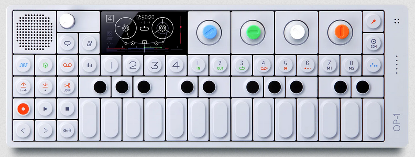
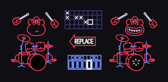
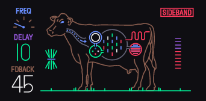
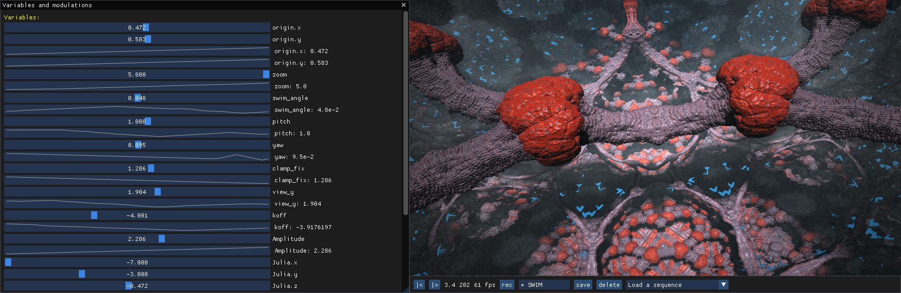

This post presents how I composed and produced the OP-961 animation fractal.
In two parts, I present:

- How I made the music.
- How-to animate the fractal.

But first, here is the final compo:

:::{.flex .items-center .justify-center}
<iframe width="888" height="500" src="https://www.youtube.com/embed/kVU5FsyzA1I" title="YouTube video player" frameborder="0" allow="accelerometer; autoplay; clipboard-write; encrypted-media; gyroscope; picture-in-picture" allowfullscreen></iframe>
:::
---

## Beat Making

I made the music using the OP-1 synthesizer. I used to have a bedroom studio filled with electronic music gear. In 2014, I switched to virtual instruments such as Reason and VCV. Nowadays, I value the portability and ease of use of this little wonder:

:::{.flex .items-center .justify-center}

:::

In particular, I really like:

- Its ergonomics and how everything fits together.
- The four track tape.
- The finger sequencer for dephasing simple patterns:
:::{.flex .items-center .justify-center .gap-1}



:::
- And of course, the COW and phone effects:

:::{.flex .items-center .justify-center .gap-1}



:::

Even though the device is quite expensive, considering the amount of time I spent tinkering with it, I find it worthy.

## Sound Mastering

For this production, I used one track for the drums, one for the bass, and the other two for synths like rhodes or plucks.
After filling the OP-1 tracks with all sort of loops, I used [Reaper][reaper] to cleanup the bad parts and to arrange the stems into a more coherent composition.

:::{.flex .items-center .justify-center}

:::

I find this software particularly good:

- It comes with common plugin such as: EQ, Reverb, Compressor and Limiter.
- It is lightweight and heavy duty.
- It works on Linux. I even made a Nix Flake for it named [modularix][modularix]

Though, I know very little sound mastering and I still find it hard to make my music sound good on different speakers.

The next sections focuses on video production.

## Fractal Shader

I imported the [Underwater Fractal Creature created by Kali][shadertoy-ufc] in my [animation-fractal][af] project. That way I could explore the fractal to find the good parameters modulations.

:::{.flex .items-center .justify-center}

:::

Checkout the source code at [Demo.UnderwaterFractalCreature](https://gitlab.com/TristanCacqueray/animation-fractal/-/blob/main/src/Demo/UnderwaterFractalCreature.hs).

> Learn more about animation-fractal in this previous post: [[introducing-animation-fractal]]

## Animation Fractal

For this production, I only had the audio stems from the tape recorder. Previously, for [[pulse-simple-pcm|summerbulb]] ,I used midi events, but this time I had to implement something else. So I exported the individual tracks and computed the peak RMS using this implementation:

```haskell
import Data.Vector.Storable qualified as SV

type Samples = SV.Vector Float

soundRMS :: Samples -> Float
soundRMS arr = sqrt (tot / fromIntegral (SV.length arr))
  where
    tot = SV.foldr (\v acc -> acc + v * v) 0 arr

type SamplesRMS = SV.Vector Float

analyzeFile :: FilePath -> IO SamplesRMS
analyzeFile fileName = do
  samples <- decodeFile fileName
  pure $ SV.generate (sampleFrameCount samples - 1) \position -> do
      let frameSize = 44100 `div` 30
      let frameSamples = SV.slice ((position `div` 2) * frameSize) (frameSize) samples
      soundRMS frameSamples
```

Then I wrote a script to generate all the fractal parameters:

- Load and prepare the scene:
```haskell
main :: IO ()
main = do
    mainSamples <- analyzeFile "data/op961.mp3"
    meloSamples <- analyzeFile "data/op961-melo.mp3"
    drumSamples <- analyzeFile "data/op961-drums.mp3"
    bassSamples <- analyzeFile "data/op961-bass.mp3"

    scene <- Demo.UnderwaterFractalCreature.sceneInfo
    mods <- traverse newSceneModulation $ sceneMods scene
    let getModulation name = fromMaybe (error $ "unknown var: " <> from name) $ lookupModulation name mods
        seedX = getModulation "Julia.x"
        seedY = getModulation "Julia.y"
        seedZ = getModulation "Julia.z"
        yaw = getModulation "yaw"
```

- Parameters modulation per frame:
```haskell
    let mkFrame :: Frame -> MSec -> IO (Map Text Float)
        mkFrame frame elapsed = do
            when (frame == 0) do
                let introLength = 694_000 / 60
                linMod yaw introLength (pi / 2 - 0.065)

            let melo = 10 * fromMaybe 0 (meloSamples SV.!? from frame)
            let drum = 10 * fromMaybe 0 (drumSamples SV.!? from frame)
            let bass = 10 * fromMaybe 0 (bassSamples SV.!? from frame)

            if
                    | frame < 694 -> do
                        when (melo > 0.1) do
                            incrMod seedX 100 (-1 * melo / 8)
                            incrMod seedY 100 (-1 * melo / 5)
                    | frame < 2776 -> do
                        when (frame == 694) do linMod zoom (2000_000 / 60) 3.2
                        when (melo > 0.1) do
                            -- incrMod seedY 100 (melo / 100)
                            incrMod amp 100 (melo / 18)
                        incrMod koff 200 (-1 * bass / 60)
                        when (drum > 1) do
                            incrMod seedX 300 (drum / 25.5)
                            incrMod seedZ 500 (drum / 35)

```

- Export values for the renderer:
```haskell

            -- update modulation and read outvar value
            frameValues <- forM mods $ \modulation -> do
                v <- atomically $ readModulation elapsed modulation
                pure (modulation.name, v)
            pure $ Map.fromList frameValues

        genFrame :: Int -> IO (Map Text Float)
        genFrame x = mkFrame (from x) elapsed
          where
            elapsed
                | x == 0 = 0
                | otherwise = frameLength

    (frames :: Vector (Map Text Float)) <- generateM (from maxFrame) genFrame
    encodeFile scriptFile frames
  where
    scriptFile = "data/Op961.json"
```

Checkout the full source code at [Demo.Op961](https://gitlab.com/TristanCacqueray/animation-fractal/-/blob/main/src/Demo/Op961.hs).
This script produces a json file with all the values.
The animation-fractal demo renderer automatically reloads the values when they are updated to get instant feedback.

For the next demo, I would like to improve this script by:
- Doing frequency analysis of the audio stem to extract better modulations.
- Implementing a scene context to enable simpler interpolation between the sequences.

That's it for today,
Cheers!

[af]: https://gitlab.com/TristanCacqueray/animation-fractal
[op-1]: https://teenage.engineering/products/op-1/original/overview
[reaper]: https://reaper.fm
[modularix]: https://github.com/podenv/modularix
[shadertoy-ufc]: https://www.shadertoy.com/view/Mtf3Rr
