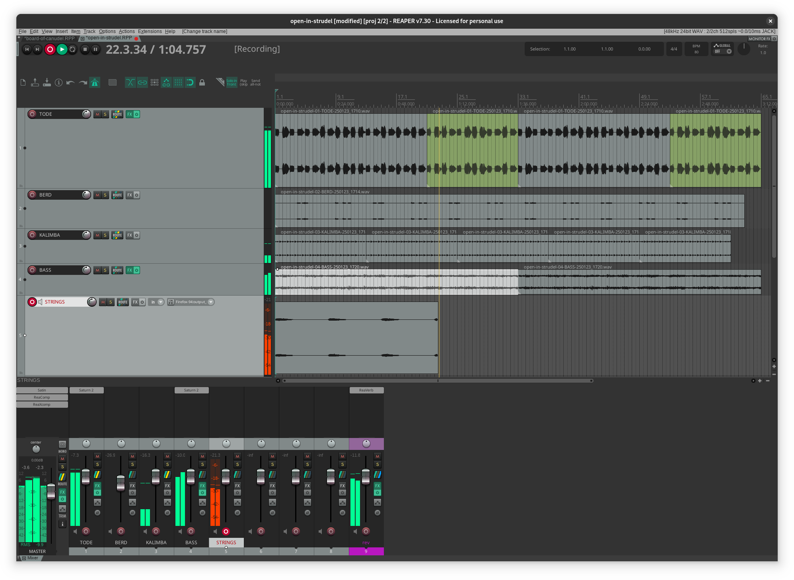

Over the past couple of months, I have created 10 new tracks by remixing [[pastagang]]'s jam sessions.
I learned a lot along the way, and in this post I want to share my workflow and how I made the tracks with [[reaper]].

:::{.hidden}

:::

## Context

I started my electronic music journey in 2007 with hardware workstations: first with the electribes EA-1/ES-1 by Korg, then the RS7000 by Yamaha, and finally the OP-1 by Teenage Engineering.
While I learned how to synthesize sound and make loops, I couldn't produce a good full track.
I found that these machines are great for jamming, but too complicated for arranging and polishing a composition.
At that time, I was using a Tascam DR-40 and Audacity to make my first releases.

> By the way, if I were to start again today, I would look into Elektron devices like the Digitone.

Around 2012, I integrated a DAW into my workflow to arrange the recordings.
DAW applications have been developed since a very long time; one of the most famous, Cubase, was first released on the Atari in 1989.
I used to be an advocate for "dawless" setups, which I think is really referring to not using a computer screen with a mouse.
It's indeed a great experience to only have dedicated hardware with mechanical interfaces.
However, using a computer has become such a massive convenience for producing music; I quickly changed my mind after enjoying the benefits of using a DAW.

In the following sections, I present Reaper, my current DAW.

## Reaper

Reaper is a relatively new kid on the block. It was first released in 2006, and
it sets a new standard for what a DAW can be. Here is what makes it special for me:

- Its author, Justin Frankel, puts the user first above all else, and this is blatantly apparent in Reaper.
- Reaper is portable; it works on Linux and is incredibly efficient: the installer only weighs **12MB**.
- Reaper is customizable; it features an extensive actions list that can be adapted to most workflows.
- Reaper is extendable, and the community has made a wealth of open-source extensions using its scripting language.
- Reaper is stable; as far as I can tell, its workflow barely changed since its first release, and it is likely to stay the same in the future.

For me, Reaper is like the Emacs of the DAWs, and as Stefan Lesser said in his [A New Cognitive Perspective on Simplicity in System and Product Design](https://www.youtube.com/watch?v=eYU62sx-EoQ) paper, for such an environment, “the measure of its success is not popularity but belonging.”


## Features

In this section, I present the main features of Reapers that I use in my workflow.

### Actions

Most things you can do in Reaper are available as *Actions*, like with Emacs <kbd>M-x</kbd>, you can get the action list by pressing <kbd>?</kbd>:


- There are thousands of actions available, they are grouped per section, like Emacs modes; for example, there is a different action list for the MIDI editor section.
- The *Menu editor* button lets you customize the toolbar and the contextual menus to configure quick access to the actions. Here is my customized main toolbar where I added 3 buttons:


- Shortcuts can be created to run actions using a keyboard or MIDI controller.

Over time, I made quite a few shortcuts to fit my workflow. Here are a few examples:

```raw
Main : Ctrl+Down : Track: Go to next track
Main : Ctrl+Up   : Track: Go to previous track
Main : Ctrl+Right : Move edit cursor forward one measure
Main : Ctrl+Left  : Move edit cursor back one measure
Main : [ : Markers: Go to previous marker/project start
Main : ] : Markers: Go to next marker/project end
```

To quickly make loops with the time selection:

```raw
Main : Q : Time selection: Set start point
Main : E : Time selection: Set end point
Main : > : Time selection: Shift left (by time selection length)
Main : < : Time selection: Shift right (by time selection length)
```

To edit MIDI:

```raw
MIDI Editor : Up   : Edit: Increase pitch cursor one semitone
MIDI Editor : Down : Edit: Decrease pitch cursor one semitone
MIDI Editor : Shift+Up   : Edit: Move notes up one octave
MIDI Editor : Shift+Down : Edit: Move notes down one octave
MIDI Editor : X : Edit: Delete notes
```

> [!tip]
> Reaper encourages you to customize the actions to significantly improve your quality of life. Finding an action and creating a shortcut is straightforward.

- You can also make custom actions to combine multiple actions, for example:


- The actions that are bound to the mouse are defined in the preferences menu, which provides a comprehensive interface to configure every modifier and mouse buttons:


- Reaper also supports Open Sound Control (OSC), which is a data transport similar to MIDI, but it is more flexible and can be used to implement a fully-fledged controller.
In the `Default.ReaperOSC` file, you can see all the controls that are available, for example:

```raw
# Example: REWIND b/rewind
# The device sends /rewind 1 to begin rewinding, and sends /rewind 0 to stop
# rewinding. REAPER sends /rewind 1 when the rewind button in the REAPER window is
# pressed, and /rewind 0 when the button is released.

# Example: FX_PARAM_VALUE n/track/@/fx/@/fxparam/@/value
# The device can send /track/3/fx/1,2,5/fxparam/6,7,7/value 0.25 0.5 0.75
# to set three FX parameter values at once, to 0.25, 0.5, 0.75 respectively.

# Example: ACTION i/action t/action/@
# The device sends /action 40757 or /action/40757 to trigger the REAPER action
# "split items at edit cursor".
```

Reaper actions feel well thought out; they allow you to customize every aspect of the user interface using a common action system.
The author also provides an open source [Software Development Kit](https://github.com/justinfrankel/reaper-sdk) (SDK) as well as a scripting API to create new actions.
Here is a famous open source extension that provides many extra features: [SWS](https://www.sws-extension.org/).
There is also a package manager to download free actions made by the community: [reapack](https://reapack.com/).

> [!note]
> I haven't used the SDK yet, but I'd like to try creating my own actions, for example to auto color a track when I change its name.

### Track

Tracks are the primary objects in Reaper, here are their main properties:

- Volume, pan, mute/solo.
- The channels number.
- Sends and receives.

The routing interface presents the main properties like this:


In the above screenshot, you can see that for this bass track:

- The channels **1-2** are sent to the parent/master track
- The audio is also sent to the track **14 reverb**.
- The track receives audio from the track **9 bd** on the channels **3/4**. In the plugin section below I explain how the auxiliary channels can be used for side-chaining.

Here are some extra things worth noting about Reaper's tracks:

- A track can send and receive both Audio and MIDI.
- The media items can be arranged into lanes, and there is a comping function to arrange multiple takes.
- Tracks can be moved into a folder to create a bus.
- The phase can be inverted, including for the individual sends.
- When a track is armed for recording, many options are available to handle the input:

:::{.flex .items-center .justify-center .m-2}

:::

> [!tip]
> Reaper tracks feels well designed, like the actions, they are versatile and I find them very easy to use.
> They provides all the feature that are commonly needed to produce high quality music, and I think Reaper features a comprehensive and efficient implementation.
> I am not aware of any limitations, and big projects can contains hundreds of them, if not more.

The next sections are dedicated to the features available in Reaper's tracks.

### Plugins

A track may contain plugins to process the audio or the MIDI in various ways.
Reaper supports multiple plugin formats, notably LV2 and CLAP, which can be implemented using Open Source licenses.
The track plugins are conveniently displayed above the mixer:

:::{.flex .items-center .justify-center}

:::

Here is how the plugins configuration window looks like:


This interface shows:
- The list of plugins (on the left), the signal goes from top to bottom.
- The plugin controls bar (on the top right), to change the preset, edit the params, adjust the wet/dry knob and toggle the bypass checkbox.
- The selected plugin user interface (on the right), here the JS 1175 compressor.
- The cpu/mem usage and the latency of the current plugin are displayed in the bottom left.


> [!tip]
> The wet/dry knob can be used to convert any insert plugin into a standalone send.

Clicking on the **X in Y out** button (in the top right corner) reveals the **pin connector** interface:


> [!tip]
> This screenshot shows the shaperbox plugin used as a compressor. The pin connector shows that the track channels **3/4** are send to the plugin **sidechain L/R** input.
> You can also see in the bottom left that this plugins adds 977 samples (*spls*) of latency.

Reaper also implements a scripting system called ReaScript, and it provides a development environment to edit scripts. Here is an example:


Plugins can be embedded inside a container, called FX-chain. Here is an example of such container to create a mid/side processing matrix:


> The above screenshot shows a container named **Cut Low Side**, which contains a nested list of effects to make the low frequencies mono.

Here are the stock plugins that I use the most:

- VST (standard plugin format):
  - ReaComp/ReaXcomp (compressor)
  - ReaVerb (reverb using impulse response file)
  - ReaEQ (eq)
  - ReaDelay (delay)
  - ReaSamplOmatic5000 (sampler)
  - ReaLimit (limiter)
  - ReaGate (gate)
  - ReaVerbate (algorithmic reverb)

- JS (editable light script):
  - 1175 Compressor
  - Loudness Meter and Frequency Spectrum
  - Moog 4-Pole Filter
  - Ping Pong Pan
  - Super8 looper
  - MIDI sequencer Megababy
  - MIDI utils like transpose and filters
  - Mid/Side encoder/decoder

I believe these plugins are fairly neutral and they are tailored for mixing/mastering without altering the musical soul.

In my previous work on [[opFreak]], I have only used stock plugins, but for [[pastagang]], I missed the extra noise I was getting by recording hardware synthesizer.
So I have started using additional plugins to compensate. Thanks to Yabridge and Wine, I can use Windows plugins on Linux, like the ones from FabFilters or Cableguys.
Though I'm now only looking for native Linux CLAP plugin as it is an open format that runs more efficiently on my Fedora. I recommend checking out U-HE and AudioThings as they support Linux natively.


### Editions

Once the tracks are configured, most of my time is spent in the arrange view to make the final composition. Here are the main actions I perform:

- Cut and fade in/out the clips:


- Razor edit to cut the clips with <kbd>alt</kbd>+<kbd>right drag</kbd>:


- Align the recording with <kbd>shift</kbd>+<kbd>left drag</kbd>:


> [!tip]
> Notice how the parent folder display the sum of the waves, enabling very precise samples alignment. This is called non destructive summing, and apparently, most DAWs lack this feature, which is a shame because that is incredibly useful to see overlaps betweeen multiple audio and/or MIDI tracks.


### Envelopes

Once the parts are in order, I set up envelopes to make the mix less static and I apply effects to accentuate certain regions.

- For the volume, simply press <kbd>v</kbd> to show the envelope.
- For any other parameters, touch its controller, and use the **Param** menu:


- Otherwise, use the envelope manager to see every available track parameters and activate their envelopes:


Then, to modify an envelope:

- Use a time selection to create a dip with <kbd>ctrl</kbd>+<kbd>shift</kbd>+<kbd>left drag</kbd>. This inserts four points in one action.


- Insert points manually with <kbd>shift</kbd>+<kbd>click</kbd> and drag their levels with the mouse:


- Set up an LFO modulation using this button:


In the future I'd like to configure a MIDI controller to record the envelope points, but I found that using the above techniques is already working well enough for me.

### Drum Rack

In this section I demonstrate how to set up a drum rack:

- Create the following track folder:


- Add the ReaSamplOmatic5000 on each track:


- Set up a loop with the time selection and insert MIDI items:


- Activate the inline MIDI editor and program the pattern:


By default, the sampler plays every notes, see the **Note start** and **Note end** parameters above.
To play different samples, using a single MIDI channel, for example with a MIDI controller,
each sampler must be assigned to a different pitch. In that case, the common setup is to create an extra MIDI track that is sent to every drum that way:


On the MIDI input track, an extra plugin can be added to choke two notes, for example to make a closed hi-hat stop an open hi-hat.
The MIDI editor is also able to display the sample keys mapping in the piano-roll, it looks like this:


> [!tip]
> On the right side of the MIDI editor, you can access the notes of the other tracks, for example to display the bass in the background of the drums.
> That way, you can configure Reaper to only use a single MIDI editor instance for handling all the notes from every track in a single window.
> Otherwise, you can use the inline editor in the arrange view to overlay audio and MIDI data.

This is not complicated to set up, and I made multiple drum racks that way, but note that there is a plugin called rs5k manager to do exactly that in a single click. It looks like this:


In this interface, all you have to do is drag a sample on the pad overview, and the plugin will take care of creating the folder track and set up the sampler on the right note, exactly like I did manually previously.

This isn't the prettiest interface, but it does the job and it's incredibly lightweight. Note that any track or folder can be saved as a template to be recalled in other projects:

:::{.flex .items-center .justify-center}

:::

> [!tip]
> I rarely save individual presets, to re-use something, I just make a template of the track folder instead.


## Project Interface

Here is how my project looks like at the end:


At a glance, you can see the arrangements of every clip, the track envelopes and all the plugins in the mixer.
This captures most of the work I do in a project.
With a bigger screen, the plugins' interfaces could also be displayed in the mixer like this:

:::{.flex .items-center .justify-center}

:::

To get more information, Reaper provides a few dedicated interfaces, for example:

- Wiring diagram:


- Project Bay FX:


- Project Bay Source Media:


Lastly, the project is stored in a light weight file format called `.RPP`.
The content is in plain text, and even though the public spec is incomplete, I wrote a little Haskell library to extract information like the clip positions and the marker timeline:
[haskell-rpp](https://github.com/TristanCacqueray/haskell-rpp)

## Remixing The Pastagang

In this section I demonstrate how I make a [[pastagang]] remix step by step.
The group uses a collaborative livecoding system called Flok, and a participant can record a video stream of the session.

### Transcribing

The first step is to get a copy of the code from the jam, using the video I:

- take note of the good timestamps,
- scrub around to see what is running and copy the code, then
- use arrange/pick to transcribe the whole session.

### Recording

Ideally, I would set up a track per instruments so that I can record live all the elements of the performance individually.
Though, strudel, the tool we are using to make the music, doesn't seem to support multi channels output, even with this setup:


Thus, I record the pattern one after the other instead, like that:



As new tracks are being recorded, I can already start working on the previous ones, for example by adding saturation or adjusting the volume.

Once all the patterns are recorded, I arrange the tracks in the following hierarchy:

- Synth bus
- Drum bus
- FX bus

### Mixing

Here are the common tasks I perform:

- Sidechain the kick/snare to duck the bass when they hit.
- Add compressors to every bus with a slow -2db compression to make the transients move together and glue the parts.
- For the dry instruments, apply saturation and reverb.
- EQ to make room between the tracks, and add high pass filter almost everywhere to keep the low end clean.

Though, good samples, like the ones from the crate, don't really benefit from the extra processing.

Checkout my [[pastagang|making of notes]] for the details of each mix.


## Alternatives

In this section I present alternative tools that work on Linux.

### DAWs

I believe the main contender is [Ardour](https://ardour.org/). Here is a great interview: [Creator of Reaper, Justin Frankel and Creator of Ardour, Paul Davis have a podcast together.](https://www.youtube.com/watch?v=94rP7lWnnxI).
There is also [Renoise](https://www.renoise.com/), featuring a keyboard driven, tracker based interface, which is also available as a plugin called Redux.

Lastly, Bitwig is also an option, but I couldn't get it to work on my laptop, and it imposes arbitrary limitations based on the license.
I also worry that they are now providing an hardware controller, which looks like a great way to be locked in their ecosystem.
At least, it runs on Linux.

### Synthesizers

In this post I mostly talked about arranging and mixing tracks. To make some noise, here are a few free software solutions worth mentioning:

- [SuperCollider](https://supercollider.github.io/), [Tidal Cycles](https://tidalcycles.org/) and [Strudel](https://strudel.cc): live coding music with Algorithmic patterns.
- [Pure Data](https://puredata.info/): visual programming language for multimedia.
- [Cardinal](https://cardinal.kx.studio/): virtual modular synth.
- [Surge XT](https://surge-synthesizer.github.io/): hybrid synth.

Though, I would also recommend using the audio input of the sound card to capture hardware synthesizers like a μFreak.

## Conclusion

Reaper’s interface may appear bare-bones, but it provides everything you need to make music.
As Deadmau5 said in this [interview](https://www.youtube.com/watch?v=0mpQdI4eMfI): “if you figure out Reaper, everything else is a joke.”

I personally like how the default interface shows everything up front; it can be overwhelming at first, but now I find it seamless.
Most of the time I start my project from scratch, and I appreciate how Reaper lets me quickly do all the actions without getting in the way.
For example, Reaper’s sampler does not provide any filters or LFOs.
I think this is great, and I prefer adding extra features manually instead of having too many options in one place.

A friend of mine started to learn Ableton Live, and I am still confused by its drum rack; I don’t understand why the inner tracks can be displayed in the session view but not in the arrange view.
Similarly, routing signals between tracks seems to be inconsistent. For example, configuring a side-chain is a different action than for a regular send.
In that context, I believe Reaper is more consistent and thus simpler to understand.
Lastly, as described in [this video by Dan Worrall](https://www.youtube.com/watch?v=b8NVAcZTH14), it's surprising that Live, a mainstream DAW, struggles with plugins' latency when Reaper handles it like a breeze.

Note that while Reaper can be used for live performances, for example with the Super8 Looper or the Megababy sequencer, I don't think it is convenient for that use case.
For me, Reaper really shines for recording and producing the final track offline.

In this post, I shared the main things I know about Reaper.
To get started, check out the video tutorials by [Kenny Gioia](https://www.reaper.fm/videos.php),
and you can see my other tips [[reaper|here]].
