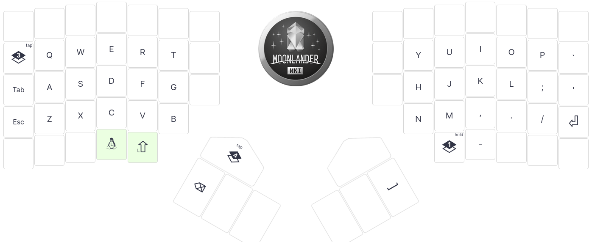
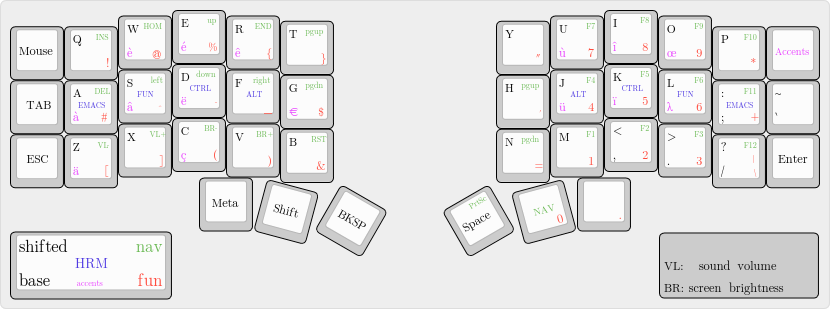

This post is a live journal to document my switch to using an ergonomic keyboard.
I am writing it as suggested by a colleague, and I hope that you'll find this entertaining and useful.

## Thu, Oct 19: Making a decision

To put this into context: I have been using various keyboards to write copious amounts of code for almost 30 years now.
I used Emacs, then Vim, and now mostly vanilla Emacs with the default key bindings.
My favorite keyboard layout is the 75%, but after relocating back from South Korea, the keyboards I bought all broke right after the warranty was over.
That was really frustrating because I was not able to fix them and I don't want to produce waste.

Thus, last year I switched back to using my laptop keyboard and I developed a bad habit of reaching the default arrow keys using my pinky.
It's worth noting that I don't use fancy navigation or browser plugins and that I rely on the arrows key for reading.
After a while, my right hand became painful and I worried that I could get a serious injury if I kept going like that.

A couple of weeks ago, a friend told me about his switch to a split keyboard and that sparked my curiosity.
After spending half a day checking what I could get, I settled on the Moonlander.
There are lots of option, and it's difficult to make a choice, and since I am not familiar with these systems, the Moonlander looked like the easiest option since it comes pre-built.
I just wished they had a version without any LEDs.


## Thu, Oct 26: Waiting

After making the purchase, my curiosity grew over the days, and I was wondering if I made the right decision.
Thankfully, ZSA, the producer of the Moonlander, has really good support and they provide great resources to get started.

Then I read the following resources:

* [Designing a 36-key custom keyboard layout](https://peterxjang.com/blog/designing-a-36-key-custom-keyboard-layout.html)
* [How do you use layers on your keyboard?](https://lobste.rs/s/2ps6iq/how_do_you_use_layers_on_your_keyboard)

Anyways, yesterday, on a Friday morning I got the "out for delivery" notification which prompt me to prepare the layout.
I didn't want to waste time tinkering my own system, and I simply replicated the layout technomancy generously shared [here](https://atreus.technomancy.us/cheat.pdf).
Using the online configurator, I made this config: https://configure.zsa.io/moonlander/layouts/J5QlB/latest/0

* The base layer:


* The fun layer:


* The upper layer:


> Update: I do not recommend using this layout, see "thumbs fatigue" below

## Fri, Oct 27: Unboxing

On Friday evening, eight days after making the order, I got the keyboard.
I flashed the initial layout I prepared and quickly realized that the learning curves was going to be too steep.
This was just too much of a change and I couldn't see how I would be able to get used to such a different setup.
Thus, I made the following adjustments to get something usable more quickly:

* add back the numbers row.
* assign the tab key where it used to be.
* assign a key to turn off the leds.
* remove the unassigned key-cap to help me place my fingers correctly.

After re-flashing the firmware, I got something a bit more usable, but it still felt like using an alien device or an advanced technology:


My first task was to start Emacs, by typing alt-f2 and "emacs". That was quite a challenge since the function keys are in the upper layer.
This was a big relief because it felt like something I can get used to.
After this first success, it was already getting late and I call it a day.


## Sat, Oct 28: First contact

On Saturday, I got some practice by writing this post, my goal was to get used to:

* the ortho layout, in particular the `c` key location.
* the `enter`, `space`, `ctrl` and `alt` location.

Writing prose was surprisingly easy to get used to, however, editing is a very different beast.
I realized that I don't even know what are the keys to make basic operations such as selecting, copy/pasting or undoing.
These are so fundamental that I am relying on muscle memory to hit the right keys.
So I had to manually perform these actions on my previous keyboard to take note of the keys I was hitting.

On one hand it is irritating having to slow down to recall new hand motions, but on the other hand, it is satisfying to see this process getting continuously faster as I am using the keyboard more and more.
I might never reach the proficiency I had before, but it feels like I should achieve a satisfying speed in a couple of weeks.

I am not doing this switch to become faster anyway, it's an investment for my well-being, and I can already feels that it is paying off:
my wrists and fingers barely moved as I am writing this post.


## Sun, Oct 29: Let the fun begin

On Sunday, I focused my practice on using the fun layer.
This layer systems is a neat feature that lets you remap keys, similarly to what the shift key does.
This is what really lets you reduce hand motions.

There are 4 options to switch layers, and for now I'm using the `TT` mode, which stands for *tap* *toggle*.
I can access the fun layer by holding the key down, or I can toggle the layer by tapping the key.
Similar to the caps lock, the keyboard has LEDs to indicate which layer is currently activated.
I think it would be easier without the toggle, but since the navigation is on the fun layer, it can be useful to keep it active by tapping the key.

It quickly became natural to hold the fun key to access arrows keys and symbols such as `#` or `*`.
My goal is to eventually get rid of the numbers row, and using a different modifiers for such symbols is not as difficult as I thought it would be.
On the contrary, it is actually easier because using symbols now requires less motion.

I have also realized that the layout I was using didn't have the `%` key.
Perhaps there is a combo to send this symbol, but since I'm aiming for a 44keys layout, and the one I copied was a 42keys layout, I had a spare key to use for `%`.
I am not sure it's a good idea to do such change as I believe the layout technomancy created is well thought out.
But I guess it's fine to try changing one key at a time and see if it works better.

I forgot to mention yesterday that while ergonomics was the primary reason for using such a keyboard,
I also enjoy the fact that this keyboard is designed for long term usage with a durable design.
It looks like I will be able to repair failures that will happen in the future.


## Mon, Oct 30: Getting to work

I am not going to lie, today was rough. My colleagues were supportive and patient with me, but using such a new device took a mental toll on me.
The day started with an innocuous tmux session to fix a service that was not starting, and I stuttered to perform most actions.
This slowdown is annoying because by the time I typed something, I almost forgot the context of what I was doing.

Perhaps I shouldn't be using the new keyboard full time and I should be taking breaks using my old one.
But I also enjoy the new physical experience where my fingers barely move anymore.
As long as nothing really urgent happens, I'll probably just push trough the learning curve.

Here are the list of changes I made to my layout:

* Similar to the change I made for the `tab` key, I moved the `'` key next to the `p` key. I am using my palms to hit the outer keys (`esc` on the left and `enter` on the right) and the adjacent keys are hard to reach for me.
  I think this is happening because I retro fitted a straight 5x4 layout by offsetting the lower row.
  Anyway, changing a single key is easy to get used to.
* I also changed my push-to-talk combo for mumble [from `<Super>F2` to `<Shift>Escape`](https://github.com/TristanCacqueray/gnome-mumble-push-to-talk/commit/60ff973b15028d1f16bb14c644992567cbcb59c8).
  I am not sure how to access the upper layer quickly enough.
  I can hit `fn`-`L2`-`F1` to start a eshell fine, but that's not practical for mumble or running gnome command.

I am also having troubles with windows management: I am using the default awesomewm keys to send a window to a different workspace with `super`-`shift`-`NUM`.
This no longer works well because `super` and `shift` are next to each others.
Well that will be a story for another day.

By the end of the day, I still managed to push a bunch of commits, and I am getting a bit more comfortable within emacs.


## Tue, Oct 31: Typing

After two full days using the keyboard, I have to say that I'm getting used to the new motions, and I can feel that with a bit more practice I'll be done with the initial learning curve.
I was a skeptical at first, but I'm glad that such a change is doable.
I did a bit of monkeytype.com and I am presently at 60 WPM for English, and about 25 WPM for Rust.

I have also read these reviews which match my impressions:

* https://no-kill-switch.ghost.io/keyboardio-atreus-yeah-or-meh-review/
* https://arslan.io/2021/05/19/a-review-of-my-first-split-keyboard-moonlander-mk1/

Here are the list of changes I made to my layout:

* I was missing the `^` key. Of course I could reach it with `Shift`-`6`, but as I said, I'd like to get rid of the numbers row eventually so I needed a replacement.
* I was often toggling the fun layer by mistake, so I switched from tap/toggle to hold. I guess that's why the arrow keys are also on the upper layer, which I assume is the one that needs to be toggled.

I don't expect more changes, I just wished there was a better location for the enter key. Here is the link if you want to check out what I am using: https://configure.zsa.io/moonlander/layouts/J5QlB/latest/0


## Wed, Nov 1: Holding keys

As I was practicing I realized that the space key's location was not ideal. And to reach the `-` key I had to move my thumb all the way under my hand.
I was also reluctant to use the thumb cluster as it was hard to reach when the keyboard is tented.
But after putting the keyboard flat, as suggested in the getting started guide, I found it was quite a natural place to rest my thumbs. So I moved the `backspace` and `space` keys there.

And since now is a good time to do such adjustments, I am also experimenting with a multi function key to make the `Alt` key send `Enter` on tap.
Here is my new layout:


It wasn't fun getting used to the new positions, and doing such tweaks was exactly what I wanted to avoid.
Hopefully, it didn't took too long to get up to speed, and after a couple of hours of training I reached about 30 WPM for Rust code.


## Thu, Nov 2: Getting rid of the nums row

I realized that reaching for the numbers on the top row offsets my hands in such a way that I can no longer reach the thumb clusters easily.
Perhaps if the cluster was higher up that wouldn't be such an issue, but I think the ultimate solution is to get rid of that row entirely.
The layout I am using already provides a num pad on the fun layer which I can get used to.
Then I also changed my gnome settings for switching workspace to use the home row instead [that way](https://github.com/TristanCacqueray/dot-files/commit/de20d6fd1edca1dabb0b5bf0aa80d0bde53cb385)


## Fri, Nov 3: Emulating the mouse

One thing I really missed was the ThinkPad track-point.
Thankfully, it is possible to emulate the mouse using the keyboard, and that seems to work well.
Here are the settings I used:


And here is my layout to control the mouse:


Here is another article that resonate with my experience so far:

- https://www.jonashietala.se/blog/2023/11/02/i_designed_my_own_keyboard_layout_was_it_worth_it/


I have been using this new keyboard for a week now. I am now adjusted to the new layout and I no longer need the printout to know where the keys are.
However, while I am making good progress on monkeytype.com (at 40 WPM for Rust code), I still feel disoriented in the terminal or in Emacs.

I barely use my pinky anymore, however I am feeling a light soreness on my other fingers. I hope this is just my hand adjusting and that it won't become an issue.


## Sat, Nov 4: Trying Colemak-DH

Out of curiosity I gave Colemak-DH a try.
It's not that I wanted to make this journey anymore difficult, but I thought it would be an interesting challenge to see if I can also get used to different letter keys positions.
I went to [colemakclub](https://gnusenpai.net/colemakclub/) and reached 15 WPM at the level 2.
That was a really interesting experience and I now wonder if such exercise could be beneficial for improving my memory.


## Sun, Nov 5: Introducing (combo) home row mods

Home row mods lets you add `super`, `alt`, `ctrl` and `shift` (mods) to the home row (the keys of the default fingers position).
I am giving this a try because I find the lower part of the thumb cluster hard to reach, and by moving modifiers to the home row, I can further reduce thumbs movements.
This feels like a really great improvement, unfortunately that didn't worked out with my typing style where my finger rolls on the keys, resulting in frequent misfire.
Here is a good summary of the challenges of using home row mods: [Taming home row mods with bilateral combinations](https://sunaku.github.io/home-row-mods.html).

Though I really liked the idea of having modifiers keys on the home row, so I used the combo trick described in [https://jasoncarloscox.com/blog/combo-mods/](https://jasoncarloscox.com/blog/combo-mods/).
That seems to work much better, albeit the odd motion to activate the mods.


## Mon, Nov 6: Reducing thumbs uses

After a while, I developed an irritating thumbs fatigues.
It seems like using thumbs keys for modifiers didn't work for me.
I was so focused on reducing my pinky usage that I inadvertently put too much pressure on my thumbs, as described in this article: [PSA: Thumbs can get overuse injuries](https://getreuer.info/posts/keyboards/thumb-ergo/index.html).
Therefor I moved back the `enter` and `` ` `` keys where they used to be.


## Tue, Nov 7: Adopting the Corne layout

The last arrangement worked like a charm, and I consolidated the key positions according to the [corne](https://github.com/foostan/crkbd#readme) layout:




## Wed, Nov 8: Fixing right thumb fatigue

Unfortunately, my right thumb was still getting uncomfortable after a while.
After all, I basically double its usage by having the `fun` layer toggle next to the space bar.
I was also having issues hitting the combo modifiers consistently.
So, I could think of two solutions: either bring back the number rows, or move the `fun` toggle to another location.

I decided to bite the bullet and setup the so called home-row-mods.
I already tried using the firmware provided by ZSA and that was not practical for me.
So I settled on using the [Achordion](https://getreuer.info/posts/keyboards/achordion/) library.
That was not an easy thing to do, and I should write a guide about it in the future. Until then, here is the gist of what I did:

- Download the source from ORIX.
- Setup the qmk toolchain and fix the compatibility issue (mostly key-codes that now have different names).
- Flash the new firmware using keymapp and make sure it works.
- Enable Achordion.

And that was it, I was quite happy that this fixed the issues I had with HRMs.
My config is now hosted [here](https://github.com/TristanCacqueray/qmk-config), and here is my current layout:

:::{.flex .items-center .justify-center}

:::

## Thu, Nov 9: Patching the firmware

Alas, there was a couple of issues that were really annoying:

- Holding `shift` and pressing an HRM was either slow or simply didn't work. I explained the issue in detail in this [discussion](https://github.com/getreuer/qmk-keymap/discussions/47) and eventually implemented a work around.
- Holding `fun` and pressing `v` didn't reliably produce a `)`. You can read about it in this [issue](https://github.com/getreuer/qmk-keymap/issues/48) and I found a solution in a PR for upstream qmk.

I guess that is the path you have to take when using niche system…


## Fri, Nov 10: Taming the home-row keys

While HRMs are really nice to use, they takes time to get used to. In particular, those keys are now visually delayed until the firmware can tell if they are pressed or held.
It seems like ZMQ has a better implementation and I'd like to use a typing streak delay to avoid misfire when typing fast.

It has been two weeks since I switched to an ergonomic keyboard, and even after all the changes I kept on making, I have now mostly regained my fluency.
I am proud of the layout I developed as it seems to be well balanced for my usage.


## Sun, Nov 11: Limiting outer column usage

Being able to toggle the fun layer from the home-row made me wonder if I could work with a 36 keys layout.
To that effect I moved the quotes and equal key where my page up/down was located.
Then for the `enter` and `tab` keys, it turns out that the terminal already emulate these keys with `ctrl`-`m` and `ctrl`-`i`:

:::{.flex .items-center .justify-center}

:::

By changing a couple of keys at a time, it only takes me about 30 to 60 minutes to acquire the new motions.


## Mon, Nov 12: Typetouch training

Now that my layout got stable, it was time to do some touch typing exercise using monkeytype.com with rust code and simple English.
My goal was to ensure I kept my fingers on the home-row so that I memorize the correct motion.
I quickly made some good progress and here are my current WPM:

:::{.flex .items-center .justify-center}

:::

:::{.flex .items-center .justify-center}

:::


## Wed, Nov 15: Unicode

To write `é` or `…` I used to rely on spell checkers to fix my spelling.
With a programmable keyboard, it is possible to implement macros to send Unicode characters.
So I added a new *accent* layer with the following custom code:

```c
bool process_record_user(uint16_t keycode, keyrecord_t *record) {
  // achordion hooks omitted

  if (record->event.pressed) {
    const bool is_shifted = get_mods() & MOD_MASK_SHIFT;
    switch (keycode) {
    case M_ECUTE:  send_unicode_string(is_shifted ? "É" : "é"); break;
    case M_EGRAV:  send_unicode_string(is_shifted ? "È" : "è"); break;
    case M_ECIRC:  send_unicode_string(is_shifted ? "Ê" : "ê"); break;
    case M_ETREMA: send_unicode_string(is_shifted ? "Ë" : "ë"); break;
    case M_ICIRC:  send_unicode_string(is_shifted ? "Î" : "î"); break;
    case M_ITREMA: send_unicode_string(is_shifted ? "Ï" : "ï"); break;
    case M_AGRAV:  send_unicode_string(is_shifted ? "À" : "à"); break;
    case M_ACIRC:  send_unicode_string(is_shifted ? "Â" : "â"); break;
    case M_UCUTE:  send_unicode_string(is_shifted ? "Ù" : "ù"); break;
    case M_UTREMA: send_unicode_string(is_shifted ? "Ü" : "ü"); break;
    case M_CEDIL:  send_unicode_string(is_shifted ? "Ç" : "ç"); break;
    case M_OE:     send_unicode_string(is_shifted ? "Œ" : "œ"); break;

    case M_LAMBDA: send_unicode_string(is_shifted ? "Λ" : "λ"); break;
    case M_DOTDOT: send_unicode_string("…"); break;
    case M_EURO:   send_unicode_string("€"); break;
    }
  }
}
```

It's quite a neat feature since it works without changing anything on the operating system.
Alas, emacs doesn't accept the common sequence by default.
I needed to add a new binding to get the desired behavior:

```elisp
;; enable standard unicode input (but still needs to press bksp-enter to complete the sequence)
(define-key global-map (kbd "C-S-u") 'insert-char)
```

## Thu, Nov 16: Emacs shortcuts

Similar to the *accent* layer, I added a few macro to type common shortcuts:

```c
    // emacs windows
    case M_CX_0:   SEND_STRING(SS_LCTL("x") "0"); break;
    case M_CX_1:   SEND_STRING(SS_LCTL("x") "1"); break;
    case M_CX_2:   SEND_STRING(SS_LCTL("x") "2"); break;
    case M_CX_3:   SEND_STRING(SS_LCTL("x") "3"); break;

    // emacs buffers
    case M_CX_B:   SEND_STRING(SS_LCTL("x") "b"); break;
    case M_CX_CF:  SEND_STRING(SS_LCTL("xf")); break;
    case M_CX_CS:  SEND_STRING(SS_LCTL("xs")); break;

    // emacs project
    case M_CC_P_P: SEND_STRING(SS_LCTL("c") "pp"); break;
    case M_CC_P_F: SEND_STRING(SS_LCTL("c") "pf"); break;
```

Here is my latest layout:

:::{.flex .items-center .justify-center}

:::


## Fri, Nov 17: Lighter switches and low profile keycaps

With such a layout, it seems like lighter switches and low profile caps are preferable since that eases chording modifiers and layer changes.
After reading the [ZSA guide](https://www.zsa.io/moonlander/keyswitches/) on the subject, I ordered the kailh super speed silver switches with low profile keycaps from *xvx*.

Coming from the cherry silent red, I find these much more enjoyable, but they make a charming thock sound when reaching the bottom.
Perhaps I should have picked the pink ones, which are supposedly quieter.
These switches are so light that sometime an adjacent key get triggered by mistake, in particular the `G` and `H`. For these I simply kept the red switches to avoid the issue.

I have been using this new keyboard for 3 weeks now, and I am glad I made this change.
The columnar layout helps me a lot with touch typing, and having a programmable firmware is great to reduce the number of keys and achieve minimal hand motions.
Here is how my setup looks like now:

:::{.flex .items-center .justify-center}

:::

Using horizontal 2u keys for the thumbs brings this layout even closer to the corne. Also, note that the labels are not accurate, for example the right thumb is for *space*, not *+*.


## Sat, Nov 18: Ordering a wireless corne

Since I was pretty satisfied with my 42 keys layout, I looked for a smaller keyboard. I also wanted to try low profile switches after reading that they are easier on the fingers.
I found several vendors that offer the corne which perfectly fits my current setup, with the added bonus that it brings the thumbs key closer:

:::{.flex .items-center .justify-center}

:::

I hesitated between [holykeebs](https://holykeebs.com/products/corne-choc) and [typeractive](https://typeractive.xyz/products/corne-partially-assembled-pcb).
I picked the later because it features the ZMK firmware which looked superior to QMK, and it works wireless-ly.
Though I really wanted to have a track-point, unfortunately this not yet possible with ZMK as the implementation is still in progress (see [PR\#1751](https://github.com/zmkfirmware/zmk/pull/1751)).


## Sun, Nov 19: Migrating my layout from QMK to ZMK

Inspired by *@urob*'s [zmk-config](https://github.com/urob/zmk-config), I migrated my configuration to this new repository: https://github.com/TristanCacqueray/zmk-config/ .
I replaced my Achordion implementation with *hold-trigger-key-positions*.
It was interesting to see how the ZMK setup rely on GitHub action to automatically build the firmware in the cloud.


## Wed, Nov 22: Building my corne

The board was smaller than I thought, it turns out that low profile switches spacing is smaller (19x18mm vs 20x20mm).
With the help of a friend, I managed to solder the controller and assembled the keyboard in an hour or so:

:::{.flex .items-center .justify-center}

:::

:::{.flex .items-center .justify-center}

:::


## Thu, Nov 23: Ah snap, here we go again

While ZMK fixed my issues with home-row mods, I discovered that it comes with its own set of problems.
For example the key repeat timing is too tight for my taste, and the tap-hold mods are no longer eagerly applied which is not great for mouse actions such as `shift+click`.
Though the behavior system seems to work really well and I'm satisfied with the change.

Fortunately it didn't took long to get used to the new keyboard size and the thumb keys' placement seemed to work better for my hands.


## Fri, Nov 24: Low profile combos

With the ZMK *require-prior-idle-ms* solution for home-row mods, I had to make a slight pause before entering symbols.
For example, to enter `parse(`, I had to hold `l` (to switch to the fun layer) and press `c` for the paren, and if I typed this too fast, then I would get `parselc`. That's a so called false negative.

Thanks to the low profile spacing, it is possible to hit two keys at once with a single finger by pressing between the keys.
So I started to replace the problematic symbols with combos, a couple of key at a time.
By the end of the day I was comfortable with this setup and I came up with this layout:

:::{.flex .items-center .justify-center}

:::

Note that I progressively transformed the initial [layout from technomancy](https://atreus.technomancy.us/cheat.pdf).
I found that changing only a couple of keys at a time worked the best, even if that resulted in odd looking layouts.
This is a complex topic, which depends a lot on usage of programming languages to find the optimal placement to reduce same finger use (SFU) and to foster inward rolls.
It's also a balancing act between comfort and speed. For example having the `shift` or `fn` on the thumbs is more efficient but that can be less comfortable.


## Sat, Nov 25: Typetouch training again

To get used to this new combos system I did a bunch of monkeytype practice, and I have to say, it was really fun.
It's quite a novel way to use a keyboard and I found the whole learning process an amazing experience.
I particularly enjoyed being able to tweak the device to my taste and getting used to the change.

If you are curious about how using this keyboard looks like, I recorded myself doing some practice in this video:

:::{.flex .items-center .justify-center .pb-3}
<iframe width="888" height="500" src="https://www.youtube.com/embed/kApLVe1ZKWE" title="YouTube video player" frameborder="0" allow="accelerometer; autoplay; clipboard-write; encrypted-media; gyroscope; picture-in-picture" allowfullscreen></iframe>
:::

I started this journey a month ago today, and even though it took me a while to find my path, it seems like I'm reaching my end game.
I really enjoy the ortho/columnar arrangement and the discomfort I had in my hands seems to be fading away!


## To be continued...
