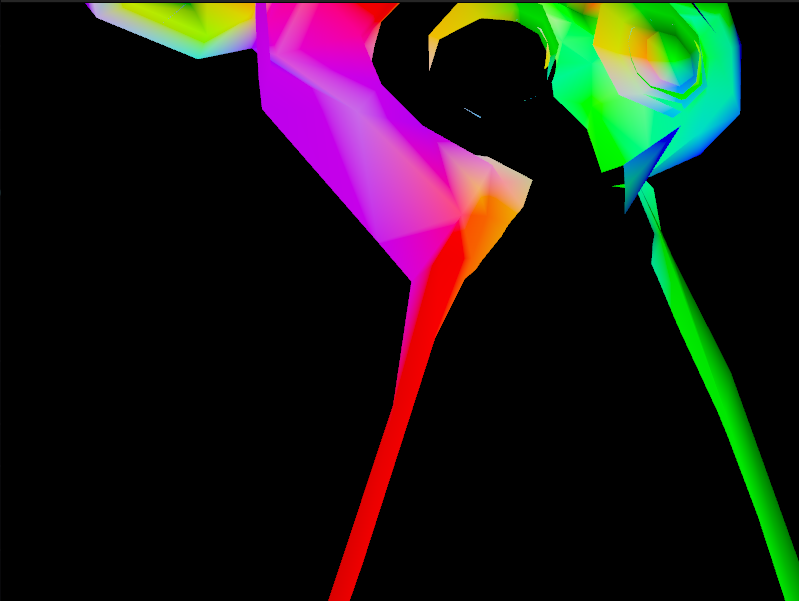

Trying to reproduce the [vkguide](https://vkguide.dev) using the Haskell engine [keid](https://keid.haskell-game.dev) I had a weird bug related to triangle winding.
This post shows how a 3d model gets rendered on screen using Vulkan.

## Context

In the vkguide's third chapter, "drawing meshes", we learn about:
- Loading the vertices of a monkey head model.
- Setup the model-view-projection matrix using a push constant.

The result looks like this: 


## Loading the meshes

The guide uses a model in the OBJ format, but keid comes with a GLTF loader, so I converted the file using blender.
Then here is the code I wrote to load the vertices:

```haskell
import RIO
import Data.Vector qualified as Vector

-- https://hackage.haskell.org/package/keid-resource-gltf
import Resource.Gltf.Load qualified as GltfLoader
import Resource.Gltf.Model qualified as GltfModel

-- Returns the list of vertex (positions, attributes, indices)
type Model = ([Vec3.Packed], [GltfModel.VertexAttrs], [Word32])
loadMonkey :: HasLogFunc env => RIO env Model
loadMonkey = do
    let fp = "assets/monkey.glb"
    (_, meshes) <- GltfLoader.loadMeshPrimitives False False fp
    pure $ case Vector.toList meshes of
        [meshPrim] -> case Vector.toList meshPrim of
            [(_, stuff)] ->
                ( Vector.toList stuff.sPositions
                , Vector.toList stuff.sAttrs
                , Vector.toList stuff.sIndices
                )
```

> GLB is the binary format of GLTF model.

This is the first time I ever load such model, if I understand correctly:

- The positions are vertex 3d coordinates relative to the origin of the model.
- The attributes contains vertex info such as the normal or the texture coordinate.
- The indices describe the vertex order.

The graphic card expects a list of triangle, for example:

```
            b
   a x-----x
      \   / \
       \ /   \
        x-----x d
       c
```

Instead of sending: [a, b, c, b, d, c], using indices we can send [a, b, c, d] along with these indices [0, 1, 2, 1, 4, 2].

In this example, the model doesn't have a texture, instead, the pixel colors are defined in the vertex normals attribute.
Thus, here is the code to load the model in the GPU:

```haskell
-- https://hackage.haskell.org/package/keid
import Resource.CommandBuffer qualified as CommandBuffer
import Resource.Model qualified as Model

initialRunState = do
    context <- ask
    CommandBuffer.withPools \pools -> do
        logInfo "Loading model"
        (meshPos, meshAttrs, meshIndices) <- loadMonkey
        let meshAttrs2Vertices (pos, attrs) =
               Model.Vertex pos attrs.vaNormal

        rsModel <- Model.createStagedL
          context
          pools
          (meshAttrs2Vertices <$> (zip meshPos meshAttrs))
          (Just meshIndices)
```


## Setup the model-view-projection matrix

The vkguide uses a push constant buffer to load the model-view-project matrix, and this is not how keid usually handles that part.
So I had to implement the render matrix manually, like this:

```haskell
import Engine.Camera qualified as Camera
import Geomancy.Transform qualified as Transform

renderMatrix :: Transform
renderMatrix = projection <> view <> model
  where
    camera =
        Camera.ProjectionInput
            { projectionNear = Camera.PROJECTION_NEAR
            , projectionFar = Camera.PROJECTION_FAR
            , projectionParams = pi / 2
            }
    projection =
        Camera.mkTransformPerspective (Vk.Extent2D 800 600) camera
    view = mempty
    model =
        Transform.translate 0 0 0
            <> Transform.rotateX -2
            <> Transform.rotateY (realToFrac time)
```

And here is what I got: 

Notice how the right ear is clipped. I first thought that the model was too close to the camera, but when using: `Transform.translate 0 0 1` to move it away, the issue became worse: 

It was time to check with renderdoc, but I couldn't find anything suspicious, here is what the mesh panel looked like: 

Thanks to the help of the keid developper [dpwiz](https://gitlab.com/dpwiz) I got to understand the issues.


## Curveball from the OpenGL world

Vulkan departed from the OpenGL standards, in particular, the Normalized Device Coordinates (NDC) are upside down:

```
  (-1, -1)    (1, -1)
      +--------+
      |        |
      |        |
      |        |
      |        |
      +--------+
  (-1, 1)     (1, 1)
```

This matters for the triangle winding process, where the GPU tests if a triangle is facing the camera or turned away from it.
The monkey head model indices needed to be adjusted, by enabling the `reserveIndices` argument when loading the mesh:

```haskell
  let reverseIndices = True
  (_, meshes) <- GltfLoader.loadMeshPrimitives reverseIndices False fp
```

That fixed the model, but that also revealed an issue with my render matrix implementation.
The transform monoid provided by the geomancy package works from the local towards the root of the scene. That means the composition needs to be reversed:

```haskell
renderMatrix = model <> view <> projection
  where
    model =
        mconcat
            [ Transform.rotateX -1.2
            , Transform.rotateY (-1 * realToFrac time)
            , Transform.translate 0 0 -5
            ]
```

And voila, the [MonkeyMesh](https://gitlab.com/TristanCacqueray/keid-vkguide/-/blob/main/src/MonkeyMesh.hs) now renders correctly!
