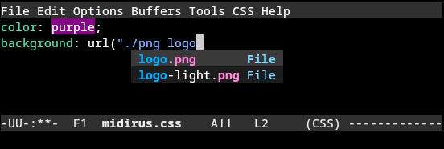
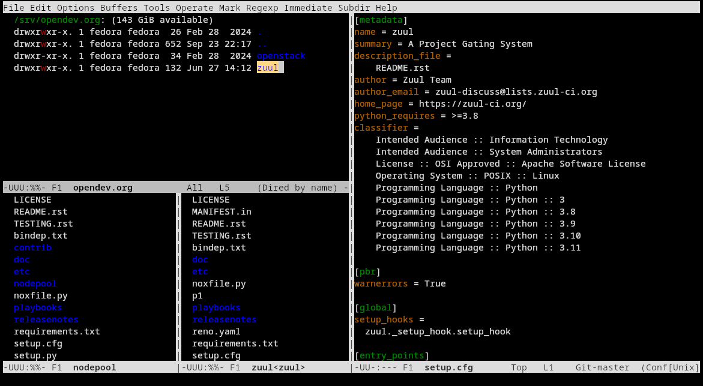
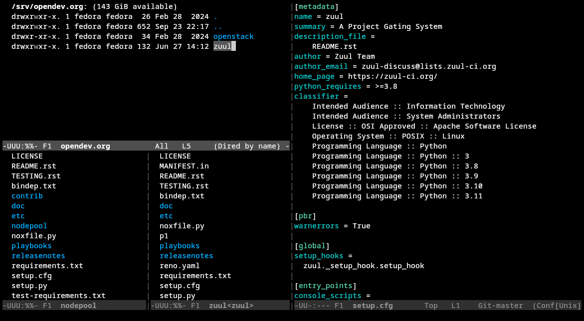

<!-- Copyright © 2024 Tristan de Cacqueray -->
<!-- SPDX-License-Identifier: GPL-3.0-or-later -->

There are many tutorials available but this one is mine where
I cover sensible defaults to showcase the standard Emacs experience.


:::{.hidden}

:::

My goal is to guide you through setting up an IDE similar to VSCode from the ground up.
I will also demonstrate how to use Emacs as a complete integrated computing environment,
allowing you to read news, send emails and much more!

> [!info]
> If you encounter any issues, please let me know; I'm committed to keeping this document updated.
>
> This [file][my-emacs-tut] is licensed under a free/libre copyleft license (GPL or CC BY-SA).
>
> **Changelog**
> - 2024-11-03: added the missing sections like [*Clipboard*](./tutorial.md#clipboard), [*Haskell*](./tutorial.md#languages) language, and extra [*elfeed*](./tutorial.md#elfeed).
> - 2024-10-16: added the [*Load Path*](./tutorial.md#load-path) section.
> - 2024-10-15: added the [*EasyPG*](./tutorial.md#easypg) and [*Mail*](./tutorial.md#send-email) section.
> - 2024-10-14: added the [*Dired*](./tutorial.md#dired) section.
> - 2024-10-08: added the [*Org Mode*](./tutorial.md#org-mode) section.
> - 2024-10-07: explained the [*Compile*](./tutorial.md#compile) workflow.
> - 2024-10-05: added the *Development* section.

In this tutorial, I will list all the commands, key bindings, and settings to provide
a comprehensive reference documentation for power users.
This tutorial is based on Emacs version **29**, which is a modern release that works exceptionally well out of the box.

If you are new to Emacs, do not read this in one sitting; take your time and don't panic; you will be here for the long-term.
Feel free to modify the configuration to your liking.
Good luck!


## Context

To put things into perspective, Emacs started in 1976 as a set of macros for the Tape Editor and Corrector (TECO).
GNU Emacs began in 1984 as a true Lisp interpreter, and it is among the oldest free and open-source projects still under
development.

Emacs helps you be productive by offering an integrated environment for a wide range of tasks.
This tool has been tested and proven to work well.


<br />

## First contact

In this first session, we will learn the most basic usage.

### Install

Emacs is available on every plateform. Get it with your package manager, for example,
by running `dnf install -y emacs-nox`. This is the lightweight terminal version;
`nox` means no X, which used to be a display server name.
Later, we'll use the graphical version for multimedias.

### Start

Start Emacs in the terminal like this: `emacs -nw`.
You can ensure a clean start using the `-Q` option.

Emacs keybindings use the <kbd>alt</kbd> and <kbd>ctrl</kbd> modifiers like this:

- `M-x` means press <kbd>alt</kbd>+<kbd>x</kbd>. `M` stands for *meta*, and it is the *alt* key on PC keyboards.
- `C-x 3` means press <kbd>ctrl</kbd>+<kbd>x</kbd>, release <kbd>ctrl</kbd> then press <kbd>3</kbd>.
- `C-h C-q` means press <kbd>ctrl</kbd>+<kbd>h</kbd> then <kbd>ctrl</kbd>+<kbd>q</kbd>. You can also maintain <kbd>ctrl</kbd> while pressing <kbd>h</kbd> then <kbd>q</kbd>.

When you are stuck, or if you want to exit a menu, hit `C-g` repeatedly to stop what Emacs is doing.
If you ever need to quit Emacs, hit `C-x C-c`, but you shouldn't do that :).

After starting Emacs, run the `help-quick` command by pressing `C-h C-q`; your terminal will look like this:


At the bottom, you now have a helpful quick help window that shows you the essential commands.
Once you are comfortable, close the help window by running the same command again.

> [!info]
> If you are already familiar with Vim keybindings, then feel free to skip the default keys.
> After the customization section below, check out the package named Evil to emulate the main
> features of Vim, transforming Emacs into a modal editor.

> [!tip]
> Here are the **only keys** you absolutely need to know:
>
> - `M-x`: (<kbd>alt</kbd>+<kbd>x</kbd>) to run a command, and
> - `C-g`: (<kbd>ctrl</kbd>+<kbd>g</kbd>) to cancel a command.


### Cursor movements

This section introduces how to move the cursor, which is also called the *point*.

Here are the main cursor movements:

| *Key*                                 | *Command*              | *Description*                                            |
|---------------------------------------|------------------------|----------------------------------------------------------|
| `C-a` or <kbd>HOME</kbd>              | move-beginning-of-line | Move point to visible beginning of current logical line. |
| `C-e` or <kbd>END</kbd>               | move-end-of-line       | Move point to end of current line as displayed.          |
| `C-f` or <kbd>→</kbd>                 | forward-char           | Move forward to the next character.                      |
| `M-f` or <kbd>ctrl</kbd>+<kbd>→</kbd> | forward-word           | Move forward to the next word.                           |
| `C-b` or <kbd>←</kbd>                 | backward-char          | Move backward to the previous character.                 |
| `M-b` or <kbd>ctrl</kbd>+<kbd>←</kbd> | backward-word          | Move backward to the previous word.                      |
| `C-p` or <kbd>↑</kbd>                 | previous-line          | Move vertically up                                       |
| `M-{`                                 | backward-paragraph     | Move backward to start of paragraph.                     |
| `C-n` or <kbd>↓</kbd>                 | next-line              | Move vertically down                                     |
| `M-}`                                 | forward-paragraph      | Move forward to end of paragraph.                        |
| `C-M-f`                               | forward-sexp           | Move forward across one balanced expression.             |
| `C-M-b`                               | backward-sexp          | Move backward across one balanced expression.            |
| `M->`                                 | end-of-buffer          | Move point to the end of the buffer.                     |
| `M-<`                                 | beginning-of-buffer    | Move point to the beginning of the buffer.               |
| `C-v` or <kbd>PageDown</kbd>          | scroll-up-command      | Scroll text of selected window upward.                   |
| `M-v` or <kbd>PageUp</kbd>            | scroll-down-command    | Scroll text of selected window down.                     |
| `C-l`                                 | recenter-top-bottom    | Successive invocation recenter the window.               |
|                                       |                        |                                                          |
| `M-g g`                               | goto-line              | Go to LINE.                                              |
| `M-g c`                               | goto-char              | Go to POSITION.                                          |


> Note that these keys mostly work by default with readline (e.g. in bash).

These commands cover most cursor movements, and with little practice, you will memorize the commands.
Notice how <kbd>ctrl</kbd> is used for short movements while <kbd>alt</kbd> makes longer movements.

> [!tip]
> `C-M-b` (backward-sexp) is not restricted to parenthesis `(`; use it to find matching `[`, `{` or `"` too.

> [!tip]
> Press `C-l` twice to scroll the buffer and move the cursor to the top.
> That's useful to compare two buffers by matching their lines vertically.

Checkout the `M-x help-with-tutorial` to get some practice.

### Window navigation

This section introduces how to manage the window layout.

| *Key*   | *Command*                   | *Description*                                        |
|---------|-----------------------------|------------------------------------------------------|
| `C-x 1` | delete-other-windows        | Make WINDOW fill its frame.                          |
| `C-x 2` | split-window-below          | Split WINDOW into two windows, one above the other.  |
| `C-x 3` | split-window-right          | Split WINDOW into two side-by-side windows.          |
| `C-x 0` | delete-window               | Delete WINDOW.                                       |
| `C-x o` | other-window                | Select another window in cyclic ordering of windows. |
| `C-x b` | switch-to-buffer            | Display buffer in the selected window.               |
|         |                             |                                                      |
| `C-x ^` | enlarge-window              | Make the selected window taller.                     |
| `C-x }` | enlarge-window-horizontally | Make the selected window wider.                      |
| `C-x +` | balance-windows             | Balance the sizes of windows shown.                  |

> [!tip]
> Use `balance-windows` when you have more than 2 splits.

To move between windows, run `M-x windmove-default-keybindings` to use
<kbd>shift</kbd>+<kbd>arrows</kbd> for moving the cursor to another window:

| *Key*                         | *Command*      | *Description*             |
|-------------------------------|----------------|---------------------------|
| <kbd>shift</kbd>+<kbd>←</kbd> | windmove-left  | Move to the left WINDOW.  |
| <kbd>shift</kbd>+<kbd>↑</kbd> | windmove-up    | Move to the up WINDOW.    |
| <kbd>shift</kbd>+<kbd>↓</kbd> | windmove-down  | Move to the down WINDOW.  |
| <kbd>shift</kbd>+<kbd>→</kbd> | windmove-right | Move to the right WINDOW. |


### File

This section introduces how to open and save a file.

| *Key*     | *Command*      | *Description*                                    |
|-----------|----------------|--------------------------------------------------|
| `C-x C-f` | find-file      | Edit file FILENAME.                              |
| `C-x C-s` | save-buffer    | Save current buffer in visited file if modified. |
| `C-x C-w` | write-file     | Write current buffer into file FILENAME.         |
| `C-x k`   | kill-buffer    | Kill the buffer specified by BUFFER.             |
| `C-x C-q` | read-only-mode | Toggle RO mode.                                  |

If you open a directory instead of a file, Emacs lists the directory contents in a
special buffer named **dired** with the following commands:

| *Key* | *Command*                 | *Description*                              |
|-------|---------------------------|--------------------------------------------|
| `RET` | dired-find-file           | Open the file or directory at point.       |
| `s`   | dired-sort-toggle-or-edit | Toggle sorting by date.                    |
| `R`   | dired-do-rename           | Rename current file.                       |
| `d`   | dired-flag-file-deletion  | Mark a file for deletion.                  |
| `x`   | dired-do-flagged-delete   | Delete the marked files.                   |
| `(`   | dired-hide-details-mode   | Toggle visibility of detailed information. |
| `g`   | revert-buffer             | Refresh the buffer.                        |

> [!tip]
> **Dired** is a powerful file manager, we'll learn more about it [later](./tutorial.md#dired).

### Modes

Every buffer is associated with a mode, which alters certain behaviors, key bindings, and text display in that buffer.
The idea is to customize the appearance and features available based on the contents of the buffer.
The current modes are displayed at the bottom of the buffer in the modeline.

Emacs has built-in support for many file types, for example, if you open a file named `test.css` and
write `color: pink`, then the buffer will look like this:

:::{.flex .items-center .justify-center}

:::

The mode command lets you toggle the mode, for example you can disable the highlighting with `M-x css-mode`.
You can also remove all modes by activating `M-x fundamental-mode`.

### Edition

Selection happens between a *mark* and the *point*. Here are the main editing keys:

| *Key*          | *Command*          | *Description*                                          |
|----------------|--------------------|--------------------------------------------------------|
| `C-SPC`        | set-mark-command   | Set the mark where point is, and activate it.          |
| `M-w`          | kill-ring-save     | Save ("copy") text between point and mark.             |
| `C-w`          | kill-region        | Kill ("cut") text between point and mark.              |
| `C-y`          | yank               | Reinsert ("paste") the last stretch of killed text.    |
| `C-k`          | kill-line          | Kill the rest of the current line.                     |
| `M-DEL`        | backward-kill-word | Kill previous word.                                    |
| `M-h`          | mark-paragraph     | Put point at beginning of this paragraph, mark at end. |
| `C-x h`        | mark-whole-buffer  | Make region contain the entire buffer ("Select all")   |
|                |                    |                                                        |
| `C-/` or `C-_` | undo               | Undo some previous changes.                            |
| `C-M-_`        | undo-redo          | Undo the last undo.                                    |

> [!tip]
> Use `M-x insert-char` to insert special characters like emojis.

To search for text:

| *Key* | *Command*        | *Description*                   |
|-------|------------------|---------------------------------|
| `C-s` | isearch-forward  | Do incremental search forward.  |
| `C-r` | isearch-backward | Do incremental search backward. |

> [!tip]
> Press the search key again to go to the next match.

To replace text:

| *Key*   | *Command*            | *Description*                                    |
|---------|----------------------|--------------------------------------------------|
| `M-%`   | query-replace        | Replace some occurrences of STRING.              |
| `C-M-%` | query-replace-regexp | Replace some things after point matching REGEXP. |

Once Emacs finds a match, press:

- <kbd>y</kbd> to replace
- <kbd>n</kbd> to skip
- <kbd>!</kbd> to do all replacement without asking.
- <kbd>ctrl</kbd>+<kbd>g</kbd> to cancel.

At this point, your terminal may look like this:




---
<br />

In this first session, we learned the basic survival skills.


## Customization

In this second session we learn how to customize Emacs behaviors and set up some quality-of-life improvements.

### Theme

Setup color theme with `M-x load-theme`:

- `modus-vivendi` for dark.
- `modus-operandi` for light.

These are highly accessible themes by @protesilaos, conforming to the highest standards for colour contrast between background and foreground values (WCAG AAA).

> [!tip]
> If the colors are off, make sure to set the TERM variable, for example start emacs with `TERM=xterm-256color emacs` in tmux

For comparison, Emacs now looks like this:




### History

Emacs can remember what you do to help recall past actions:

- `M-x savehist-mode` saves the command history. That way, pressing `M-x` shows the last used commands.
- `M-x save-place-mode` saves the location of the point when you kill a buffer and returns to it the next time you visit the associated file.
- `M-x recentf-mode` saves the recently opened files
- `M-x winner-mode` records the changes in window configuration so that you can revert any layout change with `M-x winner-undo`, for example after running `delete-other-windows` by mistake.

### Lisp Config

Emacs customization is written in the Lisp programing language.
In fact, about 70% of Emacs is written in Lisp, only the bare interface for the operating system is written in C.
Here is a primer on the basic syntax:

- Comments start with: `;;`.
- Call a function (e.g. command) with: `(function-name arg1 arg2)`.
- True and False are `t` and `nil`.
- Symbols are prefixed with `'`, like `'utf-8`.
- List can be written as: `(list 1 2 3)`, or with the quote syntax: `'(1 2 3)`.
- Pairs can be written as: `(cons 42 23)`, or with the dot syntax: `(42 . 23)`.

In the scratch buffer, write:

```elisp
;; Obligatory hello world
(message "Hello %s" 'emacs)
```

Here are useful commands to work with Lisp:

| *Key*     | *Command*       | *Description*                                      |
|-----------|-----------------|----------------------------------------------------|
| `C-x C-e` | eval-last-sexp  | Evaluate sexp before point.                        |
| `M-:`     | eval-expression | Evaluate EXP and print the value in the echo area. |
|           | eval-buffer     | Execute the current buffer as Lisp code.           |


### Dot Emacs

Add the following to your `~/.emacs` file to ensure the settings persist across restarts:

```elisp
;; Setup a nice theme.
(load-theme 'modus-vivendi)

;; Use shift + arrow keys to change window.
(windmove-default-keybindings)

;; Record window configuration and enable
;; `M-x winner-undo` command to undo layout changes.
(winner-mode)

;; Remember commands and files for easy access.
(savehist-mode)
(save-place-mode)
(recentf-mode)
```

Run `M-x eval-buffer` to apply the settings immediately.

### Settings

Settings are defined as custom variables, check out the `M-x customize` family of
commands to set the options interactively.

To change a setting, use the `setq` command, here are a couple of better defaults:

```elisp
;; Keep auto-save and backup files in one flat directory
;; (instead of next to the original files)
(setq backup-directory-alist `(("." . ,(concat user-emacs-directory "backups"))))

;; Store custom variables in ~/.emacs.d/custom.el (instead of ~/.emacs)
(setq custom-file (locate-user-emacs-file "custom.el"))
```

> [!tip]
> Some settings might be overridden after the init,
> for example *indicate-buffer-boundaries* can be reset.
> In that case, try `setq-default` instead.
> *(Let me know if you have a better explanation or how to avoid that quirk)*

When using the interactive `M-x customize-variable` command,
clicking `Save` will store the value into `~/.emacs.d/custom.el`
using this special syntax:

```elisp
(custom-set-variables
 '(require-final-newline t)
 '(load-prefer-newer t)
 '(tab-width 4))
```

To move the customization into your `~/.emacs`, convert the file like this:

```elisp
(setq require-final-newline t)
(setq load-prefer-newer t)
(setq tab-width 4)
```

### Key Bindings

While it is not necessary to use any key bindings, because you can always
run a command by typing its name in the minibuffer,
it is recommended to configure your own keys for:

- creating shortcuts to easily access the most commonly used commands, and
- altering the default bindings.

To change a key binding, use the `global-set-key` command:

```elisp
;; Do not ask for permission to kill a buffer (unless it is modified)
(global-set-key (kbd "C-x k") 'kill-current-buffer)
```

> [!tip]
> Check out the [better-defaults](https://git.sr.ht/~technomancy/better-defaults/) for other common examples.

To check the existing keys, run the following commands:

| *Command*                     | *Description*                                        |
|-------------------------------|------------------------------------------------------|
| describe-bindings             | Display a buffer showing a list of all defined keys. |
| describe-personal-keybindings | Display all the personal keybindings.                |

### Packages

Run `M-x package-install` to install packages for language syntax highlighting and extra features.
The language packages are usually named *language-mode*. For example, run:

- `M-x package-install` <kbd>⏎</kbd> `markdown-mode`

… to activate markdown file highlighting. Here are some useful commands:


| *Command*                | *Description*                                     |
|--------------------------|---------------------------------------------------|
| list-packages            | Display the list of available/installed packages. |
| describe-package         | Display packages' documentation.                  |
| package-delete           | Delete a package.                                 |
| package-refresh-contents | Download descriptions of all packages.            |


### Vert&co

In this section, we set up a completion framework to drastically improve the `M-x` and similar actions.
By default, Emacs comes with `ido`, but we'll use the modern implementation called Vert&co.
Get started with the following commands:

- `M-x package-install` <kbd>⏎</kbd> `vertico`
- `M-x vertico-mode`
- `M-x package-install` <kbd>⏎</kbd> `orderless`
- `M-x eval-expression` <kbd>⏎</kbd> `(setq completion-styles '(orderless basic))`

This enables two key features:

- Prompts show available choices in a vertical buffer.
- Completion is now fuzzy; for example, typing `file find` will select `find-file`.

Here is the result (with the nano-emacs theme):
:::{.flex .items-center .justify-center}

:::

Then install consult for a better switch-to-buffer command:

- `M-x package-install` <kbd>⏎</kbd> `consult`

Add the following to your `~/.emacs`:

```elisp
;; Setup completion framework
(vertico-mode)
(setq completion-styles '(orderless basic))
(global-set-key (kbd "C-x b") 'consult-buffer)
```

Check out my [[from-ivy-to-vertico]] post for more details.

> [!warning]
> With *vertico*, you might have to use `M-RET` to submit the minibuffer verbatim.
> This can be necessary because `RET` will pick the current selection,
> which prevents creating a new file matching an existing selection,
> for example, to pick `tut.md` when there is a matching `tutorial.md`.

### Bookmarks

Save interesting locations with bookmarks:

| *Command*       | *Description*                                      |
|-----------------|----------------------------------------------------|
| bookmark-set    | Set a bookmark named NAME at the current location. |
| bookmark-jump   | Jump to bookmark BOOKMARK (a point in some file).  |
| bookmark-delete | Delete BOOKMARK-NAME from the bookmark list.       |


> [!tip]
> Bookmarks work with most modes, and as we'll see later, they can
> also be used for remote tramp locations, and eww web pages.
> *consult-buffer* offers bookmark access by default.

---
<br />

You now have a fully functional environment.
The next section introduces how to learn on your own before we
dive in more advanced concepts.

## Learn

In this session we learn how to learn within Emacs.


### Describe

Run the following commands to access the documentation and the source of every Emacs
feature:

| *Key*   | *Command*         | *Description*                                              |
|---------|-------------------|------------------------------------------------------------|
| `C-h f` | describe-function | Display the full documentation of FUNCTION (a symbol).     |
| `C-h v` | describe-variable | Display the full documentation of VARIABLE (a symbol).     |
| `C-h m` | describe-mode     | Display documentation of the current modes and their keys. |
| `C-h P` | describe-package  | Display the full documentation of PACKAGE.                 |
| `C-h b` | describe-bindings | Display a buffer showing a list of all defined keys.       |
| `C-h k` | describe-key      | Display documentation of the function invoked by KEY-LIST. |

> [!tip]
> Use `C-h f` to read a command's documentation.

### Which Keys

Install the `which-key` package to get a tooltip about the keys that complete a sequence:

- `M-x package-install` <kbd>⏎</kbd> `which-key`
- `M-x which-key-mode`

Now try pressing `C-h`. After a short delay, the list of all available commands will be
displayed at the bottom.

> [!tip]
> Enable **which-key-mode** to discover available commands.

### Manuals

Read the info pages by running `M-x info`. In the info mode:

| *Key* | *Command*          | *Description*                                                  |
|-------|--------------------|----------------------------------------------------------------|
| `m`   | Info-menu          | The list of current nodes                                      |
| `]`   | Info-forward-node  | Go to the next page.                                           |
| `[`   | Info-backward-node | Go backward one node.                                          |
| `u`   | Info-up            | Go to the superior node of this node.                          |
| `n`   | Info-next          | Go to the "next" node, staying on the same hierarchical level. |
| `t`   | Info-top-node      | Go to the Top node of this file.                               |
| `d`   | Info-directory     | Go to the Info directory node.                                 |
| `M-n` | clone-buffer       | Create and return a twin copy of the current buffer.           |

> [!tip]
> Run `M-x clone-buffer` to persist the buffers that gets auto-replaced, like
> *Help* or *Describe*, that way you can accumulate multiple instances.

To search the info pages, use `M-x consult-info`.

Read the Un*x manual by running `M-x man`.

> [!info]
> The manuals are the ultimate references *(after the source)*. Use them!

### use-package

use-package lets you maintain a portable configuration.
Until now, we have installed package interactively,
but that's an issue when you copy your config to a fresh environment
because the commands and settings won't be available.

Instead, you need to leverage the `use-package` command to
manage external packages. The basic syntax looks like this:

```elisp
(use-package the-package-name
  :ensure t ;; install if needed
  :config
  (setq the-package-option 'value)
  (global-set-key (kbd "C-x g") 'the-package-command))
```

use-package lets you further declare your config,
for example like this:

```elisp
(use-package the-package-name
  :if (display-graphic-p)
  :diminish
  :custom
  (the-package-option 'value)
  :bind ("C-x g" . the-package-command))
```

… which is equivalent to:

```elisp
(when (display-graphic-p)
  (require 'the-package-name)
  (diminish 'the-package-name)
  (setq the-package-option 'value)
  (global-set-key (kbd "C-x g") 'the-package-command))
```

> [!tip]
> Check out `diminish` to clean up your modeline with use-package,
> and stick to `setq` and `global-set-key` if you prefer.


---
<br />

## System

In this session we learn how to perform system tasks.

### Process

Run `M-x proced` to list the system processes:

| *Key* | *Command*               | *Description*                                              |
|-------|-------------------------|------------------------------------------------------------|
| `s S` | proced-sort-interactive | Sort Proced buffer.                                        |
| `T`   | proced-toggle-tree      | Toggle the display of the process listing as process tree. |
| `m`   | proced-mark             | Mark a process.                                            |
| `k`   | proced-send-signal      | Send signals to marked processes.                          |
| `f`   | proced-filter           | Filter process.                                            |
| `F`   | proced-format           | Change formatting.                                         |
| `g`   | revert-buffer           | Refresh the buffer.                                        |

Run `M-x list-processes` to list child processes and `M-x list-timers` to list internal tasks.

### Commands

Run standalone shell commands:

| *Key*  | *Command*               | *Description*                                           |
|--------|-------------------------|---------------------------------------------------------|
| `M-!`  | shell-command           | Execute COMMAND in inferior shell                       |
| `M-&`  | async-shell-command     | Execute COMMAND asynchronously in background.           |
| `M-\|` | shell-command-on-region | Execute COMMAND in inferior shell with region as input. |

For example, type `M-!` <kbd>⏎</kbd> `uptime` to display
the age of your host to the minibuffer.
The output is also copied to the **\*Messages\*** buffer.

> [!tip]
> Prefer async commands to avoid locking your session, for example, connect to a local server with:
>
>   `M-& xdg-open http://127.0.0.1:9001`
>
> The input/output will be available in the **\*Async Shell Command\*** buffer.

You can adjust the process environment variables with the `M-x setenv` command.
Note that Emacs uses the `exec-path` variable to discover commands, so you
might want to add your own program locations like this:

```elisp
;; Ensure local scripts are available.
(add-to-list 'exec-path (concat (getenv "HOME") "/.local/bin"))
```

### Clipboard

To copy and paste from the system clipboard,
use the following config to simplify external clipboard interaction:

```elisp
;; Isolate the external clipboard
(use-package simpleclip
  :if (display-graphic-p)
  :config
  ;; C-ins / M-ins to copy/paste from the system clipboard
  (global-set-key (kbd "C-<insert>") 'simpleclip-copy)
  (global-set-key (kbd "M-<insert>") 'simpleclip-paste)
  (simpleclip-mode))

;; Provides access to the external clipboard from an Emacs TTY
;; Install the tool with `dnf install -y wl-clipboard'
(defun wl-copy ()
  "Copy the current region to Wayland clipboard with wl-copy."
  (interactive)
  (when (use-region-p)
    (let ((p (make-process :name "wl-copy"
                           :command '("wl-copy")
                           :connection-type 'pipe)))
      (process-send-string p (buffer-substring (mark) (point)))
      (process-send-eof p))))

(unless (display-graphic-p)
  (global-set-key (kbd "C-<insert>") 'wl-copy))
```

Use `C-<insert>` to copy the selection to the system clipboard.
Use `M-<insert>` to paste when using a graphical display like Wayland or Xorg,
otherwise use the regular mouse buttons of your terminal emulator.


### Shell

Start a shell session with `M-x shell` to create a dumb terminal for running bash.
This works similar to a regular terminal, but you have to press `M-p` to access previous commands.
If needed, see the `vterm` package for a full terminal emulation.

> [!tip]
> Use `C-u M-x shell` to start a secondary shell by using a different buffer name.

There is also `eshell`, which is an advanced mode that lets you run lisp command directly.
Though I don't personally use `eshell`.
You might want to checkout the `eat` and `vterm` packages for a fully-fledged terminal emulation.

---
<br />

## Development

In this session we learn how to write software using Emacs.

### Project.el

Emacs provides a generic framework for managing projects.
This feature is also provided by an external package named `projectile`,
but the core capability is now built in Emacs through `project.el`.

Here are the project commands:

| *Key*     | *Command*                    | *Description*                                         |
|-----------|------------------------------|-------------------------------------------------------|
| `C-x p p` | project-switch-project       | Open a project.                                       |
| `C-x p f` | project-find-file            | Open a file in the current project.                   |
| `C-x p r` | project-query-replace-regexp | Query-replace REGEXP in all the files of the project. |
|           | project-forget-project       | Remove directory PROJECT-ROOT from the project list.  |

### Compile

Emacs comes with a simple yet powerful compilation mode that operates as follows:

| *Command*         | *Description*                            |
|-------------------|------------------------------------------|
| project-compile   | Run `compile` in the project root.       |
| project-recompile | Restart the compilation process.         |
| next-error        | jumps to the location of the next error. |

These commands are not bound by default, but you should set up key bindings for quick access.
I configured mine like this:

```elisp
;; Press F5 to start compilation.
(global-set-key (kbd "<f5>") 'project-compile)

;; Press F3 to jump to the next error.
(global-set-key (kbd "<f3>") 'next-error)

;; Then re-run the compilation with Shift + F5 (to skip the command prompt)
(global-set-key (kbd "S-<f5>") 'project-recompile)
```

> [!tip]
> The compile workflow is the ideal feedback loop for fixing compilation errors.
> You can use it with any command that outputs file locations, such as `path:line: message`.
> Emacs will let you go through all the errors with ease.

### Corfu

Corfu enhances in-buffer completion with a small popup.
While an older package named `company` also provides in-buffer completion,
Corfu is a better choice since it integrates seamlessly with the Vert&co ecosystem,
as it is developed by the same community.
For file path completion, we will also utilize the cape package alongside Corfu.

To install Corfu, run the following commands:

- `M-x package-install` <kbd>⏎</kbd> `corfu`
- `M-x package-install` <kbd>⏎</kbd> `corfu-terminal`
- `M-x package-install` <kbd>⏎</kbd> `cape`

Next, add the following to your `~/.emacs`:

```elisp
;; Enable indentation and completion using the TAB key.
(setq tab-always-indent 'complete)

;; Make the completion suggest file paths.
(add-hook 'completion-at-point-functions #'cape-file)

;; Activate in buffer completion everywhere.
(global-corfu-mode)

;; enable corfu in terminal.
;; This is needed until child frame support for terminal Emacs arrives.
(unless (display-graphic-p) (corfu-terminal-mode +1))
```

Here is an example corfu usage to complete a path with orderless
selection:

:::{.flex .items-center .justify-center}

:::

Once the Corfu menu is open, you can:

- Keep on typing to narrow the selection, and/or
- Use the arrow keys or `M-n` to select an entry.
- Once a single choice is available, pressing <kbd>TAB</kbd> will insert the completion.
- Pressing `C-g` at any time will cancel the menu, as usual.

Completion can occur in two ways: manual or automatic.
I will describe the pros and cons of both solutions,
they are equally valid. However, I find that the manual setup is
easier to get started.

#### Manual completion

Press <kbd>TAB</kbd> to manually trigger the completion.
To use <kbd>SPC</kbd> for separating multiple orderless patterns
(as you do in the minibuffer), you need to configure this key binding:

```elisp
;; For manual corfu, use SPC to add orderless separator.
(keymap-set corfu-map "SPC"  'corfu-insert-separator)
```

> [!tip]
> Some modes might still insert a `TAB` when trying to complete.
> In that case, use `M-TAB`, that should always work.
> Run the following shell command when using GNOME desktop:
>
> ```bash
> # Re-assign the GNOME shortcut for `M-TAB`
> gsettings set org.gnome.desktop.wm.keybindings cycle-windows "['<Super>Tab']"
> ```

For reference, the example usage screenshot was produced by typing:\
➡ `"./` <kbd>TAB</kbd> `png` <kbd>SPC</kbd> `logo`

#### Automatic completion

You can make the completion menu appear automatically
after a short delay with:

```elisp
;; show completion automatically after a short delay
(setq corfu-auto t)
```

In this situation, to use orderless with corfu,
we need a way to insert a match separator.
Unlike the minibuffer, `SPC` interupts corfu to prevent misfires.
Therefore, Corfu implements a custom key for in-buffer separator,
which is set to `M-SPC` by default.

For reference, the example usage screenshot was produced by typing:\
➡ `"./` *pause* `png` <kbd>M-SPC</kbd> `logo`.

Unfortunately, `M-SPC` conflicts with the GNOME Shell binding for window menu.
Unless you need this GNOME key, you can disable it by running this
shell command in bash:

```bash
# Disable alt-spc for Corfu... The menu is still available with WIN+right-click.
gsettings set org.gnome.desktop.wm.keybindings activate-window-menu ['']
```

Alternatively, you can bind a different key for the `corfu-insert-separator` command
or simply use the manual completion, which is less problematic overall.

### Prog Mode

Common modes for source code inherit from `prog-mode`, which can be used
to define general behaviors.
For example, you can make the word motions handle camelCase boundaries
by enabling the `subword-mode`:

```elisp
;; This mode changes the definition of a word boundary so that word commands
;; stop at "Gtk" and "Window" in "GtkWindow"
(add-hook 'prog-mode-hook 'subword-mode)
```

Here are some useful prog-mode commands:

| *Key*     | *Command*     | *Description*                      |
|-----------|---------------|------------------------------------|
| `C-x C-;` | comment-line  | Comment or uncomment current line. |
| `C-M-\`   | indent-region | Prettify the region.               |


### Flymake

Flymake is a minor Emacs mode for performing on-the-fly syntax checks.
It reports errors using squigglies under the offending source code.
Here are the Flymake commands:

| *Command*                        | *Description*                           |
|----------------------------------|-----------------------------------------|
| flymake-mode                     | Toggle Flymake mode on or off.          |
| flymake-goto-next-error          | Jump to the next error.                 |
| flymake-show-buffer-diagnostics  | Show the current buffer's diagnostics.  |
| flymake-show-project-diagnostics | Show the current project's diagnostics. |

Here is an example configuration:

```elisp
;; Activate flymake for every prog-mode buffers.
(add-hook 'prog-mode-hook 'flymake-mode)

;; Use F3 to jump to the next error.
(global-set-key (kbd "<f3>") 'flymake-goto-next-error)
```

> [!tip]
> Run flymake on your `~/.emacs` to see the suggestions.
> We'll address them in the `use-package` section below.

Flymake works standalone using *backend functions* that are usually
provided by file modes. For example *python-mode* uses `pyflakes` by default.
When using the language server client `eglot`, Flymake will use
that as an additional back-end.


### Language server

Emacs comes with a language server client called `eglot`, which functions as follows:

| *Command*             | *Description*                     |
|-----------------------|-----------------------------------|
| eglot                 | Start the language server.        |
| eglot-shutdown        | Kill the server.                  |
| eglot-code-actions    | Execute server actions.           |
| xref-find-definitions | Find definition.                  |
| xref-find-references  | Find call sites.                  |
| xref-go-back          | Go back to the previous position. |

The current file mode typically configures the relevant server in the `eglot-server-programs` list.
If it's not configured, `eglot` will prompt you for the program or network endpoint to use.

> [!tip]
> The server logs are available in a buffer named \*EGLOT (mode) events\*

Eglot works seamlessly out of the box, requiring no additional configuration or external packages.
It integrates with existing Emacs features like Flymake and Xref.

### Magit

Magit is the user interface for the Git revision control system.

#### Setup

Magit is not available on the default ELPA package registry,
so you need to set up the MELPA registry.
Add the following to your `~/.emacs`:

```elisp
;; Add MELPA registry for Magit.
(add-to-list 'package-archives '("melpa" . "https://melpa.org/packages/") t)
```

> After inserting the above snippet, run `M-x eval-buffer`, or simply `C-x C-e` to set the `package-archives` value.

Then run the following commands:

- `M-x package-refresh-contents` <kbd>⏎</kbd>
- `M-x package-install` <kbd>⏎</kbd> `magit` <kbd>⏎</kbd>

Finally, add the following to your `~/.emacs` to bind the main command:

```elisp
;; Quick access to Magit.
(global-set-key (kbd "C-x g") 'magit-status)
```

#### Usage

Inside a repository, run `M-x magit-status` to get the Magit interface.
Here are the main keys:

- <kbd>TAB</kbd>: Expand/Collapse a section.
- <kbd>RET</kbd>: Visit a thing. When the cursor is on a diff,
  this creates a temporary buffers (press <kbd>q</kbd> to close it);
  <kbd>ctrl</kbd>+<kbd>j</kbd> visits the real file.
- <kbd>j</kbd>: Jump to a section.
- <kbd>?</kbd>: View the command list.
- <kbd>$</kbd>: View the actual Git commands that Magit is performing.
- <kbd>+</kbd>/<kbd>-</kbd>: Increase/Decrease the diff context size.

To prepare a commit, on a chunk or a file, press:

- <kbd>s</kbd>: Stage
- <kbd>u</kbd>: Unstage
- <kbd>k</kbd>: Trash

Here are the main git commands:

- <kbd>b</kbd>: branch
- <kbd>c</kbd>: commit
- <kbd>P</kbd>: push
- <kbd>f</kbd>: fetch
- <kbd>F</kbd>: pull
- <kbd>l</kbd>: log
- <kbd>M</kbd>: remote
- <kbd>A</kbd>: cherry-pick

> Magit interface doesn't use modifiers like ctrl or alt.

#### Example git commands

After selecting a command, a new buffer appears to let you toggle options.
The argument can be set vertabim, for example by pressing <kbd>-</kbd> followed by the flag, like <kbd>v</kbd>.

Here are some example workflows:

- Push with lease: <kbd>P</kbd> -> <kbd>-</kbd><kbd>f</kbd> -> <kbd>u</kbd>
- Commit amend and reset the author: <kbd>c</kbd> -> <kbd>-</kbd><kbd>R</kbd> -> <kbd>a</kbd>

#### Rewrite history

To start a local rebase, place the cursor on a commit (either in the status page or in the log view) and press <kbd>r</kbd> followed by <kbd>i</kbd>.
A rebase buffer will appear with the list of commits:

- <kbd>alt</kbd>+<kbd>p</kbd>/<kbd>n</kbd>: Reorder a commit.
- <kbd>ctrl</kbd>+<kbd>k</kbd>: Drop a commit.
- <kbd>e</kbd>: Edit a commit.
- <kbd>r</kbd>: Edit a commit message.
- <kbd>s</kbd>/<kbd>f</kbd>: Squash or fixup a commit.

Once you are done, `C-c C-c` to apply the changes, or `C-c C-k` to cancel.

#### Handle conflicts

When there is a conflict, press <kbd>e</kbd> to start an ediff session.
In graphic mode, the control window pops up in a new frame, which is not convenient.
Set the following setting to display the ediff control within your existing frame:

```elisp
;; Show the ediff control window inside the current frame, don't create a new window.
(setq ediff-window-setup-function 'ediff-setup-windows-plain)
```

Here are the commands to handle conflicts:

- <kbd>n</kbd>/<kbd>p</kbd>: Go to the next/previous conflict.
- <kbd>a</kbd>/<kbd>b</kbd>: Pick the left or right change. You can also manually fix the edits in the bottom window.
- <kbd>q</kbd>: Quit ediff and apply the resolution.


#### Blame

When viewing a file, run `M-x magit-blame` then press <kbd>b</kbd>:
- <kbd>⏎</kbd>: Open a commit.
- `C-c C-q`: Quit the blame mode (or just re-run `M-x magit-blame` and press <kbd>q</kbd>)


> [!tip]
> Check out the documentation to learn more: <https://magit.vc/>

---
<br />

You now have a fully functional integrated developer environment (IDE).
The next section introduces how to write source code in different languages.

## Languages

In this session we learn how to leverage the programing language modes.

### Pretty Print

Some mode offers a format on save feature by default.
Here are other useful commands:

| *Command*                | *Description*                     |
|--------------------------|-----------------------------------|
| json-pretty-print        | Pretty print the selected region. |
| json-pretty-print-buffer | Pretty print the buffer.          |
| indent-region            | Indent the region.                |

For more control, use the Reformatter library to setup your own
code formatter on save:

```elisp
;; Use reformatter to setup automatic fmt-on-save helpers.
(use-package reformatter :ensure t)

;; The following macro generates two commands: 'deno-format-buffer' and 'deno-format-region'
;; as well as the 'deno-format-on-save-mode' minor mode:
(reformatter-define deno-format
    :program "deno"
    :args `("fmt" "--ext" ,(if buffer-file-name (file-name-extension buffer-file-name) "js") "-"))
```

### Haskell

Install the toolchain by running: `dnf install -y ghc cabal-install`.

Configure the mode and auto format:

```elisp
(use-package haskell-mode
  :ensure t
  :config
  ;; auto format with fourmolu by default
  (reformatter-define fourmolu-format
    :program "fourmolu"
    :args `("--stdin-input-file" ,buffer-file-name))
  (add-hook 'haskell-mode-hook 'fourmolu-format-on-save-mode))
```

Open a test file name `Emacs.hs` and use the following commands:

| *Key*     | *Command*                 | *Description*                        |
|-----------|---------------------------|--------------------------------------|
|           | haskell-session-change    | Start the REPL process.              |
|           | haskell-session-kill      | Kill the session process and buffer. |
| `C-c C-l` | haskell-process-load-file | Load the current buffer file.        |
|           | haskell-mode-show-type-at | Show type of the thing at point.     |

A new buffer named `*haskell*` provides the REPL.


### Markdown

Press `TAB` to create tables.

```elisp
(use-package markdown-mode
  :bind (:map markdown-mode-map
              ;; rebind M-p/M-n to a more logical command.
              ("M-p" . 'backward-paragraph)
              ("M-n" . 'forward-paragraph)))
```

### Rust

Setup auto format on save:

```elisp
(use-package rust-mode
  :config
  (setq rust-format-on-save t))
```

| *Key*         | *Command*  | *Description*                |
|---------------|------------|------------------------------|
| `C-c C-c C-k` | rust-check | Compile using ‘cargo check‘. |


### Python

Manage a Python REPL:

| *Key*     | *Command*                | *Description*                           |
|-----------|--------------------------|-----------------------------------------|
| `C-c C-p` | run-python               | Start REPL.                             |
| `C-c C-c` | python-shell-send-buffer | Send the entire buffer to REPL process. |


---
<br />


## Advanced

In this session, we will learn some advanced features.

### EasyPG

EasyPG Assistant (EPA) is an Emacs user interface for GNU Privacy Guard (GnuPG)
to encrypt and sign your data and communications.

| *Command*         | *Description*                               |
|-------------------|---------------------------------------------|
| epa-list-keys     | Browse your keyring.                        |
| epa-sign-region   | Create a cleartext signature of the region. |
| epa-verify-region | Verify the current region.                  |
| epa-encrypt-file  | Encrypt a file.                             |

When opening a `.gpg` file, the encryption/decryption process is automatic.

#### Pinentry

To unlock your key in Emacs, add the following setting to your `~/.gnupg/gpg-agent.conf`:

```raw
allow-loopback-pinentry
# remember passphrase for 5 days (in seconds)
default-cache-ttl 432000
max-cache-ttl     432000
```

… and this option in your `init.el`:

```elisp
;; Use Emacs to provide passphrase when opening .gpg files
;; Make sure that `~/.gnupg/gpg-agent.conf` has allow-loopback-pinentry.
(setq epa-pinentry-mode 'loopback)
```

#### Create a key

Here are the instructions to create a private key, in case you don't already have one in your `epa-list-keys`.
Unfortunately, EPA doesn't have a command for creating a new key,
so you'll need to run this command outside of Emacs:

```ShellSession
$ gpg --gen-key
Real name: Your Name ⏎
Email address: name@domain ⏎
Change (N)ame, (E)mail, or (O)kay/(Q)uit? O ⏎
```

To export and share your public key, run the `--export` command with the fingerprint.
Here is the output for mine:

```ShellSession
$ gpg --armor --export AC3808DC2B1FDBC33603BF0E23456044E58C6036
-----BEGIN PGP PUBLIC KEY BLOCK-----

mDMEZw6bBhYJKwYBBAHaRw8BAQdAwjGTmtRMhSAldHc3n/l2TfBoM9t0H3OcXp3k
69AMAda0KlRyaXN0YW4gZGUgQ2FjcXVlcmF5IDx0cmlzdGFuQG1pZGlydXMuY29t
PoiZBBMWCgBBFiEExpE0HRinN6TyTU9xd0uUtLhEmjcFAmcOmwYCGwMFCQWjmoAF
CwkIBwICIgIGFQoJCAsCBBYCAwECHgcCF4AACgkQd0uUtLhEmjefXgEAw7ysIQtm
eIoflWQ478OAJM0viFIL5XE0O68Ls5sCzAoBAPVKIpgfrRRWGqioBB+cvZ8oQ2Dw
DeOrs0s9MwnNdcECuDgEZw6bBhIKKwYBBAGXVQEFAQEHQBgZeQwajDVgQdPQZkf+
gNnh3MHI/SNGen4lBj9Pl3JcAwEIB4h+BBgWCgAmFiEExpE0HRinN6TyTU9xd0uU
tLhEmjcFAmcOmwYCGwwFCQWjmoAACgkQd0uUtLhEmjfczAEA0NNJb4frlUykne9c
fYqE+qqDkTnGq6+gu1cY8BFJItYA/j7zd3RnKzRP/PshuS2RG6evF14zKYonSNPm
NADBrw8K
=gwYk
-----END PGP PUBLIC KEY BLOCK-----
```

To import a public key, select it in Emacs and run the `M-x epa-import-keys-region` command.

> [!tip]
> Import my key and try `M-x epa-encrypt-region` on a piece of text.
> You should be able to pick my email as a recipient by pressing <kbd>m</kbd>.

### Send Email

In this section, we learn how to write and send email from Emacs.

Add your SMTP server authentication to `~/.authinfo.gpg`:

```raw
machine HOST port 465 login LOGIN password PASS
```

Install a SMTP client by running `dnf install -y msmtp` and add the following configuration in
`~/.config/msmtp/config`:

```raw
defaults
auth            on
protocol        smtp
tls             on
# logfile         ~/.local/msmtp.log
protocol        smtp
tls_starttls    off

account         default
from            MAIL
user            LOGIN
host            HOST
port            465
passwordeval    "gpg2 -q --for-your-eyes-only -d ~/.authinfo.gpg | awk '/HOST port 465 login LOGIN/ { print $NF }'"
```

> You can test `msmtp` by sending an email with this shell command:
> ```{.ml-5 .monospace .not-italic}
> printf "Subject: Test\n\n This is a test." | msmtp -a default your@mail
> ```

Add the following configuration to your Emacs:

```elisp
;; Setup my identity
(setq user-full-name "FULL_NAME")
(setq user-mail-address "MAIL")

;; Use external sendmail program to send mail.
(setq send-mail-function 'sendmail-send-it)

;; Ensure msmtp is used, just in case it is not symlinked as "sendmail".
(setq sendmail-program "msmtp")

;; Wait for sendmail completion and display any errors.
(setq mail-interactive t)

;; Pass the From header to msmtp to enable multiple sender configs.
(setq message-sendmail-envelope-from 'header)
```

> [!info]
> Make sure to replace the HOST, MAIL, LOGIN, PASS and FULL_NAME placeholders in the three config files above.

You can now send email using Emacs by running `M-x compose-mail` (`C-x m`).
Here are some useful commands:

| *Command*                          | *Description*              |
|------------------------------------|----------------------------|
| mml-attach-file                    | Attach a file.             |
| mml-secure-message-sign-pgpmime    | Sign with gpg.             |
| mml-secure-message-encrypt-pgpmine | Encrypt and sign with gpg. |
| message-send-and-exit              | Send message. (`C-c C-c`)  |

You can save a copy of your sent emails using the following configuration:

```elisp
;; Keep a copy of my correspondance
(defun save-sent-mail ()
  "Write the current buffer into an archive file."
  (let ((buf (current-buffer)))
    (with-temp-file (format-time-string "~/Mail/sent/%Y-%m-%d_%T.txt")
      (insert-buffer buf))))
(add-hook 'message-sent-hook 'save-sent-mail)
```

> [!tip]
> Feel free to `M-x compose-mail` me at tristan@midirus.com.
> Make sure to attach your public key in your first email.

From a Git project, you can now use the `M-x vc-prepare-patch` to send
your contribution by email.

### Read Email

In this section, we will learn how to read email using the built-in newsreader
named Gnus.
Note that there is a more advanced package named NotMuch that I recommend,
but it requires external tools to setup while Gnus is simpler to demonstrate.


Add your IMAP server authentication to `~/.authinfo.gpg`:

```raw
machine HOST port 993 login LOGIN password PASS
```


Add the following configuration to your Emacs:

```elisp
;; Use Gnus with my IMAP server.
(setq gnus-select-method '(nnimap "HOST"))

;; Cite reply author with a date.
(setq message-citation-line-format "On %a, %b %d, %Y at %H:%M %N wrote:")
(setq message-citation-line-function 'message-insert-formatted-citation-line)

;; Start message above the quote.
(setq message-cite-reply-position 'above)

;; Keep my reply in the associated thread, as expected with email discussion.
;; This is not necessary for regular newsgroups because the usernet server does it automatically.
;; But since I'm using Gnus with IMAP, here is the necessary setting:
(setq gnus-parameters '((".*" (gcc-self . t))))
(setq gnus-gcc-mark-as-read t)

;; Keep Gnus in it's own window.
(setq gnus-use-full-window nil)

;; Use `g` to refresh the summary. The default key is `M-g`, which is not common.
(keymap-set gnus-summary-mode-map "g" 'gnus-summary-rescan-group)
```

Then run `M-x gnus` to check your emails. There are two modes:

- **Group** for mail folders, and
- **Summary** for mailing lists.

Here are the main group keys:

| *Key*          | *Command*                  | *Description*                          |
|----------------|----------------------------|----------------------------------------|
| <kbd>L</kbd>   | gnus-group-list-all-groups | List all group.                        |
| <kbd>l</kbd>   | gnus-group-list-groups     | List group with unread mails.          |
| <kbd>SPC</kbd> | gnus-group-read-group      | Visit a group and open the first mail. |
| <kbd>RET</kbd> | gnus-group-select-group    | Visit a group.                         |

Here are the main summary keys:

| *Key*                       | *Command*                        | *Description*             |
|-----------------------------|----------------------------------|---------------------------|
| <kbd>R</kbd>                | gnus-summary-reply-with-original | Reply to a mail.          |
| <kbd>\#</kbd>               | gnus-summary-mark-as-processable | Mark a mail.              |
|                             | gnus-summary-put-mark-as-unread  | Unread marked article(s). |
| <kbd>B</kbd> <kbd>DEL</kbd> | gnus-summary-delete-article      | Delete marked article(s). |
| <kbd>m</kbd>                | gnus-summary-mail-other-window   | Compose a new mail.       |
| <kbd>/</kbd> <kbd>o</kbd>   | gnus-summary-insert-old-articles | Show read articles.       |
| `M-g`                       | gnus-summary-rescan-group        | Resync the summary.       |

If Gnus is too slow for your mailbox, try enabling the following options:

```elisp
;; Improve Gnus performance
(setq gnus-asynchronous t
      gnus-use-cache t
      gnus-use-header-prefetch t)
```

Gnus works great when you already have server side filtering with IMAP folders.
Another option is to process your email locally with mbsync, sieve-filter and NotMuch.


### server

Enable sub commands like `git commit` or `kubectl edit` to open
a new buffer within your existing session:

```elisp
;; Allow this Emacs process to be a server for client processes.
(server-start)

;; Ensure child-process uses the main Emacs to edit files.
(setenv "EDITOR" "emacsclient")
```


### stow

Use [stow][stow] to archive your config. Quit emacs now and run the following commands:

[stow]: https://www.gnu.org/software/stow/

```bash
# Move the state to XDG location.
mv ~/.emacs.d ~/.config/emacs

# Setup your stow registry:
mkdir -p ~/src/my-dot-files/home/.config/emacs

# Move the .emacs to init.el
mv ~/.emacs ~/src/my-dot-files/home/.config/emacs/init.el

# Install your home package
stow -v --no-folding -d ~/src/my-dot-files -t ~ home
```

> [!tip]
> Use `--no-folding` to ensure the *emacs* directory stays in your home,
> only the `init.el` will be symlinked.

Keep the general purpose settings in your home stow package,
Then you can configure extra features like emails or feeds in dedicated packages.


### Load Path

When Emacs loads a Lisp library, it searches for the library in a list
of directories specified by the variable `load-path`.
To import a standalone package, or split your configuration into multiple files,
add the following configuration to your Emacs:

```elisp
(add-to-list 'load-path (expand-file-name "lisp" user-emacs-directory))
```

Then you can create a file named `~/.config/emacs/lisp/my-lib.el` with the
following content:

```elisp
(defun my-lib-hello ()
  "A test command."
  (interactive)
  (message "This is my lib")
)

;; Name the feature according to the file name
(provide 'my-lib)
```

… so that you can run `(require 'my-lib)` to import local code.

#### Local Init

A common strategy to manage a local configuration is to set up a `init-local` module.
Write to `~/.config/emacs/lisp/init-local.el`:

```elisp
;; A local settings
(blink-cursor-mode -1)

(provide 'init-local)
```

And add the following to your `init.el`:

```elisp
;; Load my local init if present:
(require 'init-local nil t)
```

#### Optional Config

Combined with `stow`, here is how to setup an optional config:

- Write your email-related configuration to `~/src/my-dot-files/mail/.config/emacs/lisp/my-mail.el`
- Add `(provide 'my-mail)` at the end of the file.
- Move the msmtp configuration to `~/src/my-dot-files/mail/.config/msptp/config`
- Run `stow -v --no-folding -d ~/src/my-dot-files -t ~ mail`

Then in your `init.el`, add the following configuration:

```elisp
;; Load my mail config if the configuration file exists.
(require 'my-mail "~/.config/emacs/lisp/my-mail.el" t)
```

#### Standalone Commands

Lastly, you might come across a command or a library that is not available
as a package.
In that case, you can copy the code to your local lisp directory.
For example, get my `git-clone` command like that:

```shell
curl https://raw.githubusercontent.com/TristanCacqueray/emacs-toolbox/refs/heads/main/git-clone.el > ~/.config/emacs/lisp/git-clone.el`
```

Then add to your `init.el`:

```elisp
;; Install the "M-x git-clone" helper.
;; From: https://github.com/TristanCacqueray/emacs-toolbox
(require 'git-clone)
```


### Dired

Dired was briefly introduced in the [File](./tutorial.md#file) section.
In this section we'll cover the basics.
First, enable the following configuration:

```elisp
;; Make dired do something intelligent when two directories are shown
(setq dired-dwim-target t)

;; Do not outright delete files.
(setq delete-by-moving-to-trash t)
```

To access Dired mode, use one of the following commands:

| *Key*     | *Command*  | *Description*                                          |
|-----------|------------|--------------------------------------------------------|
| `C-x C-j` | dired-jump | Jump to the directory corresponding to current buffer. |
| `C-x d`   | dired      | Open a directory.                                      |
|           | find-dired | Run ‘find’ to populate the dired buffer.               |

For example, to see all the Markdown files, type:

- `M-x find-dired` <kbd>⏎</kbd> `./` <kbd>⏎</kbd> `-name "*.md"`

> [!tip]
> You do not have to clear the path selection prompt to access an absolute location like `~/Documents` or `/var/log`.
> For example, when running `M-x find-file`, the completion begins with the current
> directory, and you can directly type an absolute path to go there.

Once in the Dired buffer, here are the main keys:

| *Key*        | *Command*              | *Description*     |
|--------------|------------------------|-------------------|
| <kbd>C</kbd> | dired-do-copy          | Copy file.        |
| <kbd>R</kbd> | dired-do-rename        | Rename/move file. |
| <kbd>D</kbd> | dired-do-delete        | Delete file.      |
| <kbd>+</kbd> | dired-create-directory | Create directory. |
| <kbd>^</kbd> | dired-up-directory     | Go to parent dir. |
| <kbd>g</kbd> | revert-buffer          | Refresh listing.  |

You can mark the files to apply a command on multiple files.
When no files are marked, the Dired command applies to the file under the cursor.

| *Key*                     | *Command*               | *Description*    |
|---------------------------|-------------------------|------------------|
| <kbd>m</kbd>              | dired-mark              | Mark a file.     |
| <kbd>u</kbd>              | dired-unmark            | Unmark.          |
| <kbd>%</kbd> <kbd>m</kbd> | dired-mark-files-regexp | Mark with regex. |

Use the following commands to run shell program:

| *Key*        | *Command*                    | *Description*                             |
|--------------|------------------------------|-------------------------------------------|
| <kbd>!</kbd> | dired-do-shell-command       | Run a shell command COMMAND on the files. |
| <kbd>&</kbd> | dired-do-async-shell-command | Run async shell command COMMAND.          |

> [!tip]
> Use <kbd>!</kbd> to run commands like `file` or `ffprobe`.
> Use <kbd>&</kbd> to get the output in a dedicated buffer.

Dired lets you perform batch rename by editing the buffer directly:

| *Key*     | *Command*              | *Description*                                                    |
|-----------|------------------------|------------------------------------------------------------------|
|           | dired-toggle-read-only | Edit Dired buffer.                                               |
| `C-x C-s` | wdired-finish-edit     | Actually rename files based on your editing in the Dired buffer. |


### Multi Cursors

Set up the `multiple-cursors` package to enable editing multiple lines at once:

```elisp
(use-package multiple-cursors
  :bind
  (("C->" . 'mc/mark-next-like-this)
   ("C-<" . 'mc/mark-previous-like-this)))
```

Press <kbd>ctrl</kbd>+<kbd>></kbd> to create multiple cursors. Then edit as usual and complete with <kbd>ctrl</kbd>+<kbd>g</kbd>.

### ELisp

Emacs Lisp was briefly introduced in the [Lisp Config](./tutorial.md#lisp-config) section.
Checkout this [Elisp: Lisp Basics][elisp-guide] to learn more.

[elisp-guide]: http://xahlee.info/emacs/emacs/elisp.html

Here is a basic example to create a macro using basic commands:

```elisp
(defun center-by-spliting-3-windows ()
    "Narrow the current buffer in the middle of the frame, which is useful for widescreens."
    (interactive)
    ;; Make current window full screen (C-x 1)
    (delete-other-windows)
    ;; Create 2 vertical split (C-x 3)
    (split-window-right)
    (split-window-right)
    ;; Center the middle window (C-x +)
    (balance-windows)
    ;; The cursor is still on the left window, replace it with *scratch* (C-x b)
    (switch-to-buffer (get-buffer-create "*scratch*"))
    ;; Cycle twice to go to the right window and replace it with *scrach* (C-x o)
    (other-window 2)
    (switch-to-buffer (get-buffer-create "*scratch*"))
    ;; Cycle twice to put the cursor on the middle window (C-x o)
    (other-window 2))
```

Here is a more complex command to insert a screenshot into a markdown file:

```elisp
(defun get-newest-file-from-dir  (path)
  "Return the latest file in PATH."
  (car (directory-files path 'full nil #'file-newer-than-file-p)))

(defun insert-screenshot-markdown (name)
  "Move the latest screenshot and insert markdown link with NAME."
  (interactive "Mname: ")
  (let* ((infile (expand-file-name (get-newest-file-from-dir "~/Pictures/Screenshots")))
         (outdir (concat (file-name-directory (buffer-file-name)) "/media"))
         (outfile (expand-file-name (concat name ".png") outdir)))
    (unless (file-directory-p outdir)
      (make-directory outdir t))
    (message "insert-screenshot-markdown %s to %s" infile outfile)
    (rename-file infile outfile)
    (insert (concat " ")"))
    (newline)
    (newline)))
```

### Templates

Configure custom abbreviations to help you expand repetitive content.
While you can use the builtin `dabbrev` package, here is a more
powerful solution named `tempel`:

```elisp
(use-package tempel
  :bind ("M-*" . tempel-insert)
  :init
  ;; Setup completion at point
  (defun tempel-setup-capf ()
    ;; Add the Tempel Capf to `completion-at-point-functions'.
    (setq-local completion-at-point-functions
                (cons #'tempel-expand
                      completion-at-point-functions)))

  (add-hook 'conf-mode-hook 'tempel-setup-capf)
  (add-hook 'prog-mode-hook 'tempel-setup-capf)
  (add-hook 'text-mode-hook 'tempel-setup-capf))
```

Setup your templates in `~/.config/emacs/templates`:

```elisp
;; ~/.config/emacs/templates
;; https://github.com/minad/tempel#template-syntax

fundamental-mode

(today (format-time-string "%Y-%m-%d"))
(copyr "Copyright © " (format-time-string "%Y ") user-full-name n)

markdown-mode

(kbd "<kbd>" r "</kbd>")
(code "```" r n "```")
```

Here is how to insert templates:

- Type `today` then press `TAB` to insert the current date.
- Select some text, then press `M-*` to apply a template like kbd.


## Extra

In this session we will learn extra things you can do with Emacs.

### Micro Features

Emacs contains hundreds of microscopic quality of life features:

- `undo` can be limitted to the active region
- `count-words`
- `sort-lines`
- `fill-paragraph`
- `toggle-truncate-lines`

### Spell Checker

Emacs provide an interface to spell checkers called `ispell`.
Run the following shell command `dnf install -y aspell aspell-en`,
then use `M-x ispell`, or `M-x ispell-region` to spell check your buffer.

Once Emacs finds a spelling error, press:

- <kbd>0-9</kbd> to accept a correction.
- <kbd>a</kbd> to ignore the error for this session.
- <kbd>I</kbd> to ignore the error and remember the spelling in your private dictionary.

### Org Mode

[org-mode][org-mode] is arguably the most advanced system for taking notes and organizing information.
It is a free software that comes with Emacs.

[org-mode]: https://orgmode.org/features.html

In this section we will set up a simple, yet opinionated, Getting Things Done (GTD) workflow,
as presented by Nicolas P. Rougier in his [Emacs GTD][emacs-gtd].
This configuration has been proven to work, and I recommend using it as a starting point.
Add the following to your `~/.emacs`:

```elisp
;; Adjust org-mode for GTD
(use-package org
  :config
  ;; Define task sequence, `|` separates the completed statuses.
  (setq org-todo-keywords
        '((sequence "TODO(t)" "NEXT(n)" "|" "DONE(d)" "CANCELLED(c@/!)")))

  ;; Record the task completion date.
  (setq org-log-done 'time))
```

#### Modern Style

Install a sleek-looking style with org-modern.
The following configuration defines a custom color for the `NEXT`
keyword that is used by GTD:

```elisp
;; Modern Org Style
(use-package org-modern
  :ensure t
  :config
  ;; Add styles for NEXT status
  (setq org-modern-todo-faces
        '(("NEXT" :foreground "purple" :weight bold :background "orange")))
  ;; Activate org-modern
  (global-org-modern-mode))
```

#### Your First File

In this section, we will setup your first org file.
Create a file named `~/org/projects.org` with the following content:

```bash
* Project name
** A task
** Another task

* Another project
** Yet another task
```

Here are the commands you can apply to the headings:

| *Command*            | *Description*                      |
|----------------------|------------------------------------|
| org-set-property     | Assign a property like *CATEGORY*. |
| org-set-tags-command | Set the tags.                      |
| org-todo             | Change the TODO state of an item.  |


Perform the following actions:

- Set the **CATEGORY** property for the top headings with the project codename.
- Optionally add tags, such as related technology names.
- Set some task statuses with `C-c C-t` or `M-x org-todo`.

Your buffer should look like this:


> [!note]
> When a heading has no content, the ▶ indicator might get stuck in the open state: ▼.
> If that bothers you, add an empty paragraph with a dash `-`; then pressing `TAB` will work as expected.


#### Refile and Capture

To move tasks, use the `org-refile` command (`C-x C-w`).
Add the following settings to make your `projects.org` the default target.

```elisp
;; Allow moving task from anywhere into your projects:
(setq org-refile-targets '(("~/org/projects.org" :maxlevel . 1)))

;; Automatically save org files after refile
(advice-add 'org-refile :after (lambda (&rest _) (org-save-all-org-buffers)))
```

To add tasks, use the `org-capture` command.
Add the following settings:

```elisp
;; Setup capture template to write new tasks to ~/org/inbox.org
(setq org-capture-templates
      '(("t" "todo" entry (file "~/org/inbox.org")
         "* TODO %?\n/Entered on/ %U\n")))

;; Press F6 to capture a task
(global-set-key (kbd "<f6>") 'org-capture)
```

> [!tip]
> Capture tasks at any time by pressing <kbd>F6</kbd> <kbd>t</kbd>.
> Avoid using refile right away, use org-capture to quikcly move tasks off your mind.


#### Editing Org File

Org leverages a few keys to help with editing an Org file:

| *Key*                           | *Description*                     |
|---------------------------------|-----------------------------------|
| <kbd>TAB</kbd>                  | Cycle folding on current heading. |
| <kbd>shift</kbd>+<kbd>TAB</kbd> | Cycle folding on the whole file.  |
| <kbd>alt</kbd>+<kbd>↑</kbd>     | Move subtree up.                  |
| <kbd>alt</kbd>+<kbd>↓</kbd>     | Move subtree down.                |
| `M-g i`                         | Jump to a place in the buffer.    |
| `M-RET`                         | Insert a new heading.             |


#### Agenda

In this section, we will set up the agenda view, which is the main user interface you
will use to get things done.
Add the following to your Emacs config:

```elisp
;; org-agenda provides the GTD dashboard
(use-package org-agenda
  :config
  ;; The agenda pulls data from the following files:
  (setq org-agenda-files '("~/org/projects.org" "~/org/inbox.org"))

  ;; The GTD view
  (setq-default org-agenda-custom-commands
   '(("g" "Get Things Done (GTD)"
      ((agenda ""
         ((org-agenda-skip-function '(org-agenda-skip-entry-if 'deadline))
          (org-deadline-warning-days 0)))
       (todo "NEXT"
         ((org-agenda-skip-function '(org-agenda-skip-entry-if 'deadline))
          (org-agenda-prefix-format "  %i %-12:c [%e] ")
          (org-agenda-overriding-header "\nTasks\n")))
       (tags-todo "inbox"
         ((org-agenda-prefix-format "  %?-12t% s")
          (org-agenda-overriding-header "\nInbox\n")))
       (tags "CLOSED>=\"<today>\""
         ((org-agenda-overriding-header "\nCompleted today\n")))))))

  ;; Press F4 to get things done!
  (global-set-key (kbd "<f4>") (lambda () (interactive) (org-agenda nil "g"))))
```

> [!note]
> We don't need to use `use-package` because org-agenda is built into Emacs, but
> that helps keep your config nice and tidy.

This setup is well documented in Nicolas's [Emacs GTD][emacs-gtd] paper,
so I won't explain the settings in detail. What you need to know is that,
pressing <kbd>F4</kbd> will display a dashboard with four sections:

- The current week; see the next section for scheduling events.
- The list of tasks marked as `NEXT`.
- The list of tasks captured in the *inbox* that need to be refiled.
- The list of tasks completed today.

From that view, you can use the usual commands such as `org-todo` and `org-refile`.
Press `RET` to visit the file.
The view looks like this:


> [!note]
> Add the following header at the top of your `~/org/inbox.org` to see the untriaged tasks:
> ```bash
> #+FILETAGS: inbox
> ```

> [!tip]
> org-agenda is your main dashboard, it's not just an agenda.

[emacs-gtd]: https://www.labri.fr/perso/nrougier/GTD/index.html

#### Scheduling

Schedule a task with `org-schedule` (`C-x C-s`): this command pops up the Emacs calendar to
select a date. You can pick the date in the calendar by pressing `RET` on a day,
or you can directly type a date delta like:

- `+3h`: three hours from now.
- `+1d`: tomorrow.
- `+1w`: next week.
- `+1m`: next month.
- `Mon`: next Monday.
- `12-25`: next Dec 25th.
- `YY-MM-DD`: a fixed date.

When a task has a scheduled property, it will appear in the calendar.
If an open task is scheduled in the past, it appears as `Sched AGEx` in the current day,
reminding you that you forgot to complete a scheduled task.

You can make an event repeat with the following time syntax:

- `<2024-11-01 Fri +1m -3d>` for paying the rent; the task is required every month.
- `<2024-11-16 Sat .+2m>` for checking batteries; marking this DONE shifts the date to two months after today.
- `<2008-02-10 Sun ++1w>` for calling your mom; marking this DONE shifts the date by at least one week

For example, add the following headings to get started. Note that the first item is not a task, it's just a reminder for tri-weekly event:

```bash
* Work
** Sprint review
SCHEDULED: <2024-10-09 Wed 09:00 ++3w>

* Home
** TODO Pay rent
SCHEDULED: <2024-11-01 Fri +1m -3d>

** TODO Change toothbrush
SCHEDULED: <2024-11-16 Sat .+2m>

** TODO Call mum
SCHEDULED: <2008-02-10 Sun ++1w>
```

> [!tip]
> Schedule tasks with `C-c C-s` to put them at the top of your dashboard.


Finally, add the following to record anniversary events:

```bash
* Anniversaries
%%(diary-anniversary 3 20 1985) GNU Emacs was first released %d years ago
%%(diary-anniversary 5 29 2012) Zuul was created %d years ago
```

#### Journaling

You can write a journal with org-capture, add the following template:

```elisp
;; Add a new org-capture 'j' for journaling
(add-to-list 'org-capture-templates
  '("j" "Journal" entry (file+olp+datetree "~/org/journal.org")
    "* %?\n")
  t)
```

Press <kbd>F6</kbd> <kbd>j</kbd> to record an event. It will be written to
your `~/org/journal.org` using date tree headings.

> [!tip]
> Use journal capture to keep track of what you are doing.
> That's a good practice for daily standups and monthly reviews.

#### Archive

When a task or project is no longer relevant, use the `org-archive-subtree`
to clean up your org file. This command moves the content to an
archive file that you can use to research the past events.

Here is a useful command to archive all completed tasks:

```elisp
;; From: https://stackoverflow.com/a/70131908
;; With auto save disabled
(defun org-archive-done-tasks ()
  "Archive all tasks marked DONE in the file."
  (interactive)
  ;; Disable auto save to avoid repeated file write.
  (setq org-archive-subtree-save-file-p nil)
  ;; unwind-protect is like try/finally
  (unwind-protect
    ;; process the entry in reverse to avoid changes in positioning
    (mapc (lambda(entry)
            (goto-char entry)
            (org-archive-subtree))
          (reverse (org-map-entries (lambda () (point)) "TODO=\"DONE\"" 'file)))
    ;; Enable auto save, even if an exception is raised.
    (setq org-archive-subtree-save-file-p t))
  (org-save-all-org-buffers))
```

---
To summarize, here are the main actions to implement GTD with Emacs:
- Add tasks with `org-capture`.
- Sort your inbox with `org-refile`.
- Groom your backlog with `org-todo`.
- Plan your projects with `org-schedule`.
- Get things done with `org-agenda`.

Note that Org Mode also provides many additional features, such as:
- Time management with `org-clock`.
- Document publication with `org-export`.
- Literate source code editing with `org-babel`, which is similar to Jupyter notebooks.

However, I am not familiar with these features because I only use basic Org for Getting Things Done.

### elfeed

Setup the elfeed reader:

```elisp
(use-package elfeed
  :config
  ;; Mark all message as read, from https://emacs.stackexchange.com/a/2441
  (defun elfeed-mark-all-as-read ()
      (interactive)
      (mark-whole-buffer)
      (elfeed-search-untag-all-unread))
  (define-key elfeed-search-mode-map (kbd "R") 'elfeed-mark-all-as-read))

(use-package elfeed-org
  :config
  (elfeed-org)
  (setq rmh-elfeed-org-files (list "~/.config/emacs/elfeeds.org")))
```

In your `~/.config/emacs/elfeeds.org`, add:

```raw
* My RSS feeds                                                      :elfeed:
** Developers                                                       :dev:
*** https://protesilaos.com/codelog.xml
*** https://midirus.com/blog.xml
```

Then run `M-x elfeed` to read RSS feed with Emacs:

| *Key* | *Command*                      | *Description*       |
|-------|--------------------------------|---------------------|
| `G`   | elfeed-search-fetch            | Update all feeds.   |
| `r`   | elfeed-search-untag-all-unread | Mark entry as read. |


### eww

EWW is the built-in web browser for Emacs. Run `M-x eww` to browse a URL within an Emacs buffer.

| *Key* | *Command*         | *Description*                                        |
|-------|-------------------|------------------------------------------------------|
| `g`   | eww-reload        | Reload the current page.                             |
| `q`   | eww-quit          | Quit WINDOW and bury its buffer.                     |
| `w`   | eww-copy-page-url | Copy the URL of the current page into the kill ring. |


### erc

ERC is the built-in Internet Relay Chat (IRC) client for Emacs.

```elisp
(use-package erc
  :config
  ;; Setup auth-source
  (setq erc-use-auth-source-for-nickserv-password t)
  ;; Disable password prompts
  (setq erc-prompt-for-nickserv-password nil)
  (setq erc-prompt-for-password nil))

(defun erc-libera ()
  (interactive)
  (erc-tls :server    "irc.libera.chat"
           :port      6697
           :nick      "NICK"
           :full-name "FULL_NAME"))
```

Then run `M-x erc-libera` to chat.

Create an account with [this guide](https://libera.chat/guides/registration) and add your password to `~/.authinfo.gpg`:

```raw
machine irc.libera.chat login NICK password ***
```


### Tramp

TRAMP stands for "Transparent Remote (file) Access, Multiple Protocol".
It extends editing and the Dired mode to enable an easy and consistent interface
to remote files as if they were local.

Access a remote host by using the following command:

- `M-x dired` <kbd>⏎</kbd> `/ssh:host:~/`

From this remote buffer, opening a file or starting a shell works as expected.
Here is a bit of useful configuration:

```elisp
;; Transparent Remote Access, Multiple Protocol
(use-package tramp
  :custom
  ;; Ensure multi-hop stays verbatim, e.g. /ssh:user@host|sudo:host:/path
  ;; Without this setting, the bookmark will be reduced to =/ssh:root@host/=, which doesn't work
  ;; Q: is this worth reporting/fixing upstream?
  (tramp-show-ad-hoc-proxies t))

;; Disable consult preview of remote buffer
;; From: https://github.com/minad/consult/discussions/969#discussioncomment-10871508
(defun buffer-remote-p (buf)
  "Return t when BUF is remote."
  (if-let ((fp (buffer-file-name buf)))
      (file-remote-p fp)
    nil))
(setq consult-preview-excluded-buffers 'buffer-remote-p)
```

> [!tip]
> Checkout the `podman` and `kubernetes` transport methods to access containers.

## Next

Here are further resources to continue your journey:

- Guided tour: https://www.gnu.org/software/emacs/tour/index.html
- Beginner resources: https://sachachua.com/web/beginner-map.html
- Light configs: https://quickelisp.dev/ and https://github.com/ebittleman/emacs-bedrock
- Professional config: https://github.com/purcell/emacs.d
- Emacs philosophie: https://protesilaos.com/codelog/2021-09-22-live-stream-emacs-unix/
- Guide for writers: https://github.com/pprevos/emacs-writing-studio
- [The Absolute Beginner’s Guide to Emacs - System Crafters](https://systemcrafters.net/emacs-essentials/absolute-beginners-guide-to-emacs/) - if you prefer videos

[my-emacs-tut]: https://github.com/TristanCacqueray/tristancacqueray.github.io/blob/main/content/emacs/tutorial.md


<script>
hljs.highlightAll();
</script>
