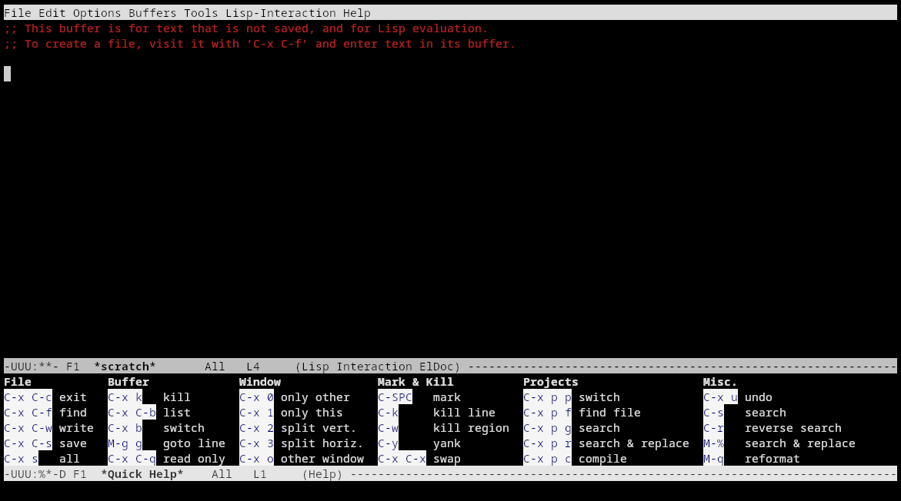

There are many tutorials, but this one is mine.
My goal is to explain how to displace VSCode from the ground up.
Then I show how to use Emacs for a whole integrated computing environment,
for example, to read news, send mails, play medias and more!

> This is work in progress

I list all the commands, (default) key bindings and settings to provide a complete reference documentation for a power user.
If you are new to Emacs, do not read this in one sitting, take your time and don't panic, you will be here long-term.
Good luck!


## History

To put things into perspective, Emacs started in 1976 as a set of macros for the Tape Editor and Corrector (TECO).
GNU Emacs began in 1984 as a true Lisp interpreter, and it is among the oldest free and open source projects still under development.

## First contact

In this first session you learn the most basic usage.

### Start

Start Emacs in the terminal like this: `emacs -nw`.
You can ensure a clean start using the `-Q` option.

Emacs keybindings use the <kbd>alt</kbd> and <kbd>ctrl</kbd> modifiers like this:

- `M-x` means press <kbd>alt</kbd>+<kbd>x</kbd>. `M` stands for *meta*, and it is the *alt* key on PC keyboard.
- `C-x 1` means press <kbd>ctrl</kbd>+<kbd>x</kbd>, release <kbd>ctrl</kbd> then press <kbd>1</kbd>.
- `C-h C-q` means press <kbd>ctrl</kbd>+<kbd>h</kbd> then <kbd>ctrl</kbd>+<kbd>q</kbd>. You can also maintain <kbd>ctrl</kbd> while pressing <kbd>h</kbd> then <kbd>q</kbd>.

When you are stuck, or if you want to exit a menu, hit `C-g` repeatedly to stop what Emacs is doing.
If you ever need to quit Emacs, hit `C-x C-c`, but you shouldn't do that :).

After starting Emacs, run the `help-quick` command by pressing `C-h C-q`, your terminal will look like this:



At the bottom you now have a helpful quick help window that shows you the essential commands.
Once you are comfortable, close the help window by running the same command again.

Here are the only keys you absolutely need to know:

- `M-x`: (<kbd>alt</kbd>+<kbd>x</kbd>) to run a command, and
- `C-g`: (<kbd>ctrl</kbd>+<kbd>g</kbd>) to cancel a command.


### Cursor movements

In this section I introduce how to move the cursor, also called *point*.

Here are the main cursor movements:

| *Key*                                 | *Command*              | *Description*                                            |
|---------------------------------------|------------------------|----------------------------------------------------------|
| `C-a` or <kbd>HOME</kbd>              | move-beginning-of-line | Move point to visible beginning of current logical line. |
| `C-e` or <kbd>END</kbd>               | move-end-of-line       | Move point to end of current line as displayed.          |
| `C-f` or <kbd>→</kbd>                 | forward-char           | Move forward to the next character.                      |
| `M-f` or <kbd>ctrl</kbd>+<kbd>→</kbd> | forward-word           | Move forward to the next word.                           |
| `C-b` or <kbd>←</kbd>                 | backward-char          | Move backward to the previous character.                 |
| `M-b` or <kbd>ctrl</kbd>+<kbd>←</kbd> | backward-word          | Move backward to the previous word.                      |
| `C-p` or <kbd>↑</kbd>                 | previous-line          | Move vertically up                                       |
| `M-{`                                 | backward-paragraph     | Move backward to start of paragraph.                     |
| `C-n` or <kbd>↓</kbd>                 | next-line              | Move vertically down                                     |
| `M-}`                                 | forward-paragraph      | Move forward to end of paragraph.                        |
| `M->`                                 | end-of-buffer          | Move point to the end of the buffer.                     |
| `M-<`                                 | beginning-of-buffer    | Move point to the beginning of the buffer.               |
| `C-v` or <kbd>PageDown</kbd>          | scroll-up-command      | Scroll text of selected window upward.                   |
| `M-v` or <kbd>PageUp</kbd>            | scroll-down-command    | Scroll text of selected window down.                     |
| `M-g g`                               | goto-line              | Go to LINE                                               |
| `M-g c`                               | goto-char              | Go to POSITION                                           |

> Note that these keys mostly work by default with readline (e.g. in bash).

This covers most cursor movements, and with little practices you will memorize the commands.
Notice how <kbd>ctrl</kbd> is used for short movements while <kbd>alt</kbd> makes longer movements.

Checkout the `M-x help-with-tutorial` to get some practice.

### Window navigation

In this section I introduce how to manage the window layout.

| *Key*   | *Command*            | *Description*                                        |
|---------|----------------------|------------------------------------------------------|
| `C-x 1` | delete-other-windows | Make WINDOW fill its frame.                          |
| `C-x 2` | split-window-below   | Split WINDOW into two windows, one above the other.  |
| `C-x 3` | split-window-right   | Split WINDOW into two side-by-side windows.          |
| `C-x 0` | delete-window        | Delete WINDOW.                                       |
| `C-x o` | other-window         | Select another window in cyclic ordering of windows. |
| `C-x b` | switch-to-buffer     | Display buffer in the selected window.               |

To move between windows, run `M-x windmove-default-keybindings` to use <kbd>shift</kbd>+<kbd>arrows</kbd> for moving the cursor to another window:

| *Key*                         | *Command*      | *Description*             |
|-------------------------------|----------------|---------------------------|
| <kbd>shift</kbd>+<kbd>←</kbd> | windmove-left  | Move to the left WINDOW.  |
| <kbd>shift</kbd>+<kbd>↑</kbd> | windmove-up    | Move to the up WINDOW.    |
| <kbd>shift</kbd>+<kbd>↓</kbd> | windmove-down  | Move to the down WINDOW.  |
| <kbd>shift</kbd>+<kbd>→</kbd> | windmove-right | Move to the right WINDOW. |


### File

In this section I introduce how to open and save a file.

| *Key*     | *Command*      | *Description*                                    |
|-----------|----------------|--------------------------------------------------|
| `C-x C-f` | find-file      | Edit file FILENAME.                              |
| `C-x C-s` | save-buffer    | Save current buffer in visited file if modified. |
| `C-x C-w` | write-file     | Write current buffer into file FILENAME.         |
| `C-x k`   | kill-buffer    | Kill the buffer specified by BUFFER.             |
| `C-x C-q` | read-only-mode | Toggle RO mode.                                  |

### Edition

In this section I introduce how to edit buffers.

| *Key*          | *Command*          | *Description*                                        |
|----------------|--------------------|------------------------------------------------------|
| `C-SPC`        | set-mark-command   | Set the mark where point is, and activate it.        |
| `M-w`          | kill-ring-save     | Save ("copy") text between point and mark.           |
| `C-w`          | kill-region        | Kill ("cut") text between point and mark.            |
| `C-y`          | yank               | Reinsert ("paste") the last stretch of killed text.  |
| `C-k`          | kill-line          | Kill the rest of the current line.                   |
| `M-DEL`        | backward-kill-word | Kill previous word.                                  |
| `C-x h`        | mark-whole-buffer  | Make region contain the entire buffer ("Select all") |
|                |                    |                                                      |
| `C-/` or `C-_` | undo               | Undo some previous changes.                          |
| `C-M-_`        | undo-redo          | Undo the last undo.                                  |


To replace text:

| *Key*   | *Command*            | *Description*                                    |
|---------|----------------------|--------------------------------------------------|
| `M-%`   | query-replace        | Replace some STRING occurrences.                 |
| `C-M-%` | query-replace-regexp | Replace some things after point matching REGEXP. |

Once Emacs finds a match, press:

- <kbd>y</kbd> to replace
- <kbd>n</kbd> to skip
- <kbd>!</kbd> to do all replacement without asking.
- <kbd>ctrl</kbd>+<kbd>g</kbd> to cancel.


## Customization

In this second session we learn how to customize Emacs behaviors and setup some quality of life.

### load-theme

Setup color theme with `M-x load-theme`:

- `modus-vivendi` for dark.
- `modus-operandi` for light.

These are highly accessible themes by @protesilaos, conforming with the highest standard for colour contrast between background and foreground values (WCAG AAA).

> If the colors are off, make sure to set the TERM variable, for example start emacs with `TERM=xterm-256color emacs` in tmux

### global-set-key

To change a key binding, use `M-x global-set-key`. For example, to bind `M-u` to *undo* (this key is bound to `upcase-word` by default):

- Type `M-x global-set-key` then <kbd>enter</kbd>.
- Press <kbd>alt</kbd>+<kbd>u</kbd>.
- Complete `Set key M-u to command: ` with `undo`.

Remember, press `C-g` (<kbd>ctrl</kbd>+<kbd>g</kbd>) at anytime to cancel the operation.

A commom key change is to replace `C-x b` with `kill-current-buffer`. The default command
asks to enter the buffer name, but that is not necessary most of the time.


### winner-mode

Run `M-x winner-mode` to records the changes in window configuration so that you can revert any layout mistake with `M-x winner-undo`, for example after running `delete-other-windows` by mistake.

### savehist-mode

Run `M-x savehist-mode` to save the minibuffer history. That way, pressing `M-x` shows the last used commands.

### dot emacs

Add the following to your `~/.emacs` file to ensure the settings persist accross restart:

```scheme
;; Setup theme
(load-theme 'modus-vivendi)

;; Use shift+arrow to change window
(windmove-default-keybindings)

;; Records window configuration and enable `M-x winner-undo` command to revert change
(winner-mode)

;; Keep track of useful commands
(savehist-mode)

;; Keep auto-save and backup files into one flat dir (instead of next to the files)
(setq backup-directory-alist '(("." . "~/.emacs.d/backups/")))

;; Store custom variables to ~/.emacs.d/custom.el (instead of ~/.emacs)
(setq custom-file (locate-user-emacs-file "custom.el"))

;; Easier undo/redo
(global-set-key (kbd "M-u")   'undo)
(global-set-key (kbd "C-M-u") 'undo-redo)

;; Do not ask for permission to kill a buffer
(global-set-key (kbd "C-x k") 'kill-current-buffer)
```

Run `M-x eval-buffer` to apply the settings now.

### package-install

Run `M-x package-install` to install modes for custom syntax, for example install:

- `markdown-mode`
- `haskell-mode`

Add other modes like `yaml-mode`, `go-mode` depending on your usage.

### Vert&co

Setup completion framework by running the following command:

- `M-x package-install` <kbd>ret</kbd> `vertico`
- `M-x vertico-mode`
- `M-x package-install` <kbd>ret</kbd> `orderless`
- `M-x eval-expression` <kbd>ret</kbd> `(setq completion-styles '(orderless basic))`

This enables two key features:

- Prompts show available choice in a vertical buffer.
- Completion is now fuzzy, for example typing `file find` will select `find-file`.

Add the following to your `~/.emacs`:

```scheme
(vertico-mode)
(setq completion-styles '(orderless basic))
```

## Learn

### Describe

| *Key*   | *Command* | *Description* |
|---------|-----------|---------------|
| `C-h f` |           |               |
| `C-h v` |           |               |
| `C-h m` |           |               |
| `C-h b` |           |               |
| `C-h k` |           |               |

### Which keys

### Info

### Man

## Development

In this session we learn how to write software with Emacs

### Compile

### Corfu

### Language server

### Magit

Magit is the user interface for the git revision control system.

#### Setup

Magit is not available on the default elpa package registry, so to install it
you need to setup the melpa registry. Add to your `~/.emacs`:

```scheme
;; add melpa registry for magit
(add-to-list 'package-archives '("melpa" . "https://melpa.org/packages/") t)
```

> After inserting the above snippet, run `M-x eval-buffer`, or simply `C-x C-e` to set the `package-archives` value.

Then run the following commands:

- `M-x package-refresh-contents RET`
- `M-x package-install RET magit RET`

Finally add the following to your `~/.emacs` to bind the main command:

```scheme
;; quick access to Magit
(global-set-key (kbd "C-x g") 'magit-status)
```

#### Intro

Inside a repository, run `M-x magit-status` to get the magit interface.
Here are the main keys:

- <kbd>TAB</kbd> to expand/collapse a section.
- <kbd>RET</kbd> to visit a thing. When the cursor is on a diff, this creates a temporary buffers (<kbd>q</kbd> to close it), press <kbd>ctrl</kbd>+<kbd>j</kbd> visits the real file.
- <kbd>j</kbd> for jumping to a section.
- <kbd>?</kbd> to see the command list.
- <kbd>$</kbd> to see the real commands that magit is performing.

To prepare a commit, on a chunk or a file press:

- <kbd>s</kbd> to stage
- <kbd>u</kbd> to unstage
- <kbd>k</kbd> to trash

Here are the main git commands:

- <kbd>b</kbd>: branch
- <kbd>c</kbd>: commit
- <kbd>P</kbd>: push
- <kbd>f</kbd>: fetch
- <kbd>F</kbd>: pull
- <kbd>l</kbd>: log
- <kbd>M</kbd>: remote
- <kbd>A</kbd>: cherry-pick

> Magit interface don't use modifiers like ctrl or alt.

#### Example git commands

After picking a command, a new buffer pops to let you toggle options.
The argument can be set vertabim, for example by pressing <kbd>-</kbd> then the flag, like <kbd>v</kbd>.

Here are some example workflow:

- Push with lease: <kbd>P</kbd> -> <kbd>-</kbd><kbd>f</kbd> -> <kbd>u</kbd>
- Commit amend and reset the author: <kbd>c</kbd> -> <kbd>-</kbd><kbd>R</kbd> -> <kbd>a</kbd>

#### Rewrite history

To start a local rebase, put the cursor on a commit, either in the status page or in the log view, and press <kbd>r</kbd> then <kbd>i</kbd>.
A rebase buffer will appears with the list of commits:

- <kbd>alt</kbd>+<kbd>p</kbd>/<kbd>n</kbd>: re-order a commit.
- <kbd>ctrl</kbd>+<kbd>k</kbd>: drop a commit.
- <kbd>e</kbd>: edit a commit.
- <kbd>r</kbd>: edit a commit message.
- <kbd>s</kbd>/<kbd>f</kbd>: squash or fixup a commit.

Once you are done, `C-c C-c` to make it happens, or `C-c C-k` to cancel.

#### Handle conflicts

When there is a conflict, press <kbd>e</kbd> to start an ediff session.
In graphic mode, the control window pops in a new frame which is not convenient.
Set the following setting to pack the ediff control inside your existing frame:

```scheme
;; show the ediff control window inside the current frame, don't create a new window
(setq ediff-window-setup-function 'ediff-setup-windows-plain)
```

Here are the commands to handle conflicts:

- <kbd>n</kbd>/<kbd>p</kbd>: go to the next/previous conflict.
- <kbd>a</kbd>/<kbd>b</kbd>: pick the left or right change.
- <kbd>q</kbd>: to quit ediff and apply the resolution.


#### Blame

When viewing a file, run `M-x magit-blame` then <kbd>b</kbd>:
- Press <kbd>RET</kbd> to open a commit.
- `C-c C-q` to quit the blame mode (or just re-run `M-x magit-blame` then <kbd>q</kbd>)


Checkout the documentation to learn more: <https://magit.vc/>

### Shell

## Advanced

### use-package


### Multi cursors

```scheme
(use-package multiple-cursors
  :bind
  (("C->" . 'mc/mark-next-like-this)
   ("C-<" . 'mc/mark-previous-like-this)))
```

Press <kbd>ctrl</kbd>+<kbd>></kbd> to create multiple cursors. Then edit as usual and complete with <kbd>ctrl</kbd>+<kbd>g</kbd>

### Templates


## Extra

### org mode

### notmuch

### dired

### elfeed

### eww

### ready-player

### tramp

## Next

Here are further resources to continue your journey:

- Guided tour: https://www.gnu.org/software/emacs/tour/index.html
- Beginner resources: https://sachachua.com/web/beginner-map.html
- Light configs: https://quickelisp.dev/ and https://github.com/ebittleman/emacs-bedrock
- Professional config: https://github.com/purcell/emacs.d
- Emacs philosophie: https://protesilaos.com/codelog/2021-09-22-live-stream-emacs-unix/
- Guide for writers: https://github.com/pprevos/emacs-writing-studio
