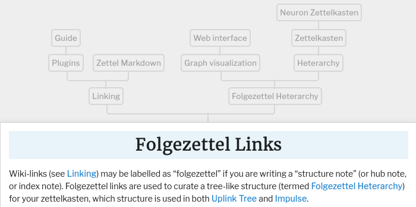

# Mitadi Web Principles

This page describes Mitadi, an extension of the *digital garden* / *tadi web*.
My goal is to share the core principles of my [[website|website]], e.g. what I wished I had known before starting it.

> [!info]
> This is a work in progress, your feedback is much appreciated.
>
> **Changelog**
> - 2025-01-01: initial draft

This document introduces a step-by-step procedure to implement Mitadi, a local first, independent multimedia web site.


## Local First

A Mitadi must be fully hosted on your own server or computer, rather than relying on third-party services.
There are three main reasons:

- Protect your visitors' data and don't let it be harvested for profit.
- Stay available when a third party provider goes down.
- Distribute the content by copying the files.

> [!info]
> Serve a local copy of evey asset, including fonts and useful scripts.


## Files Hierarchy

A Mitadi is composed of a collection of static files that is stored on a hard drive that is yours.
While the file path hierarchy is free-form, here are some recommendations:

- Avoid committing to a hierarchy too early and prefer a flat structure with interconnections.
- Store the large static files like videos or JavaScripts in a separate structure, for example by calling it `cdn`.
- Keep a full copy of the Mitadi on your local filesystem. This is essential for maintaining control over your content and ensuring availability, even without an internet connection.

Here is an example files hierarchy:

```raw
/srv/
├── cdn.midirus.com/
│   ├── audio/
│   │   ├── 2012-studio/
│   │   │   ├── title.flac
│   │   │   ├── title.mp3
│   │   │   └── ...
│   │   └── 2024-pastagang/
│   │       └── ...
│   ├── git/
│   │   └── website.git/
│   ├── script/
│   │   ├── highlightjs@11/
│   │   │   ├── default.min.css
│   │   │   └── ...
│   │   └── peaks-player.js
│   └── video/
│       ├── 2009-lta-boitaklou.avi
│       └── ...
└── midirus.com/
    ├── index.html
    ├── favicon.svg
    ├── blog/
    │   ├── beautiful-haskell.html
    │   ├── broadcasting-webm.html
    │   └── ...
    └── notes/
        └── emacs.html
```

> [!tip]
> If you can't write to `/srv`, create a bind mount: `sudo mount -o bind ~/src /srv`.


## Local Server

With [[podenv]], you can start an isolated browser with a self signed server using the following commands:

```bash
# TODO: support add-host in podenv to fix that ugly eval
localhost$ eval $(podenv --name local-first --volume ~/src:/srv:ro --no-network --show --shell nixify firefox | tail -n 3 | sed 's/Raw command: podman run/podman run --add-host midirus.com:127.0.0.1 --add-host cdn.midirus.com:127.0.0.1 /')

container$ nix run /srv/code.midirus.com/website#local &
Apache/2.4.54 (Unix) OpenSSL/3.0.7 configured -- resuming normal operations
[Wed Jan 01 23:12:01.538419 2025] [core:notice] [pid 2:tid 140640858097472] AH00094: Command line: '/nix/store/5c80i25xr9bqqba6cfxxs3cal3c2vrvq-apache-httpd-2.4.54/bin/httpd -f /nix/store/db80l5i88a0pjq5sl2l2qnqpnq6wij8c-local-apache.conf -D FOREGROUND'

container$ firefox https://midirus.com
```


Alternatively, here is how to do it manually:

- Setup a local CA:

```bash
# Write certificates to /srv/_local-ca
out=/srv/_local-ca; mkdir $out

# Generate the local ca key
openssl req -x509 -new -nodes -newkey rsa:2048 -keyout localCA.key -sha256 -days 1825 -out localCA.crt -subj /CN='localhost ca'

# Generate the vhost keys
for dns in midirus.com cdn.midirus.com; do
  openssl req -newkey rsa:2048 -nodes -keyout $dns.key -out $dns.csr -subj /CN=$dns -addext subjectAltName=DNS:$dns
  openssl x509 -req -in $dns.csr -copy_extensions copy -CA localCA.crt -CAkey localCA.key -CAcreateserial -out $dns.crt -days 365 -sha256
done;

# Copy the relevant files
mv *.key *.crt $out
```

- Start apache with the following config `httpd -f /srv/_local-ca/httpd.conf -DFOREGROUND`:

```raw
# /srv/_local-ca/httpd.conf
LoadModule mpm_event_module modules/mod_mpm_event.so
LoadModule log_config_module modules/mod_log_config.so
LoadModule mime_module modules/mod_mime.so
LoadModule filter_module modules/mod_filter.so
LoadModule deflate_module modules/mod_deflate.so
LoadModule alias_module modules/mod_alias.so
LoadModule headers_module modules/mod_headers.so
LoadModule dir_module modules/mod_dir.so
LoadModule authz_core_module modules/mod_authz_core.so
LoadModule unixd_module modules/mod_unixd.so
LoadModule rewrite_module modules/mod_rewrite.so
LoadModule ssl_module modules/mod_ssl.so
TypesConfig conf/mime.types

PidFile /tmp/httpd.pid
DocumentRoot "/tmp"
DirectoryIndex index.html
ErrorLog /dev/stderr
LogFormat "%h %l %u %t \"%r\" %>s %b" common
CustomLog /dev/stdout common

Listen *:80
Listen *:443
ServerName "local-apache"

<Directory />
  AllowOverride None
  Require all denied
</Directory>

<VirtualHost *:80>
    ServerName midirus.com
    RewriteEngine On
    <Directory "/srv/midirus.com">
        AllowOverride All
        Require all granted
    </Directory>
    DocumentRoot /srv/midirus.com
</VirtualHost>
<VirtualHost *:443>
    ServerName midirus.com
    RewriteEngine On
    SSLEngine on
    SSLCertificateFile /srv/_local-ca/midirus.com.crt
    SSLCertificateKeyFile /srv/_local-ca/midirus.com.key
    <Directory "/srv/midirus.com">
        AllowOverride All
        Require all granted
    </Directory>
    DocumentRoot /srv/midirus.com
</VirtualHost>

<VirtualHost *:80>
    ServerName cdn.midirus.com
    RewriteEngine On
    <Directory "/srv/cdn.midirus.com">
        AllowOverride All
        Require all granted
    </Directory>
    DocumentRoot /srv/cdn.midirus.com
</VirtualHost>
<VirtualHost *:443>
    ServerName cdn.midirus.com
    RewriteEngine On
    SSLEngine on
    SSLCertificateFile /srv/_local-ca/cdn.midirus.com.crt
    SSLCertificateKeyFile /srv/_local-ca/cdn.midirus.com.key
    <Directory "/srv/cdn.midirus.com">
        AllowOverride All
        Require all granted
    </Directory>
    DocumentRoot /srv/cdn.midirus.com
</VirtualHost>
```

- Then update your local dns and starts firefox with a new session to by-pass HSTS error: \
`firefox --new-instance --profile ~/.local-browser`:

```raw
# /etc/hosts
127.0.0.1 localhost midirus.com cdn.midirus.com
```


## Pubic Server

A host is required to serve the content online. This section introduces the available options:

```raw
[ managed service ] - - - [ web host ] - - - [ dedicated server ] - - - [ autonomous system ]
         ← less technical               ↑                         more technical →
                                       Mitadi
```

Here are some of the trade-offs:

|                 | Cost   | Operation | Independence |
|-----------------|--------|-----------|--------------|
| managed service | Medium | Trivial   | Low          |
| web host        | Low    | Boring    | Medium       |
| dedicated       | Medium | Medium    | High         |
| as              | ?      | High      | High         |

- Managed Service is not an option because the service provider has too much power over the content.
- Web Host requires some technical skills (e.g., using `rsync`), the service provider handles the HTTP stack.
- Dedicated Server requires more technical expertise (e.g., using `systemd`), while the service provider handles the network stack.
- Autonomous System (AS) requires advanced skills (e.g., configuring `BGP`), while the service provider (data center) handles the physical infrastructure and external network connections (peers).

> For example, for midirus.com, I pay 7€ per month for a 300GB web host with the domain.
> I recommend finding a web hosting provider near you to get started.

To publish a local Mitadi, use `rsync`:

```bash
rsync --delete -a /srv/midirus.com/ public-provider:sites/midirus.com/
rsync --delete -a /srv/cdn.midirus.com/ public-provider:sites/cdn.midirus.com/
```


## Edition & Links

Use a standard text editor and a hot-reload service to see live changes.
Create notes about everything and make the following links between files:

- **Uplinks** represent the main hierarchy, to be displayed at the top of the page like this:

:::{.flex .items-center .justify-center}

:::

- **Backlinks** are normal links that points to a given note, displayed at the bottom of the page.
- **Table of Content** is the list of heading, which must be linkable standalone to refer to a specific part of a note.
- **Tags** are another way to group note, they are also displayed at the bottom of the page.

I'm presently using a tool named `emanote` to generate the HTML files, as explained in this [[website|page]].

> [ ] TODO: Adopt [denote](https://protesilaos.com/emacs/denote) file-naming scheme by figuring out how to
> publish the content with nicer URLs (see: <https://github.com/srid/emanote/discussions/551>).

Here is my website source hierarchy. The notes are written in the markdown format:

```raw
/srv/
└── code.midirus.com/
    └── website/
        ├── .git/
        ├── README.md
        ├── LICENSE
        └── content/
            ├── blog/
            │   ├── beautiful-haskell.md
            │   ├── broadcasting-webm.md
            │   └── ...
            ├── project/
            │   └── ...
            └── notes/
                ├── emacs.md
                └── ...
```

Here are the rewrite rules to make pretty links:

```raw
# Serve directory path like "/blog/" with a file named "/blog.html"
RewriteCond "%{REQUEST_FILENAME}" -d
RewriteRule ^(.+?)/?$ $1.html [L]

# Serve file without the html extension
RewriteCond "%{REQUEST_FILENAME}.html" -f
RewriteRule ^(.*)$ $1.html [L]
```

Note that the source code may be hosted on a different host.
I recommend to checkout and download any external resources using
the same hierarchy: `/srv/HOSTNAME/PATH` to keep everything local.

> [!tip]
> This hierarchy also help in console outputs and program debug.
> For example, instead of having ambiguous paths like `/home/tristanc/code/dear-imgui.hs`,
> prefer `/srv/github.com/haskell-game/dear-imgui.hs`, so that any log would point to a known location.


Here is how I update midirus.com:

```bash
emanote -L /srv/code.midirus.com/website/content gen /srv/midirus.com
rsync --delete -a /srv/midirus.com/ public-provider:sites/midirus.com/
```


## Multimedia

Mitadi fully supports multimedia content.
Use the HTML elements `audio` and `video` to serve the content locally.

The following sections explain how to handle transcoding and setup galeries for serving every media automatically.

### Metadata

The workflow goes as follow:

- Move the raw/high quality files to the cdn folder.
- Run an automated script to generate web preview and setup metadata.
- Add tags.

For example, given a `song.flac` and `demo.mp4`, the script run the following commands:

```bash
# Set metadata
metaflac --preserve-modtime --remove-all-tags --set-tag=artist=Midirus song.flac
# Encode mp3
ffmpeg -i song.flac -map_metadata 0 -id3v2_version 3 -ar 44100 song.mp3
# Encode video
ffmpeg -i demo.mp4 -movflags +faststart -c:v libx264 -crf 23 -maxrate 1M -bufsize 2M -c:a copy demo-light.mp4
```

An extra file is generated with metadata where tags can be manually added.

Then, a database can be generated using this schema:

```json
[ {"path": "song", "title": "mon son", "length": "42", "tags": []}
]
```

- [ ] TODO: formalize this process, it is currently developed in the `src/Audio.hs` module


### Media Type

This section explains how to include multimedias in the web pages

#### Audio

> [ ] TODO: Publish the peaks-player and peaks-playlist component

#### Video

> [ ] TODO: Migrate off youtube and implement a playlist player

#### Paper

> [ ] TODO: Figure out a pdf viewer

#### Photos

> [ ] TODO: Figure out a solution to transcode the RAW files and annotate the shot's lens/focal/shutter

#### Code

> [ ] TODO: Implement a light php git viewer and migrate off GitHub.

#### All of the above

> [ ] TODO: Figure out how to best serve a content that is half code / half media.
