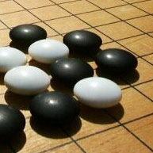

# The Game Of Go

:::{.flex .items-center .justify-center}

:::


Also known as weiqi or baduk, Go is an abstract strategy board game developed in China more than 2,500 years ago.
Even though this game has the simplest rules, it is the most profound.

---
> The rules of Go are so elegant, organic, and rigorously logical that if intelligent life forms exist elsewhere in the universe they almost certainly play Go.
>
> -- <cite>Edward Lasker</cite>

I recommend taking the time to look over fundamental concept resources such as [[weiqi]] or [[lambda-calculus]].

## Links

Here are my notes:

```query
path:weiqi/*
```

I wrote a demo game to play with GnuGO:

[[baduk-trainer]]#


> Image by [Dilaudid, CC BY-SA 3.0](https://commons.wikimedia.org/wiki/File:Go_board_part.jpg)
