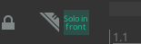
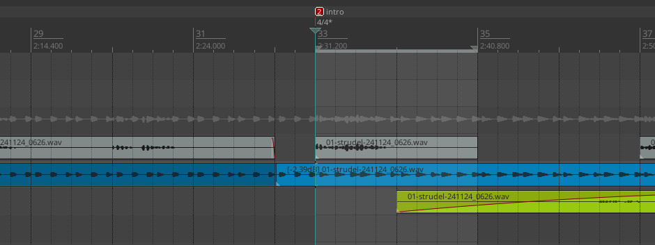
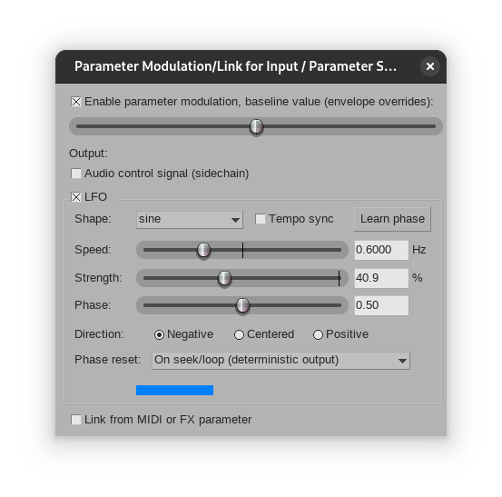
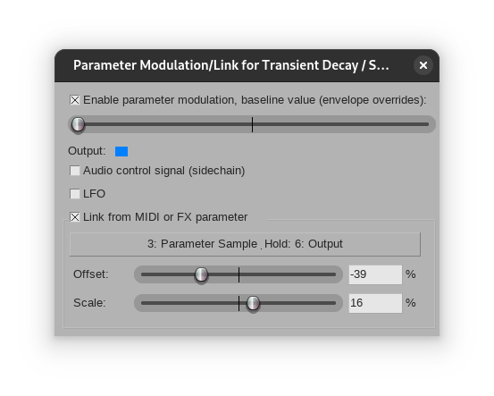

# Reaper

Here are my notes to use [Reaper](https://reaper.fm)

## Settings

The non-default settings I like:

- Activate `Reset meter peak on play/seek` to keep the max volume fresh. Otherwise you have to click the indicator to reset the peak value.

Avoid dangling project and ensure audio stems are saved in the right place:
- Project -> Prompt to save on new project [x]

Better default send:
- Project -> Track/Send Defaults -> Send gain `-18db`
                                 -> Send midi by default [ ]

Assign midi controller, press <kbd>?</kbd> to see action list
- `:>` Transport play (not play/stop because that requires the button to stay pressed)
- `[]` Transport stop
- `<-` Markers: Go to previous marker/project start
- `->` Markers: Go to next marker/project end
- `C-<left>` Move edit cursor back one measure
- `C-<right>` Move edit cursor forward one measure

> Use `Find shortcut` to find the action of an existing key

Disable auto fading on cut:

- Project -> Item Fade Defaults -> Untick all the "Fade-in/fade-out"

Navigate arrange view with middle click:

- Editing Behavior -> Mouse Modifier:
  - Context: Arrange view
  - middle drag
  - Default action set to `Hand scroll`

Center zoom on mouse position (instead of play cursor):
- Appearance -> Zoom/Scroll/Offset -> Horizontal zoom center: `Mouse cursor`

Untick to disable `Tiny fade in on playback start`

Bind (e.g. to `z`) `Toggle solo for selected tracks`, to quickly solo the current track, whatever the current view.

Add `$project-` to recorded filenames.

## Shortcuts like op1

Here is my attempt to control Reaper like an OP-1

```
KEY 9 32 40073 0		 # Main : Ctrl+Space : OVERRIDE DEFAULT : Transport: Play/pause
KEY 176 7 40157 0		 # Main : MIDI Chan 1 CC 7 : Markers: Insert marker at current position
KEY 1 77 40157 0		 # Main : M : OVERRIDE DEFAULT : Markers: Insert marker at current position
KEY 176 15 40172 0		 # Main : MIDI Chan 1 CC 15 : Markers: Go to previous marker/project start
KEY 0 91 40172 0		 # Main : [ : OVERRIDE DEFAULT : Markers: Go to previous marker/project start
KEY 176 16 40173 0		 # Main : MIDI Chan 1 CC 16 : Markers: Go to next marker/project end
KEY 0 93 40173 0		 # Main : ] : OVERRIDE DEFAULT : Markers: Go to next marker/project end
KEY 1 81 40625 0		 # Main : Q : Time selection: Set start point
KEY 1 69 40626 0		 # Main : E : OVERRIDE DEFAULT : Time selection: Set end point
KEY 9 32807 41042 0		 # Main : Ctrl+Right : OVERRIDE DEFAULT : Move edit cursor forward one measure
KEY 9 32805 41043 0		 # Main : Ctrl+Left : OVERRIDE DEFAULT : Move edit cursor back one measure
```

## Solo in front

Click `Options` and then `Solo in front`
Add an icon to the toolbar:




## Match item or track loudness with SWS

- select items
- show actions list
- SWS/BR: Normalize loudness of selected items/tracks
- pick items (the clip) or tracks (the mixer)
- set lufs to -14 for spotify

## Setup volume envelop [Adjusting Envelope Segments in REAPER](https://www.youtube.com/watch?v=FsuYl5JcPkE)

- Press <kbd>v</kbd> to display the volume envelop.

### Create segment

- Make a timeselection and use <kbd>ctrl</kbd>+<kbd>shift</kbd>+`mouse drag` to make a segment.

To do this manually:
- Create 4 points to make a segment using <kbd>shift</kbd>+`mouse`.
- Move the middle segment to adjust the volume

Or use the `insert 4 points at time selection` action.

## Adjust the curve

- <kbd>alt</kbd>+`mouse drag`

## Move curve horizontally

- <kbd>ctrl</kbd> + <kbd>alt</kbd> + `mouse drag`

## Find BPM

- insert tempo marker in the timeline <kbd>shift</kbd><kbd>c</kbd>, for example at position 5
- in TCP, change tracks timebase to `time`
- change source properties: check `ignore project tempo`
- ctrl drag the mark to match transient

## Move items on one axis only

<kbd>ctrl</kbd>+<kbd>shift</kbd>

## Midi note too early

When recording midi sequence through extenal synth with the miniFuse,
the audio latency is negative (recording starts a few ms after the audio play first midi).

In `Preferences` -> `Audio` -> `Recording`, untick `Use audio driver reported latency`, then adjust recording manually.

## Free impulse response

For ReaVerb, use [Big Gee's Lexicon 480L](https://grantnelson.co/article/1/lexicon-480l-free-impulse-responses), like Large Room, or Small Plate (which is bigger :)

## Automatic Gain Riding

- Use loudness meter plugin to write LUFS-M env
- Move automation to track envelop
- Tweaks envelop params to inverse

## Master FX by Kenny Gioia

- ReaEQ    (e.g. shelft +1db)
- JS 1175  (e.g. -10db threshold, 3db gain, 140 atk, 180 release)
- ReaXComp (e.g. ratio 4/1, check program dependent release, link the thresholdm -10db threshold)
- ReaLimit
- JS Loudness Meter (to check LUFS-I for max -8)

## JS 1175 by Kenny Gioia

- Start with attack > 200
- Lower threshold to get a -6db compression

Example settings:
- For snare: a(260).r(240)
- For kick:  longer release
- For hat:   shorter release
- For drum buss: fast release, but 60% mix

## Mono kick drum (remove low from side)

TODO: figure out how to make this work

- Encoder
- Eq (disconnect in1 out1), low shelf -6db at 160Hz
- Decoder

## Reset a measure after bridge

Here is the trick

- Insert a new marker when a new verse begin by right clicking on the ruler: `insert tempo/time signature marker`.
- Copy the position (because it will be adjusted to the closest measure), untick `Set tempo` and tick `Set time signature`.
- Then tick `Allow a partial measure before this marker`, paste the position and add the marker.

This looks like this:

:::{.flex .items-center .justify-center}

:::


## Run VST with yabridge

This one is tricky in my fedora/bubblewrap setup: the upstream release needs a custom wine, and the COPR is too complicated. So here is how I setup yabridge with nix:

- Pull yabridge with: `nix shell nixpkgs/94073c2546d20efc0ae206b41fc0b775f1e06dab#yabridge nixpkgs/94073c2546d20efc0ae206b41fc0b775f1e06dab#yabridgectl nixpkgs/94073c2546d20efc0ae206b41fc0b775f1e06dab#carla`
- Get the wine path with: `grep wine $(which yabridgectl)`
- Run VSTs installer with wine.
- Convert VST's .dll to .so with yabridge using these commands:

```ShellSession
# Ensure yabridge can find its lib, otherwise it may fail with: can't find the "libyabridge-vst.so"
$ mkdir -p ~/.local/share/yabridge && cp $(dirname $(which yabridge-host.exe))/* $(dirname $(which yabridge-host.exe))/../lib/* ~/.local/share/yabridge/
$ yabridgectl add ~/.wine/drive_c/Program\ Files/Steinberg/VSTPlugins/
$ yabridgectl add ~/.wine/drive_c/Program\ Files/Common\ Files/VST3/
$ yabridgectl sync
$ ls .vst3/yabridge/
Snapback.dll  Snapback.so
```

<!--
- Setup dxvk:

```ShellSession
$ nix shell nixpkgs/94073c2546d20efc0ae206b41fc0b775f1e06dab#dxvk
$ setup_dxvk.sh install
$ winecfg
```

Should looks like this:


-->

Validate a plugin works with carla. Somehow, yabridge can't be in the PATH, so start it like that: `PATH=/bin $(which carla)`
The UI might freeze with this error in the debug log `[Wine STDERR] 010c:err:wgl:X11DRV_WineGL_InitOpenglInfo  couldn't initialize OpenGL, expect problems`.
In that case you need nixGL:

```shellSession
nix shell --override-input nixpkgs nixpkgs/94073c2546d20efc0ae206b41fc0b775f1e06dab --impure github:nix-community/nixGL
PATH=/bin $(which nixGL) $(which carla)
```

That's it, run reaper with nixGL too.

## sample&hold modulation

Copy this script: https://stash.reaper.fm/v/28057/parameter%20sample%20and%20hold

```reascript
desc:Parameter Sample & Hold
//  Use MIDI Learn, Parameter Modulation, or whatever else to move
.. the Input slider
.. Use Parameter Modulation to Link your desired VST parameter to
// the Output slider
// Both time sliders add, and their total reads on slider4

slider1:0<0,100>Input
slider2:0<0,1200,1>S&H time (ms)
slider3:1<0,8,1>S&H time (quarter notes)
slider4:<0,12000> total S&H time (read only)
slider5:0<0,200,1>smoothing time(ms)
slider6:0<0,100,0.1>Output

@init
bpos=0;


@slider
  beat = slider3 * 60 * srate;
  ms_samples = slider2 * srate /1000;
  slider5 == 0 ?
  coeff = 0 :
  coeff = exp(-1/(slider5/1000*srate));
  input = slider1;

@block
  beat_samples = beat/tempo;
  total_samples = beat_samples + ms_samples;
  slider4 = total_samples * 1000 / srate ;

@sample
  bpos == 0 ? hold_level = input;
  output = output * coeff + hold_level * (1 - coeff);
  slider6 = output;
  bpos = (bpos + 1) % total_samples;

spl0=spl0;
spl1=spl1;
```

- Move the input fader (so that it's the last used parameter), then click the `param` button and `Parameter Modulation`.
- Click `enable parameter modulation` and use a LFO to modulate the S&H input, for example like this:



> The output fader of the s&h plugin should move randomly

- Then move the parameter to be modulated, for example the transient decay, click the `param` button and tick `Link from MIDI or FX parameter` to grab the S&H output like this:



That way, the parameter is getting a new random value according to the S&H script.
