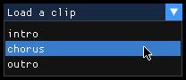

# Incredibly Magic Graphics User Interface

This post introduces the [dear-imgui](https://github.com/ocornut/imgui#readme) library along with its
Haskell [binding](https://hackage.haskell.org/package/dear-imgui) to create this simple user interface:


IMGUI is a style of API that is surprisingly hard to define, please check the [About the IMGUI paradigm](https://github.com/ocornut/imgui/wiki/About-the-IMGUI-paradigm) wiki page to learn more about it.

> This document is a literate haskell file

---

```haskell
-- Quality of life syntaxic sugar
{-# LANGUAGE OverloadedStrings, ImportQualifiedPost, NamedFieldPuns, BlockArguments, LambdaCase #-}

import Control.Monad (when, void, forM_)
import Control.Concurrent.STM (
        atomically, STM, TVar, newTVar, readTVar, writeTVar,
        readTVarIO, modifyTVar')
import Data.Text (Text, pack)

import DearImGui qualified

-- Necessary import to create the window and render the GUI
import Control.Exception (bracket, bracket_)
import Control.Monad.IO.Class (liftIO)
import Control.Monad.Managed (runManaged, managed, managed_)
import DearImGui.OpenGL3 qualified as DGL3
import DearImGui.SDL qualified as DSDL
import DearImGui.SDL.OpenGL qualified as DGL
import Graphics.GL qualified as GL
import SDL qualified
```

## Context

For this demonstration purpose, we'll create a GUI to add and remove elements from a list. The GUI contains:

- text input for the current element.
- save/delete buttons.
- selector to load previous element.

We are going to store the state in this data type:

```haskell
data ClipManager = ClipManager {
  currentClip :: TVar Text,
  clips :: TVar [Text]
}

newClipManager :: STM ClipManager
newClipManager = ClipManager <$> newTVar "default" <*> newTVar []
```

## How it works

The dear-imgui API defines graphical components as draw calls to be performed for each frame.
In the main event loop, we call procedures to define the user interface.
These drawing procedures may returns information about the state of the interface.
For example, a [button](https://hackage.haskell.org/package/dear-imgui-2.1.1/docs/DearImGui.html#v:button)
returns true when the user clicks it.

Here is the main body of our GUI:

```haskell
drawClipManager :: ClipManager -> IO ()
drawClipManager ClipManager{currentClip, clips} = do
  DearImGui.text "clip: "
  DearImGui.sameLine

  -- Draw the input box with a max size of 100 char.
  DearImGui.setNextItemWidth 200
  void $ DearImGui.inputText "##current-clip" currentClip 100
  DearImGui.sameLine

  -- Draw the save/delete buttons
  whenM (DearImGui.button "save") saveHandler
  DearImGui.sameLine

  whenM (DearImGui.button "delete") deleteHandler
  DearImGui.sameLine

  -- Draw the list selector
  DearImGui.setNextItemWidth 200
  drawClipSelector
 where
```

## Layout

By default, the elements are drawn vertically, from top to bottom.
By calling [sameLine](https://hackage.haskell.org/package/dear-imgui-2.1.1/docs/DearImGui.html#v:sameLine),
we discard the last line return, which result in the element being drawn on the same line. It's as simple as that!

We can also adjust individual elements, for example by calling [setNextItemWidth](https://hackage.haskell.org/package/dear-imgui-2.1.1/docs/DearImGui.html#v:setNextItemWidth).


## Button handler

The handlers simply update the element list. Note that dear-imgui store the current name to
the `currentClip` reference.

```haskell
  saveHandler = atomically do
    currentName <- readTVar currentClip
    writeTVar currentClip "new"
    modifyTVar' clips (currentName :)

  deleteHandler = atomically do
    currentName <- readTVar currentClip
    writeTVar currentClip "new"
    modifyTVar' clips (filter (/= currentName))
```


## Dear ID

dear-imgui requires an unique ID for each component so that the library can properly manage their individual state.
By default, the library builds a stack of ID using the component names.

When two components share the same name, or when they don't have a name (e.g. our inputText), we can specify the ID using the `##ID` notation. We can also adds an ID to the stack using [withID](https://hackage.haskell.org/package/dear-imgui-2.1.1/docs/DearImGui.html#v:withID).


## List selector

Creating a selector is also very easy, here is the whole implementation:

```haskell
  drawClipSelector = do
    whenM (DearImGui.beginCombo "##sel" "Load a clip") do
      -- The user clicked the selector
      allClips <- readTVarIO clips

      forM_ allClips $ \clip ->
        whenM (DearImGui.selectable clip) do
          -- The user clicked an item
          atomically (writeTVar currentClip clip)

      DearImGui.endCombo
```




## Run the GUI

Finally, the initializing code borrowed from the dear-imgui README:

```haskell
whenM :: Monad m => m Bool -> m () -> m ()
whenM testAction action = do
  res <- testAction
  when res action

main :: IO ()
main = do
  clipManager <- atomically (newClipManager)
  -- For this demo we'll draw the interface fullscreen:
  let doDrawGUI = DearImGui.withFullscreen (drawClipManager clipManager)

  SDL.initializeAll
  runManaged do
    window <- do
      let title = "Hello, Dear ImGui!"
      let config = SDL.defaultWindow { SDL.windowGraphicsContext = SDL.OpenGLContext SDL.defaultOpenGL }
      managed $ bracket (SDL.createWindow title config) SDL.destroyWindow
    glContext <- managed $ bracket (SDL.glCreateContext window) SDL.glDeleteContext
    _ <- managed $ bracket DearImGui.createContext DearImGui.destroyContext
    _ <- managed_ $ bracket_ (DGL.sdl2InitForOpenGL window glContext) DSDL.sdl2Shutdown
    _ <- managed_ $ bracket_ DGL3.openGL3Init DGL3.openGL3Shutdown
    liftIO $ mainLoop window doDrawGUI


mainLoop :: SDL.Window -> IO () -> IO ()
mainLoop window doDrawGUI = unlessQuit do
  DGL3.openGL3NewFrame
  DSDL.sdl2NewFrame
  DearImGui.newFrame

  -- Build the GUI
  doDrawGUI

  GL.glClear GL.GL_COLOR_BUFFER_BIT
  DearImGui.render
  DGL3.openGL3RenderDrawData =<< DearImGui.getDrawData
  SDL.glSwapWindow window
  mainLoop window doDrawGUI

  where
    unlessQuit action = do
      shouldQuit <- checkEvents
      if shouldQuit then pure () else action
    checkEvents = do
      DSDL.pollEventWithImGui >>= \case
        Nothing ->
          return False
        Just event ->
          (isQuit event ||) <$> checkEvents
    isQuit event =
      SDL.eventPayload event == SDL.QuitEvent
```

## Conclusion

Coming from React or GTK, dear-imgui offers a solid alternative to create graphical user interfaces.
Don't let the retro look fools you, it is well capable and very efficient. Checkout the [gallery](/srv/localhost/git/github.com/TristanCacqueray/TristanCacqueray.github.io/static/dear-imgui-demo.png).

To get started, runs the demo which contains all the widgets and some instructions: [showDemoWindow](https://hackage.haskell.org/package/dear-imgui-2.1.1/docs/DearImGui.html#v:showDemoWindow).
The documentation is sparse, and the Haskell bindings are not complete, so you might have to checkout the [imgui.cpp source](https://hackage.haskell.org/package/dear-imgui-2.1.1/docs/DearImGui.html#v:showDemoWindow).

Cheers!

> To evaluate the file:
> nixGLIntel nix-shell -I nixpkgs=https://github.com/NixOS/nixpkgs/archive/da60f2dc9c95692804fa6575fa467e659de5031b.tar.gz -p ghcid -p "haskellPackages.ghcWithPackages (p: [p.markdown-unlit p.dear-imgui p.text p.stm p.OpenGLRaw])" --command 'ghcid --test=:main --command "ghci -pgmL markdown-unlit" dear-imgui.lhs'
