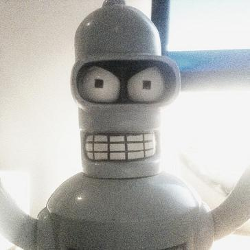

# Tristan de Cacqueray

{#avatar .ui .left .floated .small .circular .image}

Welcome to my homepage. I am a software engineer working for Red Hat on OpenStack cloud [[continuous-integration]] and the [[software-factory]].

I am passionate about [[free-software]], [[programing-language]], [[computer-graphics]] and [[music]]. Check out my <publications>.

Feel free to reach me by [mail](mailto:tristan.cacqueray@gmail.com) or [irc](ircs://chat.freenode.net:6697/tristanC).

:::{.ui .message .basic .segment}
_This work is licensed under a [Creative Commons Attribution 4.0 International License](http://creativecommons.org/licenses/by/4.0/)._
:::
